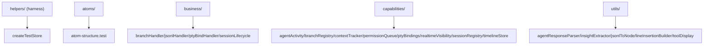

---
paths:
  - "claude-driver/src/__tests__/**/*"
---

<!-- parent: TDD -->

### 模块架构图

### 模块概览

- **职责**：Vitest 测试套件，镜像渲染层结构。覆盖 atoms/business/capabilities/utils 纯逻辑单测。无 DOM 渲染（environment: node）。
- **输入**：createTestStore/createStoreWith 工厂 + 被测模块。
- **输出**：测试用例 + 断言。

### API 概览

- **`helpers/createTestStore.ts`**
  - `createTestStore(): TestStore` — 隔离 Jotai store 工厂
  - `createStoreWith(seeds: Array<[AnyAtom, unknown]>): TestStore` — 带初始值 seed
  - `collectAtomValues(store, atom): unknown[]` — 订阅并记录值历史（副作用顺序断言）
- **`helpers/setup.ts`**：`@testing-library/jest-dom` matchers 注册
- **`helpers/env.test.ts`**：Phase 0 harness 验证（store 独立性、get/set、window undefined）
- **测试文件**（见各目录对应模块 API）：
  - atoms/atom-structure.test：9 atom 初始值 + sessions.atom barrel re-export 向后兼容
  - business/{branchHandler,jsonlHandler,ptyBindHandler,sessionLifecycle}.test：状态机 + 事件路由 + 绑定路径 B/C
  - capabilities/{agentActivity,branchRegistry,contextTracker,permissionQueue,ptyBindings,realtimeVisibility,sessionRegistry,timelineStore}.test：store 操作单测
  - utils/{agentResponseParser,insightExtractor,jsonlToNode,lineInsertionBuilder,toolDisplay}.test：纯函数单测

### 数据模型

- **`TestStore`**：`ReturnType<typeof createStore>`（Jotai store）
- **`Store`**：`Pick<TestStore, 'get' | 'set'>`（注入接缝）

### 关键流程

1. 每个 test `beforeEach` createTestStore 隔离
2. capability/business 函数接受注入 store：`fn(store, ...args)`
3. 断言：`store.get(atom)` 读；`store.set(atom, value)` 写
4. createStoreWith 初始 seed；collectAtomValues 记录副作用顺序

### 状态机

无（测试代码）。

### 异常处理

无。

### 监控与测试

- **框架**：Vitest（globals:true，environment:node，无 DOM 渲染；config 注释提及 jsdom 但实际 'node'，测试断言 `typeof window === 'undefined'`）。
- **别名**：@shared/@renderer。
- **测试覆盖**：atoms(1)/business(4)/capabilities(8)/utils(5) = 18 测试文件。
- **覆盖缺口 [待补]**：无主进程测试（GitManager/PtyManager/JsonlParser/HookServer/SettingsManager/ClaudeJsonManager/DriverConfigStore/ProjectStore/ProjectScanner/RemoteBridgeService/NotificationService/SchedulerStore/StatusLineBridge/DependencyChecker/updater）；无组件测试；无 preload 测试；无 IPC channel 注册表测试；business 仅 4/9（toolActivityHandler/contextHandler/permissionHandler/statusLineHandler/subagentHandler 未测）。

> 详情请阅读对应 Architecture 块文件：`docs/architecture.md` § __tests__（`.claude/rules/architecture/src/__tests__.md`）
