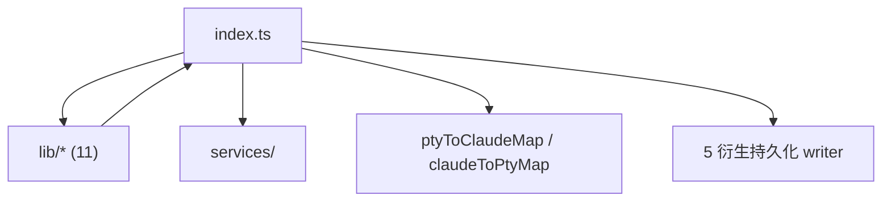
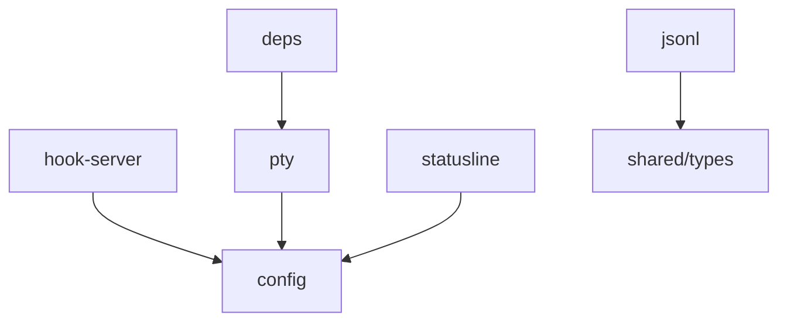
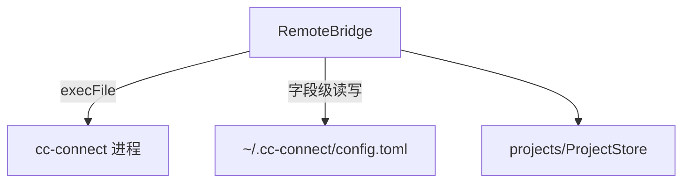

---
paths:
  - "claude-driver/src/main/**/*"
---

<!-- parent: TDD -->

### 模块架构图

### 模块概览

- **职责**：主进程编排器。窗口、HTTP Hook Server、80+ IPC handler、PTY↔Claude 绑定、5 衍生持久化、依赖检测、启动流程。
- **输入**：IPC invoke（renderer）、HTTP POST（Claude Hook）、node-pty stdout。
- **输出**：IPC push（renderer）、PTY stdin、衍生 sidecar 文件、HTTP 响应。

### API 概览

- **编排函数**：`createWindow()`、`registerIpcHandlers()`、`startServices()`、`runDependencyCheck()`、`autoRescanProjects()`、`initUserSettings()`。
- **会话绑定**：`autoWatchTranscript(sessionId, projectPath, startTime, isPtyId?, parentPtyId?, expectedClaudeId?)`、`bindPtyToClaudeSession(ptyId, claudeId, transcriptPath, cwd)`、`unbindPtyFromClaudeSession(claudeId)`。
- **衍生持久化**：`replayInsertions(filePath)`、`getSubagentInsertionsPath(parentTranscriptPath, agentId)`。
- **Hook 处理**：`onHookEvent(payload)`（SessionStart/PreToolUse/PostToolUse/Subagent/Permission/Stop/SessionEnd/PostCompact 分发）、`handleTrustFolderPrompt(sessionId, data)`、`stripAnsi(str)`。
- **IPC handler 分组**（~80）：PROJECT_*（list/create/scan/update/history-scan）、SESSION_*（start/input/stop/resume/meta-write）、PTY_*（bind/unbind）、JSONL_*（watch/record/records/subagent-*/branch-snapshot）、GIT_*（commit/reset/ensure-repo/delete-commit/push/get-status/mark-*/marks-load）、INSERTION_*（append/patch/load/subagent-*）、MILESTONE_*（save/load）、CONFIG_*/DRIVER_CONFIG_*/PROVIDER_*/CLAUDE_SETTINGS_*/PROJECT_SETTINGS_*/MCP_*/SKILL_*、SCHEDULER_*、CC_CONNECT_*、INSIGHT_*/CHAT_*、TERM_*、UPDATER_*、RECOMMEND_GET、API_TEST*、DIALOG_*、SHELL_*、OPEN_WEBVIEW、TOKEN_SCAN_FILE。

### 数据模型

- **运行时状态**（index.ts 模块级）：`ptyToClaudeMap: Map<string,string>`、`claudeToPtyMap: Map<string,string>`、`insightPtyIds/chatPtyIds/schedulerPtyIds/schedulerClaudeIds: Set<string>`、`schedulerPtyByProject: Map`、`pendingBranchByPtySession: Map`、`confirmedBranchPtyIds: Set`、`termWindows: Map<string,BrowserWindow>`、`trustHandledPtyIds: Set`。
- **衍生 sidecar**：见统一规范（5 类）。

### 关键流程

- **Session 启动**：SESSION_START -> PtyManager.startSession(spawn claude stream-json) -> 早期 PTY_BIND(ptyId 占位) -> autoWatchTranscript 轮询 JSONL 出现 -> 提取 claudeId -> bindPtyToClaudeSession -> PTY_BIND(真实)。
- **resume**：SESSION_RESUME -> `claude -r <claudeId>`（不发 SessionStart）-> 依赖 autoWatchTranscript 绑定。
- **PTY 退出清理**：`onExit` 回调 → `ptyToClaudeMap.get(sid)` 查真实 claudeId → `sendToRenderers(SESSION_STATUS, {status:'Completed'})` + `sendToRenderers(PTY_UNBIND, {ptyId:sid, claudeId})` → `unbindPtyFromClaudeSession(claudeId)` 清理主进程映射。**不能用 `unbindPtyFromClaudeSession(sid)`**（迁移后 `claudeToPtyMap` key 为真实 claudeId，sid lookup 失败 early return）。不依赖 SessionEnd Hook（PTY 退出时不一定触发）。
- **`sendToRenderers` 辅助函数**：统一向 mainWindow + notificationWindow 广播事件，避免分散的 `mainWindow?.webContents.send` + `notificationWindow?.webContents.send` 重复代码。
- **衍生持久化**：INSERTION_APPEND/PATCH/MILESTONE_SAVE/GIT_MARK_SAVE/SESSION_META_WRITE -> appendFileSync 对应 sidecar。
- **/branch 检测**：PTY stdout 正则 `Branched[\s─\-]+conversation` -> branch 握手流程。
- **Insight PTY 流程**：`INSIGHT_RUN` handler -> spawn 裸 claude PTY（`ptyManager.startBare`）-> `handleTrustFolderPrompt` 自动确认 trust 对话框（`TRUST_DIALOG_RE` 匹配压缩文本，`\s*` 处理空格压缩）-> 15s 定时器兜底发送 `/insights\r`（不依赖 onData 文本检测：Windows GBK 环境下 `❯` 被损坏为 `鉁?`、`*` 被 ANSI 转义序列包裹导致 `stripAnsi` 后不出现）-> 输出缓冲（`outputBuffer`，最多 2KB）累积 + 4 模式宽松正则匹配完成信号（`insights?\s+(report|generated|ready)` / `\.html\b` / `report\s+ready` / `generated\s+(your|the)`）-> `handleCompletion` 从缓冲提取 `file://` 路径（`/file:\/\/[^\s"']+\.html/i`）-> `openNotificationWindow()` 自动创建通知窗口（幂等）-> 1s 延迟等待页面加载 -> `sendToRenderers(IPC.INSIGHT_REPORT_READY, {filePath})` 广播。2min 超时兜底销毁 PTY。`onExit` 兜底：若 `completed=false` 则调用 `handleCompletion` 从缓冲提取路径。

### 状态机

- **Branch 链接握手**：`IDLE -> PENDING_CONFIRM -> PENDING_BIND -> IDLE`（处理预通知无 child -> 等确认 -> 等新 PTY 绑定的 IPC 时序竞态；非生命周期三态）。

### 异常处理

- **PTY 停止**：写 `\x03\x03` + 500ms 等待 + pty.kill；不手动 unbind（PTY 退出自然发 SessionEnd）。
- **PTY_UNBIND 禁改 session 状态**：branch 时父 PTY 也发 PTY_UNBIND，改状态会导致父 AgentBlock 误消失。
- **端口冲突**：HookServer onPortConflict 回调（不崩）。
- **依赖缺失**：弹窗引导安装。

### 监控与测试

- **日志点**：Hook 事件分发、PTY bind/unbind、衍生文件写入、branch 检测。
- **测试缺口 [待补]**：index.ts 编排逻辑无单测（80+ handler 集中）。

## lib
<!-- parent: main -->
### 模块架构图

### 模块概览

- **职责**：主进程基础设施层（11 个机制模块）。各自封装一类与 Claude Code / 文件系统 / 系统集成的原子能力；编排由 index.ts 完成。
- **输入**：IPC invoke（renderer）、HTTP POST（Claude Hook）、node-pty stdout、文件系统事件。
- **输出**：IPC push、PTY stdin、衍生 sidecar 文件、配置读写结果。

### API 概览

各模块 API 详见对应子级块文件。lib 层整体无独立 API（按 SRP 拆分）。

### 数据模型
### 关键流程
### 状态机
### 异常处理
### 监控与测试

## services
<!-- parent: main -->
### 模块架构图

### 模块概览

- **职责**：cc-connect 远程交互（飞书 bot）安装检测 + `~/.cc-connect/config.toml` 字段级读写。
- **输入**：IPC invoke（CC_CONNECT_*）、cc-connect 进程 stdout。
- **输出**：安装状态、TOML 配置、服务启停状态、日志推送。

### API 概览

- **`class RemoteBridgeService`**
  - `checkInstall(): Promise<{installed: boolean; version?: string}>` — execFile which/where
  - `saveProjectBot(projectId: string, bot: FeishuBotConfig): void` — patch 匹配 [[projects]]
  - `readProjectConfig(projectName: string): FeishuBotConfig | null`
  - `ensureConfig(): void`
  - private: `readToml(): Record<string,unknown>`、`writeToml(data): void`
  - `export default RemoteBridgeService`

### 数据模型
### 关键流程
### 状态机
### 异常处理
### 监控与测试
