---
paths:
  - "claude-driver/src/main/lib/**/*"
---


<!-- parent: main -->

### 模块架构图

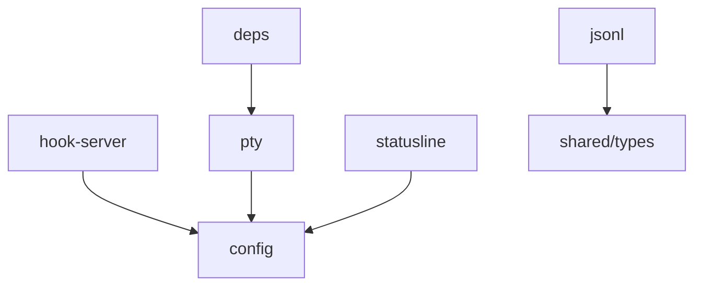

### 模块概览

- **职责**：主进程基础设施层（11 个机制模块）。各自封装一类与 Claude Code / 文件系统 / 系统集成的原子能力；编排由 index.ts 完成。
- **输入**：IPC invoke（renderer）、HTTP POST（Claude Hook）、node-pty stdout、文件系统事件。
- **输出**：IPC push、PTY stdin、衍生 sidecar 文件、配置读写结果。

### API 概览

各模块 API 详见对应子级块文件。lib 层整体无独立 API（按 SRP 拆分）。

### 数据模型

共享类型见 `shared/types`；各模块内部类型见子级块文件。

### 关键流程

- Hook POST -> hook-server -> HookEventBus -> IPC.HOOK_EVENT/STATUS_LINE
- JSONL tail -> jsonl -> IPC.JSONL_RECORD*
- PTY stdin 注入（消息队列 Stop 触发 + 权限审批 TUI 按键序列：rawWrite 方向键/回车/Tab，非 y/n 字母）

### 状态机

无（各模块独立，状态机在 index.ts 层或子模块内）。

### 异常处理

- Hook 端口冲突 -> onPortConflict 回调
- PTY 心跳 + 30min 超时
- JSONL tail offset 去重

### 监控与测试

日志点：Hook 事件分发、PTY 绑定/解绑、衍生文件写入。

## config
<!-- parent: lib -->
### 模块架构图

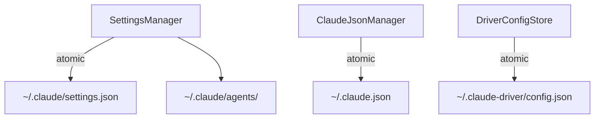

### 模块概览

- **职责**：全部配置文件原子读写 + Hook/statusLine 配置注入 + 5 类配置组读取。
- **输入**：IPC invoke（CONFIG_*/DRIVER_CONFIG_*/PROVIDER_*/CLAUDE_SETTINGS_*/PROJECT_SETTINGS_*/MCP_*/SKILL_*）。
- **输出**：配置读写结果、Hook 注入脚本、5 类配置组。

### API 概览

- **`SettingsManager`**
  - `readClaudeSettings(): ClaudeSettings`
  - `writeClaudeSettings(data: ClaudeSettings): void`
  - `readClaudeEnvBlock(): Record<string,string>`
  - `writeClaudeEnvBlock(env: Record<string,string>): void`
  - `removeClaudeEnvBlock(): void`
  - `setupHookBridge(port: number): string`
  - `injectHookConfig(port: number): void`
  - `removeHookConfig(port: number): void`
  - `getUserHooksForEvent(eventName: string, port: number, cwd?: string): string[]`
  - `injectStatusLineConfig(scriptPath: string): void`
  - `readAgentsFromDir(dir: string): AgentItem[]`
  - `readProjectSkills(projectPath: string): SkillItem[]`
  - `readAllConfigGroups(): AllConfigGroups`
- **`ClaudeJsonManager`**
  - `ensureOnboardingCompleted(): void`
  - `ensureProjectTrusted(projectPath: string): void`
  - `readGlobalMcpServers(): string[]`
  - `readProjectMcpJsonServers(projectPath: string): string[]`
  - `readProjectMcpState(projectPath: string): ProjectMcpState`
  - `patchProjectMcpState(projectPath: string, serverName: string, enabled: boolean): void`
- **`DriverConfigStore`**
  - `readDriverConfig(): DriverConfig`
  - `writeDriverConfig(data: DriverConfig): void`
  - `patchDriverConfig(key: keyof DriverConfig, value: unknown): void`
- **Types**: `ItemGroup<T> {label, source: 'builtin'|'user'|'plugin', pluginId?, items: T[]}`、`AgentItem {name, model}`、`SkillItem {name, description?, dirName?}`、`HookItem {event, name}`、`ToolItem {name}`、`McpItem {name}`、`AllConfigGroups {agentGroups, skillGroups, hookGroups, toolGroups, mcpGroups}`。

### 数据模型
### 关键流程
### 状态机
### 异常处理
### 监控与测试

## deps
<!-- parent: lib -->
### 模块架构图

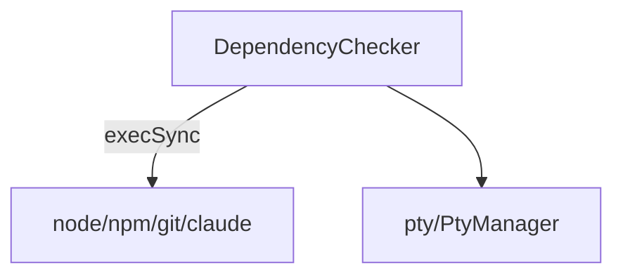

### 模块概览

- **职责**：启动期依赖检测（Node ≥18 / npm / Git / Claude Code CLI）+ 平台安装提示 + Claude CLI 自动安装。
- **输入**：`runDependencyCheck()` 同步调用（启动期）。
- **输出**：依赖状态列表、安装提示、自动安装结果。

### API 概览

- **`DependencyChecker`**
  - `checkNode(): DepStatus`
  - `checkNpm(): DepStatus`
  - `checkGit(): DepStatus`
  - `checkClaude(): DepStatus`
  - `checkAllDependencies(): DepStatus[]`
  - `autoInstallClaude(): Promise<{ok: boolean; message: string}>`
- **Types**: `DepStatus { name, found, version?, path?, error?, canAutoFix, manualUrl, installHint }`

### 数据模型
### 关键流程
### 状态机
### 异常处理
### 监控与测试

## git
<!-- parent: lib -->
### 模块架构图

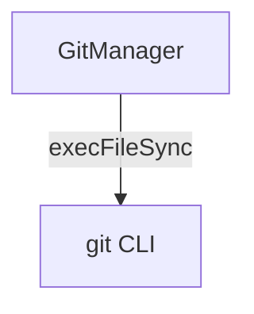

### 模块概览

- **职责**：无状态 Git CLI 操作包装（节点级快照/回退/删除、项目级同步 GitHub）。
- **输入**：IPC invoke（GIT_COMMIT/RESET/ENSURE_REPO/DELETE_COMMIT/PUSH/GET_STATUS）。
- **输出**：结构化结果 `{ok: true, commitHash?} | {ok: false, error}`。

### API 概览

- **`const GitManager`**（对象式 API）
  - `commit(cwd, message): {ok: true, commitHash} | {ok: false, error}`
  - `reset(cwd, commitHash): {ok: true} | {ok: false, error}`
  - `ensureRepo(cwd): {ok: true} | {ok: false, error}` — init + checkout -b main
  - `push(cwd, branch?): {ok: true} | {ok: false, error}`
  - `getStatus(cwd): {ok: true, hasRemote, currentBranch} | {ok: false, error}`
  - `deleteCommit(cwd, commitHash): {ok: true} | {ok: false, error}` — rebase --onto（非交互）

### 数据模型
### 关键流程
### 状态机
### 异常处理
### 监控与测试

## hook-server
<!-- parent: lib -->
### 模块架构图

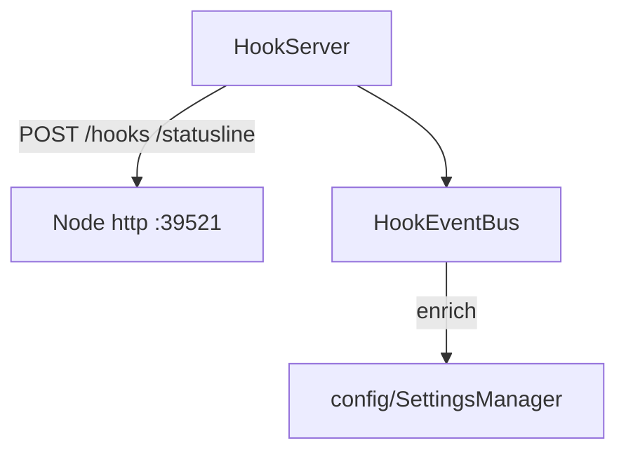

### 模块概览

- **职责**：三通道主通道。零依赖 HTTP Server 接收 Claude Code Hook 事件 + statusLine 数据，EventBus 推送渲染层。
- **输入**：HTTP POST `/hooks`（Hook payload）、`/statusline`（statusLine JSON）。
- **输出**：IPC.HOOK_EVENT/STATUS_LINE 推送（webContents.send）。

### API 概览

- **`HookServer`**
  - `startHookServer(port: number, handlers: HookServerHandlers): Promise<http.Server>`
  - `stopHookServer(server: http.Server): Promise<void>`
- **`HookEventBus`**
  - `createHookEventBus(getWindow: GetWindow, port: number): { dispatchHook, dispatchStatusLine }`
- **Types**:
  - `HookServerHandlers { onHookEvent: (payload: HookPayload) => void, onStatusLine: (data: StatusLineData) => void, onPortConflict: (port: number) => void, onError: (err: Error) => void }`
  - `GetWindow = () => BrowserWindow | null`

### 数据模型
### 关键流程
### 状态机
### 异常处理
### 监控与测试

## jsonl
<!-- parent: lib -->
### 模块架构图

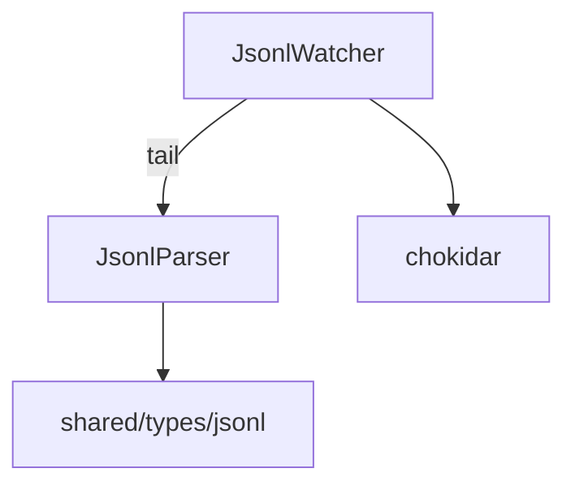

### 模块概览

- **职责**：JSONL 转录文件增量解析与监听（主 session + subagent depth:3）。
- **输入**：文件系统事件（chokidar）、JSONL 追加内容。
- **输出**：onRecord 回调（解析后的 JsonlRecord）。

### API 概览

- **`class JsonlWatcher`**
  - `watchFile(filePath: string, sessionId: string, readFromStart?: boolean, agentId?: string): void`
  - `watchProject(encodedProjectPath: string): void`
  - `unwatchFile(filePath: string): void`
  - `close(): void`
- **`JsonlParser`**
  - `parseJsonlLine(line: string): JsonlRecord | null`
  - `extractSessionIdFromPath(filePath: string): string | null`
  - `extractSubagentInfo(filePath: string): {sessionUuid: string; agentId: string} | null`
  - `hookEventToMessageType(eventName: HookEventName): JsonlMessageType`
- **Types**: `JsonlWatcherCallbacks { onRecord, onError }`

### 数据模型
### 关键流程
### 状态机
### 异常处理
### 监控与测试

## notification
<!-- parent: lib -->
### 模块架构图

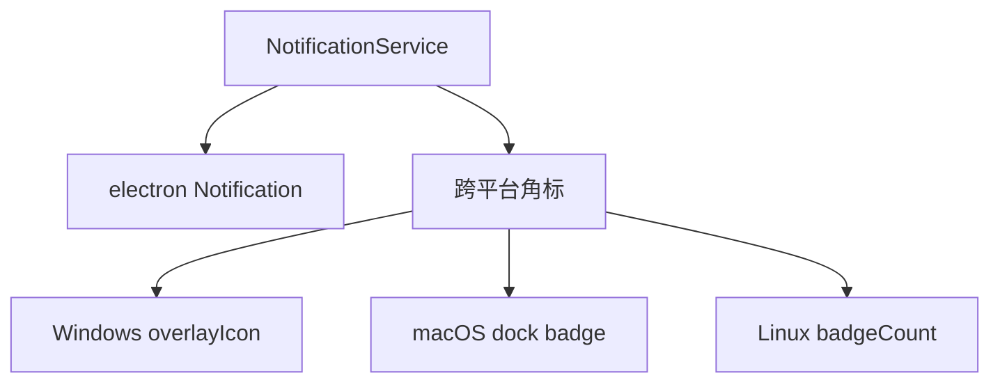

### 模块概览

- **职责**：桌面通知 + 跨平台任务栏角标管理。
- **输入**：main/index.ts 在 PermissionRequest Hook 触发 notify+increment、审批后 decrement、关闭后 decrement。
- **输出**：桌面通知（electron Notification）、任务栏角标。

### API 概览

- **`const NotificationService`**（对象式 API）
  - `init(getWindow: GetWindow): void`
  - `notify(title: string, body: string): void`
  - `setBadge(n: number): void`
  - `incrementBadge(): void`
  - `decrementBadge(): void`
  - `resetBadge(): void`

### 数据模型
### 关键流程
### 状态机
### 异常处理
### 监控与测试

## projects
<!-- parent: lib -->
### 模块架构图

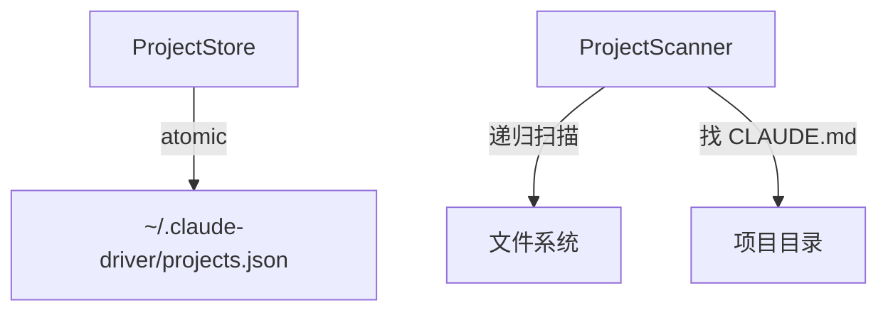

### 模块概览

- **职责**：项目记录单持久化 + 目录扫描发现项目。
- **输入**：IPC invoke（PROJECT_LIST/CREATE/SCAN/UPDATE/UPDATED/HISTORY_SCAN）。
- **输出**：项目列表、扫描结果、认领状态更新。

### API 概览

- **`ProjectStore`**
  - `readProjectsFile(): ProjectsFile`
  - `writeProjectsFile(data: ProjectsFile): void`
  - `readProjects(): Project[]`
  - `upsertProject(project: Project): void`
  - `updateProjectClaims(updates: Array<{projectId: string; claimStatus: ClaimStatus}>): void`
  - `isInitCompleted(): boolean`
  - `setInitCompleted(lastRootDir: string | null): void`
  - `getLastRootDir(): string | null`
  - `projectsFileExists(): boolean`
- **`ProjectScanner`**
  - `scanForProjects(rootDir: string): Promise<ScannedProject[]>`
  - `isGitRepo(dir: string): boolean`

### 数据模型
### 关键流程
### 状态机
### 异常处理
### 监控与测试

## pty
<!-- parent: lib -->
### 模块架构图

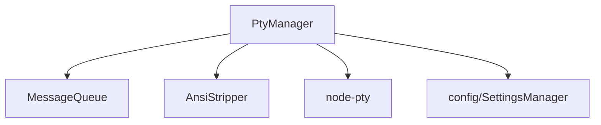

### 模块概览

- **职责**：多 Claude 会话 PTY 生命周期管理 + 消息队列 + ANSI 清洗。
- **输入**：IPC.SESSION_START/INPUT/STOP/RESUME（spawn claude stream-json）、Stop Hook 触发消息出队。
- **输出**：PTY stdout（onData 回推）、TERM_DATA 推送、PERMISSION_RESPOND 注入。

### API 概览

- **`class PtyManager`**
  - `startSession(opts: PtyStartOptions): void`
  - `startBare(opts, args: string[]): void`
  - `startCommand(opts, command: string, args: string[]): void`
  - `resumeSession(opts & {resumeSessionId: string}): void`
  - `writeToSession(sessionId: string, text: string): void`
  - `rawWrite(sessionId: string, text: string): void`
  - `stopSession(sessionId: string): void`
  - `findSessionByCwd(cwd: string): string | null`
  - `getStatus(sessionId: string): SessionStatus | null`
  - `getActiveSessions(): string[]`
  - `stopAll(): void`
  - `resizeSession(sessionId: string, cols: number, rows: number): void`
- **`MessageQueue`**
  - `enqueue(message: string): void`
  - `onStop(): void`
  - `get length(): number`
  - `clear(): void`
- **`AnsiStripper`**
  - `stripAnsi(raw: string): string`
  - `isPrintableContent(raw: string): boolean`
- **Standalone**: `resolveClaudeBin(): string`、`refreshClaudeBin(): string`、`getClaudeBin(): string`
- **Types**: `PtyStartOptions { sessionId, projectPath, permissionMode, model?, onData, onExit }`

### 数据模型
### 关键流程
### 状态机
### 异常处理
### 监控与测试

## scheduler
<!-- parent: lib -->
### 模块架构图

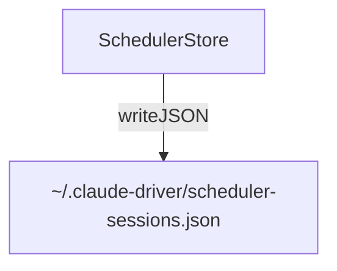

### 模块概览

- **职责**：定时任务持久化存储（按 projectPath 分组，含 claudeId + 任务列表）。
- **输入**：IPC invoke（SCHEDULER_LIST/CREATE/TOGGLE/DELETE）。
- **输出**：任务列表、操作结果。

### API 概览

- **`SchedulerStore`**
  - `readSchedulerSessions(): SchedulerStore`
  - `writeSchedulerSessions(data: SchedulerStore): void`
  - `appendTaskToSession(projectPath: string, claudeId: string, task: SchedulerTaskRecord): SchedulerStore`
  - `deleteTask(taskId: string): SchedulerStore`
  - `updateClaudeId(projectPath: string, claudeId: string): void`

### 数据模型
### 关键流程
### 状态机
### 异常处理
### 监控与测试

## statusline
<!-- parent: lib -->
### 模块架构图

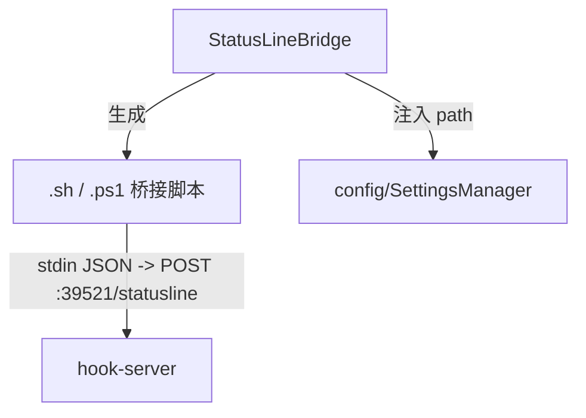

### 模块概览

- **职责**：生成 statusLine 桥接脚本（Unix .sh / Windows .ps1）并注入 `~/.claude/settings.json` 的 statusLine 字段。
- **输入**：启动期 `setupStatusLineBridge(port)` 调用。
- **输出**：脚本文件（~/.claude-driver/statusline-bridge.sh/.ps1）、settings.json statusLine 字段。

### API 概览

- **`StatusLineBridge`**
  - `setupStatusLineBridge(port: number): void`
  - `removeStatusLineBridge(): void`

### 数据模型
### 关键流程
### 状态机
### 异常处理
### 监控与测试

## updater
<!-- parent: lib -->
### 模块架构图

```mermaid
graph TD
    Updater -->|autoUpdater| EU["electron-updater"]
    Updater -.IPC.UPDATER_*.-> Renderer["renderer"]
```

### 模块概览

- **职责**：应用自动更新包装（仅 packaged 应用激活）。
- **输入**：IPC invoke（UPDATER_CHECK/DOWNLOAD/QUIT_AND_INSTALL）。
- **输出**：IPC push（UPDATER_STATE_CHANGED）。

### API 概览

- **`updater/index.ts`**
  - `initUpdater(mainWindow: BrowserWindow): void`
  - `checkForUpdates(): Promise<void>`
  - `downloadUpdate(): Promise<void>`
  - `quitAndInstall(): void`

### 数据模型
### 关键流程
### 状态机
### 异常处理
### 监控与测试
