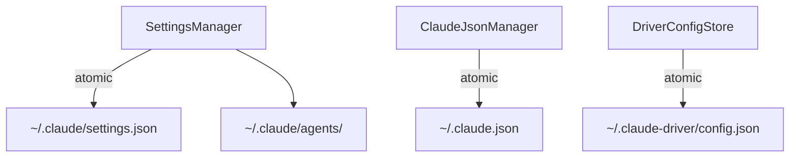

---
paths:
  - "claude-driver/src/main/lib/config/**/*"
---

<!-- parent: lib -->

### 模块架构图

### 模块概览

- **职责**：全部配置文件原子读写 + Hook/statusLine 配置注入 + 5 类配置组读取。
- **输入**：IPC invoke（CONFIG_*/DRIVER_CONFIG_*/PROVIDER_*/CLAUDE_SETTINGS_*/PROJECT_SETTINGS_*/MCP_*/SKILL_*）。
- **输出**：配置读写结果、Hook 注入脚本、5 类配置组。

### API 概览

- **`SettingsManager`**
  - `readClaudeSettings(): ClaudeSettings`
  - `writeClaudeSettings(data: ClaudeSettings): void`
  - `readClaudeEnvBlock(): Record<string,string>`
  - `writeClaudeEnvBlock(env: Record<string,string>): void`
  - `removeClaudeEnvBlock(): void`
  - `setupHookBridge(port: number): string`
  - `injectHookConfig(port: number): void`
  - `removeHookConfig(port: number): void`
  - `getUserHooksForEvent(eventName: string, port: number, cwd?: string): string[]`
  - `injectStatusLineConfig(scriptPath: string): void`
  - `readAgentsFromDir(dir: string): AgentItem[]`
  - `readProjectSkills(projectPath: string): SkillItem[]`
  - `readAllConfigGroups(): AllConfigGroups`
- **`ClaudeJsonManager`**
  - `ensureOnboardingCompleted(): void`
  - `ensureProjectTrusted(projectPath: string): void`
  - `readGlobalMcpServers(): string[]`
  - `readProjectMcpJsonServers(projectPath: string): string[]`
  - `readProjectMcpState(projectPath: string): ProjectMcpState`
  - `patchProjectMcpState(projectPath: string, serverName: string, enabled: boolean): void`
- **`DriverConfigStore`**
  - `readDriverConfig(): DriverConfig`
  - `writeDriverConfig(data: DriverConfig): void`
  - `patchDriverConfig(key: keyof DriverConfig, value: unknown): void`
- **Types**: `ItemGroup<T> {label, source: 'builtin'|'user'|'plugin', pluginId?, items: T[]}`、`AgentItem {name, model}`、`SkillItem {name, description?, dirName?}`、`HookItem {event, name}`、`ToolItem {name}`、`McpItem {name}`、`AllConfigGroups {agentGroups, skillGroups, hookGroups, toolGroups, mcpGroups}`。

### 数据模型

- **`ClaudeSettings`**（internal）：hooks、statusLine、env、permissions、model 等字段。
- **`McpServerConfig`**：type、command?、args?、env?、url?。
- **`ProjectMcpState`**：enabledMcpjsonServers、disabledMcpjsonServers。
- **`DriverConfig`**（shared/types）：tokenPriceInputPerM、tokenPriceOutputPerM、monthlyBudgetAlertUsd、desktopNotificationsEnabled、themePreference、uiLanguage?。

### 关键流程

1. **启动注入**：injectHookConfig（13 事件类型，Unix curl + Windows .ps1 bridge 生成）+ setupStatusLineBridge
2. **5 类配置组读取**：readAllConfigGroups 一次性返回 agents/skills/hooks/tools/mcp（含 builtin/user/plugin 三源）
3. **字段级 patch**：patchDriverConfig / patchProjectMcpState（只改目标字段，保留其他）
4. **原子写入**：write-tmp + os.replace（防中途损坏）

### 状态机

无。

### 异常处理

- 配置文件不存在 -> 创建默认
- Hook 注入失败 -> 日志警告，不崩

### 监控与测试

- **日志点**：配置读写、Hook 注入、字段级 patch。
- **测试缺口 [待补]**：SettingsManager/ClaudeJsonManager/DriverConfigStore 无单测。

> 详情请阅读对应 Architecture 块文件：`docs/architecture.md` § main § lib § config（`.claude/rules/architecture/src/main/lib/config.md`）
