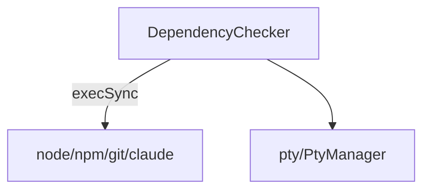

---
paths:
  - "claude-driver/src/main/lib/deps/**/*"
---

<!-- parent: lib -->

### 模块架构图

### 模块概览

- **职责**：启动期依赖检测（Node ≥18 / npm / Git / Claude Code CLI）+ 平台安装提示 + Claude CLI 自动安装。
- **输入**：`runDependencyCheck()` 同步调用（启动期）。
- **输出**：依赖状态列表、安装提示、自动安装结果。

### API 概览

- **`DependencyChecker`**
  - `checkNode(): DepStatus`
  - `checkNpm(): DepStatus`
  - `checkGit(): DepStatus`
  - `checkClaude(): DepStatus`
  - `checkAllDependencies(): DepStatus[]`
  - `autoInstallClaude(): Promise<{ok: boolean; message: string}>`
- **Types**: `DepStatus { name, found, version?, path?, error?, canAutoFix, manualUrl, installHint }`

### 数据模型

- **`DepStatus`**：依赖检测结果（name/found/version?/path?/error?/canAutoFix/manualUrl/installHint）。

### 关键流程

1. **启动检测**：`runDependencyCheck()` -> checkAllDependencies -> 缺失项弹窗引导安装
2. **自动安装**：`autoInstallClaude()` -> `npm install -g @anthropic-ai/claude-code`
3. **平台提示**：winget/brew/apt/dnf/pacman 五包管理器分支

### 状态机

无。

### 异常处理

- claude bin 未找到 -> refreshClaudeBin 重新解析
- 依赖缺失 -> canAutoFix 标记 + manualUrl/installHint

### 监控与测试

- **日志点**：检测结果、自动安装。
- **测试缺口 [待补]**：DependencyChecker 无单测（依赖 child_process execSync）。

> 详情请阅读对应 Architecture 块文件：`docs/architecture.md` § main § lib § deps（`.claude/rules/architecture/src/main/lib/deps.md`）
