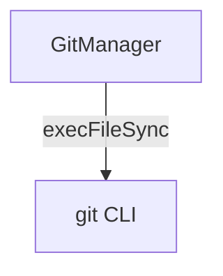

---
paths:
  - "claude-driver/src/main/lib/git/**/*"
---

<!-- parent: lib -->

### 模块架构图

### 模块概览

- **职责**：无状态 Git CLI 操作包装（节点级快照/回退/删除、项目级同步 GitHub）。
- **输入**：IPC invoke（GIT_COMMIT/RESET/ENSURE_REPO/DELETE_COMMIT/PUSH/GET_STATUS）。
- **输出**：结构化结果 `{ok: true, commitHash?} | {ok: false, error}`。

### API 概览

- **`const GitManager`**（对象式 API）
  - `commit(cwd, message): {ok: true, commitHash} | {ok: false, error}`
  - `reset(cwd, commitHash): {ok: true} | {ok: false, error}`
  - `ensureRepo(cwd): {ok: true} | {ok: false, error}` — init + checkout -b main
  - `push(cwd, branch?): {ok: true} | {ok: false, error}`
  - `getStatus(cwd): {ok: true, hasRemote, currentBranch} | {ok: false, error}`
  - `deleteCommit(cwd, commitHash): {ok: true} | {ok: false, error}` — rebase --onto（非交互）

### 数据模型

无（内联返回类型）。

### 关键流程

1. **节点快照**：commit(cwd, message) -> git add -A + git commit
2. **回退**：reset(cwd, commitHash) -> git reset --hard
3. **删除节点**：deleteCommit -> git rebase --onto（禁交互式 -i）
4. **远程同步**：push -> git push origin <branch>
5. **远程未配置/权限不足**：弹子窗口说明操作步骤

### 状态机

无（无状态）。

### 异常处理

- 禁用交互式 rebase（`-i`），全程非交互静默
- execFileSync 避免 shell 注入

### 监控与测试

- **日志点**：commit/reset/push/deleteCommit。
- **测试缺口 [待补]**：GitManager 无单测（依赖 child_process execFileSync + git CLI）。

> 详情请阅读对应 Architecture 块文件：`docs/architecture.md` § main § lib § git（`.claude/rules/architecture/src/main/lib/git.md`）
