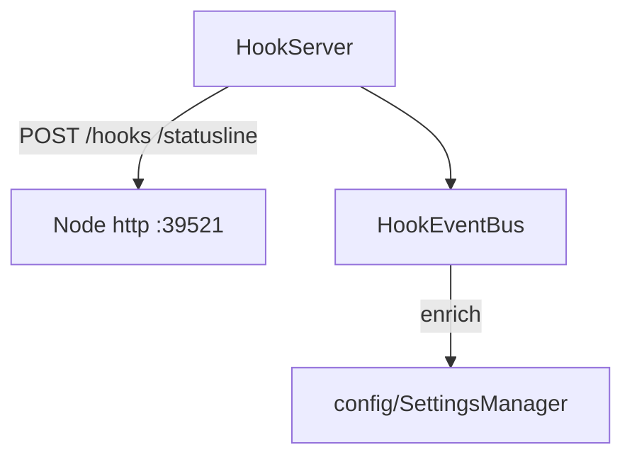

---
paths:
  - "claude-driver/src/main/lib/hook-server/**/*"
---

<!-- parent: lib -->

### 模块架构图

### 模块概览

- **职责**：三通道主通道。零依赖 HTTP Server 接收 Claude Code Hook 事件 + statusLine 数据，EventBus 推送渲染层。
- **输入**：HTTP POST `/hooks`（Hook payload）、`/statusline`（statusLine JSON）。
- **输出**：IPC.HOOK_EVENT/STATUS_LINE 推送（webContents.send）。

### API 概览

- **`HookServer`**
  - `startHookServer(port: number, handlers: HookServerHandlers): Promise<http.Server>`
  - `stopHookServer(server: http.Server): Promise<void>`
- **`HookEventBus`**
  - `createHookEventBus(getWindows: GetWindows, port: number): { dispatchHook, dispatchStatusLine }`
- **Types**:
  - `HookServerHandlers { onHookEvent: (payload: HookPayload) => void, onStatusLine: (data: StatusLineData) => void, onPortConflict: (port: number) => void, onError: (err: Error) => void }`
  - `GetWindows = () => BrowserWindow[]`

### 数据模型

- **`HookPayload`**（shared/types）：判别联合（SessionStart/PreToolUse/PostToolUse/Subagent/Notification/Stop/SessionEnd/PostCompact/PermissionRequest/PermissionDenied）。
- **`StatusLineData`**：model、context_window{current_usage,max_tokens,used_percentage}、rate_limits、transcript_path、cwd。
- **`HookEvent`**：eventName、sessionId、cwd、transcriptPath、payload、receivedAt、userHooks?。

### 关键流程

1. **Hook 接收**：POST `/hooks` -> 解析 HookPayload -> dispatchHook -> enrich user_hooks（getUserHooksForEvent）-> 广播 IPC.HOOK_EVENT 到 mainWindow + notificationWindow（如已打开）
2. **StatusLine 接收**：POST `/statusline` -> 解析 StatusLineData -> dispatchStatusLine -> webContents.send IPC.STATUS_LINE
3. **端口冲突**：onPortConflict 回调（不崩）
4. **窗口时序**：闭包 getWindows 返回目标窗口列表；广播到所有目标窗口；页面加载中 500ms 后重试 send

### 状态机

无。

### 异常处理

- 端口占用 -> onPortConflict（上层处理）
- 页面加载中 send 失败 -> 500ms 重试

### 监控与测试

- **日志点**：Hook 事件分发、statusLine 解析、端口冲突、重试。
- **测试缺口 [待补]**：HookServer/HookEventBus 无单测（依赖 http + electron webContents）。

> 详情请阅读对应 Architecture 块文件：`docs/architecture.md` § main § lib § hook-server（`.claude/rules/architecture/src/main/lib/hook-server.md`）
