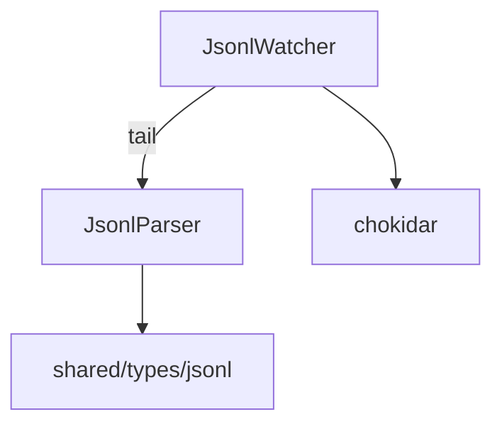

---
paths:
  - "claude-driver/src/main/lib/jsonl/**/*"
---

<!-- parent: lib -->

### 模块架构图

### 模块概览

- **职责**：JSONL 转录文件增量解析与监听（主 session + subagent depth:3）。
- **输入**：文件系统事件（chokidar）、JSONL 追加内容。
- **输出**：onRecord 回调（解析后的 JsonlRecord）。

### API 概览

- **`class JsonlWatcher`**
  - `watchFile(filePath: string, sessionId: string, readFromStart?: boolean, agentId?: string): void`
  - `watchProject(encodedProjectPath: string): void`
  - `unwatchFile(filePath: string): void`
  - `close(): void`
- **`JsonlParser`**
  - `parseJsonlLine(line: string): JsonlRecord | null`
  - `extractSessionIdFromPath(filePath: string): string | null`
  - `extractSubagentInfo(filePath: string): {sessionUuid: string; agentId: string} | null`
  - `hookEventToMessageType(eventName: HookEventName): JsonlMessageType`
- **Types**: `JsonlWatcherCallbacks { onRecord, onError }`

### 数据模型

- **`JsonlRecord`**（shared/types/jsonl）：uuid?、type、text?、toolUse?、toolResult?、cwd?、sessionId?、isSidechain?、agentId?、isBranchStart?、usage?、model?、raw?、parsedAt。
- **`JsonlUsage`**：inputTokens、outputTokens、cacheCreationTokens、cacheReadTokens。
- **`WatchedFile`**（internal）：filePath、sessionId、agentId?、readOffset、prevWasHistorySnapshot?。

### 关键流程

1. **实时 tail**：chokidar 监听 -> 新行 -> parseJsonlLine -> onRecord（带 sessionId + agentId?）
2. **历史回看**：readFromStart=true -> 全量解析 -> IPC.JSONL_RECORDS（批量）
3. **Subagent 自动发现**：depth:3 覆盖 `<uuid>/subagents/agent-*.jsonl` -> 新文件自动 watch
4. **Branch 起点标记**：追踪 `file-history-snapshot` 记录 -> 标记 isBranchStart

### 状态机

无（无状态解析）。

### 异常处理

- 文件监听静默停止 -> 上层轮询兜底
- tail offset 去重防重复处理

### 监控与测试

- **日志点**：watch/unwatch、新行解析、subagent 发现、branch 快照。
- **测试缺口 [待补]**：JsonlParser/JsonlWatcher 无单测（依赖文件系统 + chokidar）。

> 详情请阅读对应 Architecture 块文件：`docs/architecture.md` § main § lib § jsonl（`.claude/rules/architecture/src/main/lib/jsonl.md`）
