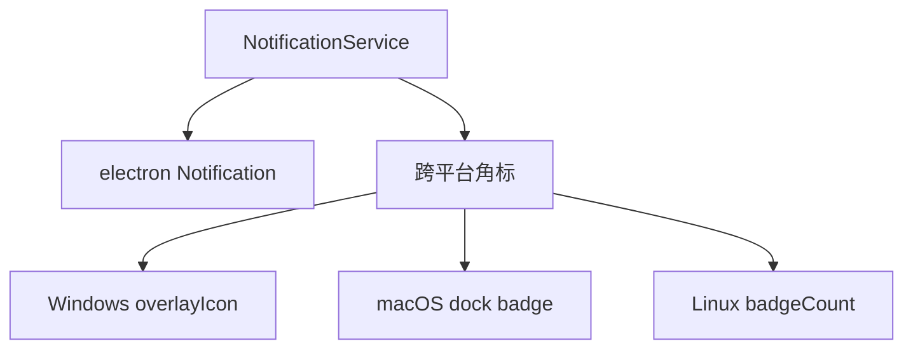

---
paths:
  - "claude-driver/src/main/lib/notification/**/*"
---

<!-- parent: lib -->

### 模块架构图

### 模块概览

- **职责**：桌面通知 + 跨平台任务栏角标管理。
- **输入**：main/index.ts 在 PermissionRequest Hook 触发 notify+increment、审批后 decrement。
- **输出**：桌面通知（electron Notification）、任务栏角标。

### API 概览

- **`const NotificationService`**（对象式 API）
  - `init(getWindow: GetWindow): void`
  - `notify(title: string, body: string): void`
  - `setBadge(n: number): void`
  - `incrementBadge(): void`
  - `decrementBadge(): void`
  - `resetBadge(): void`

### 数据模型

- **`GetWindow`**：`() => BrowserWindow | null`。
- **`pendingCount`**（internal）：主进程持有角标计数。

### 关键流程

1. PermissionRequest Hook -> notify + incrementBadge
2. 用户审批 -> decrementBadge
3. 点击桌面通知 -> IPC.NOTIFICATION_FOCUS_TAB（切通知 tab）

### 状态机

无。

### 异常处理

- **当前限制 [待确认]**：`desktopNotificationsEnabled` 死开关（notify 不读此开关）
- 角标计数硬编码为「待处理权限请求数」语义

### 监控与测试

- **日志点**：notify/increment/decrement。
- **测试缺口 [待补]**：NotificationService 无单测（依赖 electron API）。

> 详情请阅读对应 Architecture 块文件：`docs/architecture.md` § main § lib § notification（`.claude/rules/architecture/src/main/lib/notification.md`）
