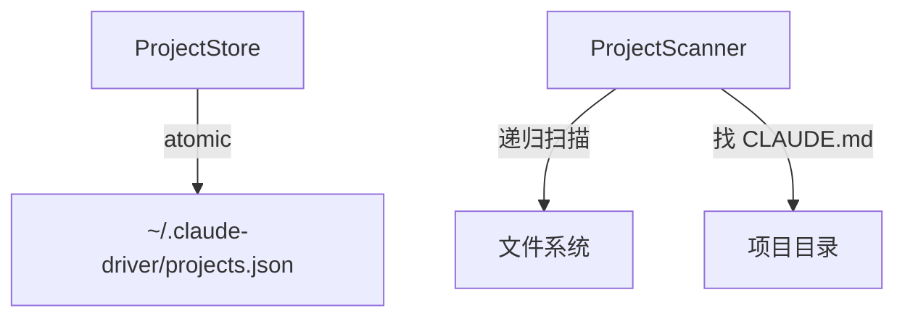

---
paths:
  - "claude-driver/src/main/lib/projects/**/*"
---

<!-- parent: lib -->

### 模块架构图

### 模块概览

- **职责**：项目记录单持久化 + 目录扫描发现项目。
- **输入**：IPC invoke（PROJECT_LIST/CREATE/SCAN/UPDATE/UPDATED/HISTORY_SCAN）。
- **输出**：项目列表、扫描结果、认领状态更新。

### API 概览

- **`ProjectStore`**
  - `readProjectsFile(): ProjectsFile`
  - `writeProjectsFile(data: ProjectsFile): void`
  - `readProjects(): Project[]`
  - `upsertProject(project: Project): void`
  - `updateProjectClaims(updates: Array<{projectId: string; claimStatus: ClaimStatus}>): void`
  - `isInitCompleted(): boolean`
  - `setInitCompleted(lastRootDir: string | null): void`
  - `getLastRootDir(): string | null`
  - `projectsFileExists(): boolean`
- **`ProjectScanner`**
  - `scanForProjects(rootDir: string): Promise<ScannedProject[]>`
  - `isGitRepo(dir: string): boolean`

### 数据模型

- **`ProjectsFile`**：version、initCompleted、lastRootDir、projects。
- **`ScannedProject`**：path、name、isGitRepo。
- **`Project`**（shared/types）：id、name、path、claimStatus、isGitRepo、activeSessionId、sessionIds[]、lastActiveAt、feishuBot?。
- **`ClaimStatus`**：`1 | 0 | -1`（claimed/unclaimed/ignored）。

### 关键流程

1. **初始化 SOP**：扫描根目录（max depth 6，排除 node_modules）-> 认领清单 -> updateProjectClaims
2. **新建项目**：upsertProject -> PROJECT_CREATE -> SESSION_START
3. **后续打开**：加载 claimStatus=1 的项目

### 状态机

- **ClaimStatus**：1（认领）/ 0（稍后决定）/ -1（忽略）。

### 异常处理

- projectsFile 不存在 -> 创建 DEFAULT_FILE
- 扫描深度限制 + 排除规则防性能问题

### 监控与测试

- **日志点**：扫描结果、认领更新、upsert。
- **测试缺口 [待补]**：ProjectStore/ProjectScanner 无单测。

> 详情请阅读对应 Architecture 块文件：`docs/architecture.md` § main § lib § projects（`.claude/rules/architecture/src/main/lib/projects.md`）
