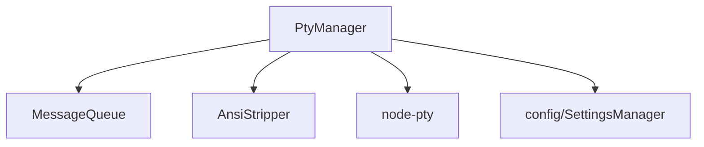

---
paths:
  - "claude-driver/src/main/lib/pty/**/*"
---

<!-- parent: lib -->

### 模块架构图

### 模块概览

- **职责**：多 Claude 会话 PTY 生命周期管理 + 消息队列 + ANSI 清洗。
- **输入**：IPC.SESSION_START/INPUT/STOP/RESUME（spawn claude stream-json）、Stop Hook 触发消息出队。
- **输出**：PTY stdout（onData 回推）、TERM_DATA 推送、PERMISSION_RESPOND 注入。

### API 概览

- **`class PtyManager`**
  - `startSession(opts: PtyStartOptions): void`
  - `startBare(opts, args: string[]): void`
  - `startCommand(opts, command: string, args: string[]): void`
  - `resumeSession(opts & {resumeSessionId: string}): void`
  - `writeToSession(sessionId: string, text: string): void`
  - `rawWrite(sessionId: string, text: string): void`
  - `stopSession(sessionId: string): void`
  - `findSessionByCwd(cwd: string): string | null`
  - `getStatus(sessionId: string): SessionStatus | null`
  - `getActiveSessions(): string[]`
  - `stopAll(): void`
  - `resizeSession(sessionId: string, cols: number, rows: number): void`
- **`MessageQueue`**
  - `enqueue(message: string): void`
  - `onStop(): void`
  - `get length(): number`
  - `clear(): void`
- **`AnsiStripper`**
  - `stripAnsi(raw: string): string`
  - `isPrintableContent(raw: string): boolean`
- **Standalone**: `resolveClaudeBin(): string`、`refreshClaudeBin(): string`、`getClaudeBin(): string`
- **Types**: `PtyStartOptions { sessionId, projectPath, permissionMode, model?, onData, onExit }`

### 数据模型

- **`PtyInstance`**（internal）：pty、sessionId、projectPath、status、lastActivityAt、heartbeatTimer、timeoutTimer。
- **`SessionStatus`**（shared）：`'Running' | 'Paused' | 'Interrupted' | 'Completed'`。

### 关键流程

1. **startSession**：spawn claude（stream-json）-> onData 回推 -> 早期 PTY_BIND(ptyId 占位) -> autoWatchTranscript 检测 JSONL -> bindPtyToClaudeSession -> PTY_BIND(真实)
2. **resumeSession**：`claude -r <claudeId>`（不发 SessionStart）-> 依赖 autoWatchTranscript
3. **stopSession**：`\x03\x03` + 500ms 等待 + pty.kill（不手动 unbind）
4. **MessageQueue**：用户输入 -> enqueue（isProcessing=true 时）；Stop Hook -> onStop -> 取队首 -> writeToSession

### 状态机

- **SessionStatus**：Running -> Paused（Stop Hook）/ Interrupted（stopSession）/ Completed（SessionEnd）。

### 异常处理

- claude bin 未找到 -> refreshClaudeBin 重新解析
- 心跳 10s 检测 + 30min 无交互超时 -> 自动关闭

### 监控与测试

- **日志点**：session start/stop、bind/unbind、消息入队/出队、心跳超时。
- **测试缺口 [待补]**：PtyManager 无单测（依赖 node-pty）。

> 详情请阅读对应 Architecture 块文件：`docs/architecture.md` § main § lib § pty（`.claude/rules/architecture/src/main/lib/pty.md`）
