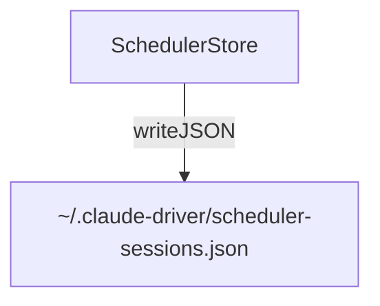

---
paths:
  - "claude-driver/src/main/lib/scheduler/**/*"
---

<!-- parent: lib -->

### 模块架构图

### 模块概览

- **职责**：定时任务持久化存储（按 projectPath 分组，含 claudeId + 任务列表）。
- **输入**：IPC invoke（SCHEDULER_LIST/CREATE/TOGGLE/DELETE）。
- **输出**：任务列表、操作结果。

### API 概览

- **`SchedulerStore`**
  - `readSchedulerSessions(): SchedulerStore`
  - `writeSchedulerSessions(data: SchedulerStore): void`
  - `appendTaskToSession(projectPath: string, claudeId: string, task: SchedulerTaskRecord): SchedulerStore`
  - `deleteTask(taskId: string): SchedulerStore`
  - `updateClaudeId(projectPath: string, claudeId: string): void`

### 数据模型

- **`SchedulerTaskRecord`**：taskId、interval、prompt、createdAt。
- **`SchedulerSessionEntry`**：projectPath、claudeId、tasks。
- **`SchedulerStore`**：`SchedulerSessionEntry[]`。

### 关键流程

1. **创建任务**：appendTaskToSession -> 写入 scheduler-sessions.json
2. **暂停/恢复**：toggle -> 控制 loop PTY（需 claudeId 初始化）
3. **删除**：deleteTask
4. **7 天过期**：renderer 侧 formatExpiry 强制

### 状态机

无。

### 异常处理

- claudeId 未初始化 -> toggle disabled
- 每会话最多 50 任务

### 监控与测试

- **日志点**：任务 CRUD、toggle。
- **测试缺口 [待补]**：SchedulerStore 无单测。
- **待优化**：当前为 `/loop` 间隔触发，cron 式定时为规划方向。

> 详情请阅读对应 Architecture 块文件：`docs/architecture.md` § main § lib § scheduler（`.claude/rules/architecture/src/main/lib/scheduler.md`）
