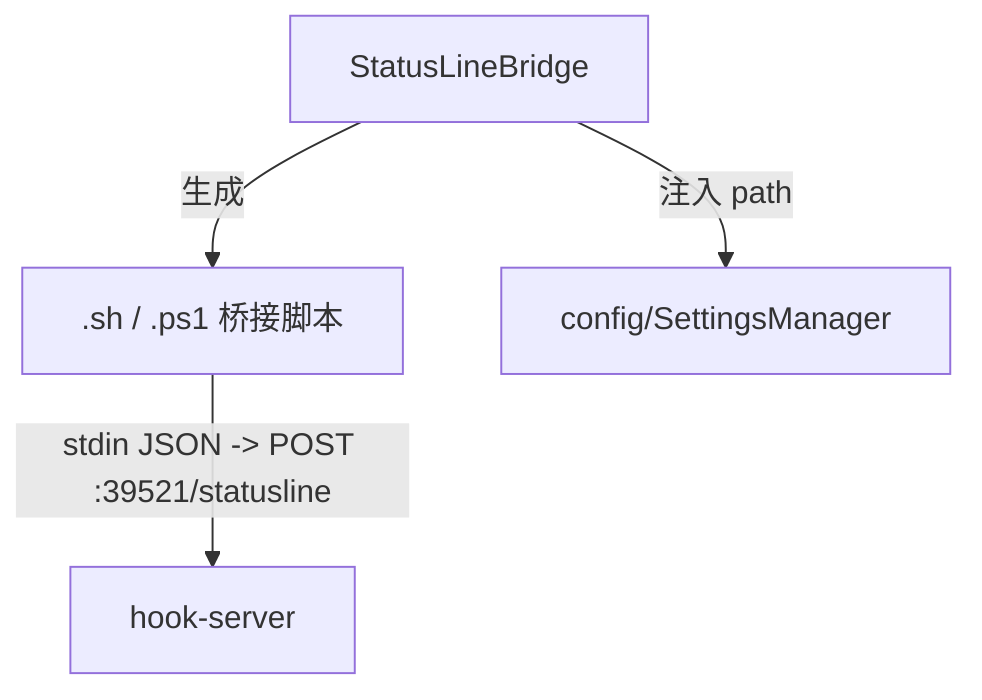

---
paths:
  - "claude-driver/src/main/lib/statusline/**/*"
---

<!-- parent: lib -->

### 模块架构图

### 模块概览

- **职责**：生成 statusLine 桥接脚本（Unix .sh / Windows .ps1）并注入 `~/.claude/settings.json` 的 statusLine 字段。
- **输入**：启动期 `setupStatusLineBridge(port)` 调用。
- **输出**：脚本文件（~/.claude-driver/statusline-bridge.sh/.ps1）、settings.json statusLine 字段。

### API 概览

- **`StatusLineBridge`**
  - `setupStatusLineBridge(port: number): void`
  - `removeStatusLineBridge(): void`

### 数据模型

无（脚本生成 + 注入）。

### 关键流程

1. **启动**：setupStatusLineBridge -> 生成脚本（curl/Invoke-WebRequest）+ 注入 settings.json statusLine 字段
2. **运行**：Claude Code 每 ~300ms 唤起脚本 -> POST `/statusline` -> HookEventBus.dispatchStatusLine -> IPC.STATUS_LINE

### 状态机

无。

### 异常处理

- 脚本不存在 -> Claude Code 调用失败（不影响主流程）

### 监控与测试

- **日志点**：脚本生成、注入。
- **测试缺口 [待补]**：StatusLineBridge 无单测。

> 详情请阅读对应 Architecture 块文件：`docs/architecture.md` § main § lib § statusline（`.claude/rules/architecture/src/main/lib/statusline.md`）
