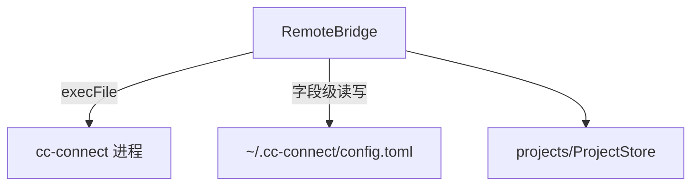

---
paths:
  - "claude-driver/src/main/services/**/*"
---

<!-- parent: main -->

### 模块架构图

### 模块概览

- **职责**：cc-connect 远程交互（飞书 bot）安装检测 + `~/.cc-connect/config.toml` 字段级读写。
- **输入**：IPC invoke（CC_CONNECT_*）、cc-connect 进程 stdout。
- **输出**：安装状态、TOML 配置、服务启停状态、日志推送。

### API 概览

- **`class RemoteBridgeService`**
  - `checkInstall(): Promise<{installed: boolean; version?: string}>` — execFile which/where
  - `saveProjectBot(projectId: string, bot: FeishuBotConfig): void` — patch 匹配 [[projects]]
  - `readProjectConfig(projectName: string): FeishuBotConfig | null`
  - `ensureConfig(): void`
  - private: `readToml(): Record<string,unknown>`、`writeToml(data): void`
  - `export default RemoteBridgeService`

### 数据模型

- **`FeishuBotConfig`**（shared/types）：appId、appSecret、adminFrom、allowFrom、enableFeishuCard、progressStyle、agentMode、model、provider。
- **TOML 结构**：`[[projects]]` → `[[projects.bots]]` → `[projects.bots.feishu_config]` + `[[projects.bots.allowed_senders]]`。

### 关键流程

1. 检测安装 -> 未装引导（CHAT_START+CHAT_WINDOW_OPEN 预填 `npm install -g cc-connect`）
2. 保存 bot -> readToml -> patch 匹配 [[projects]] -> writeToml
3. start/stop cc-connect 服务

### 状态机

无。

### 异常处理

- TOML 嵌套结构严格控制缩进顺序
- config.toml 字段级合并保留其他项目

### 监控与测试

日志点：CC_CONNECT_START/STOP/LOG。

> 详情请阅读对应 Architecture 块文件：`docs/architecture.md` § main § services（`.claude/rules/architecture/src/main/services.md`）
