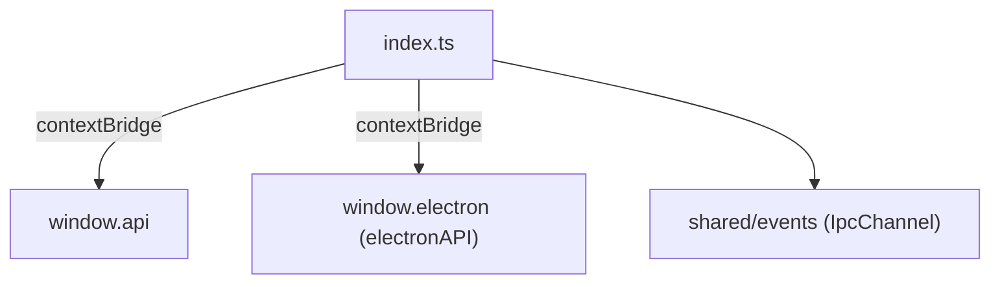

---
paths:
  - "claude-driver/src/preload/**/*"
---

<!-- parent: TDD -->

### 模块架构图

### 模块概览

- **职责**：ContextBridge IPC 包装。将 ipcMain handler 映射为类型安全 `window.api`（invoke/on/removeAllListeners）。安全模型：`contextIsolation` 默认开启，渲染进程不直接接触 ipcRenderer，仅获 3 个收窄方法 + @electron-toolkit/preload 的 electronAPI。
- **输入**：ipcMain.handle（main 注册）。
- **输出**：window.api（invoke/on/removeAllListeners）+ window.electron（electronAPI）。

### API 概览

- **`preload/index.ts`**
  - `window.api.invoke(channel: IpcChannel, ...args: unknown[]): Promise<unknown>` — Renderer->Main 双向请求
  - `window.api.on(channel: IpcChannel, listener: (...args: unknown[]) => void): (() => void)` — 订阅 Main->Renderer 推送；包裹 listener 去 IpcRendererEvent；返回退订函数
  - `window.api.removeAllListeners(channel: IpcChannel): void`
  - `process.contextIsolated` true 时用 contextBridge，否则直挂 window
- **`preload/index.d.ts`**
  - `window.electron: ElectronAPI`
  - `window.api: { invoke, on, removeAllListeners }`（同上签名）

### 数据模型

- **`IpcChannel`**（shared/events）：联合类型约束 channel 参数。
- **`ElectronAPI`**（@electron-toolkit/preload）：进程信息/版本等。

### 关键流程

1. **双向请求**：Renderer 调 `window.api.invoke(channel, ...args)` -> ipcRenderer.invoke -> main ipcMain.handle -> 返回结果
2. **单向推送**：main webContents.send(channel, data) -> ipcRenderer.on -> 包裹 listener 去 event -> 用户 listener
3. **退订**：window.api.on 返回 unsubscribe 函数 -> 调 unsub 清理监听

### 状态机

无。

### 异常处理

- contextIsolation 默认开启（安全）
- channel 参数类型约束（IpcChannel 联合）

### 监控与测试

- **测试缺口 [待补]**：preload 无单测（依赖 electron contextBridge）。

> 详情请阅读对应 Architecture 块文件：`docs/architecture.md` § preload（`.claude/rules/architecture/src/preload.md`）
