---
paths:
  - "claude-driver/src/renderer/**/*"
---

<!-- parent: TDD -->

### 模块架构图

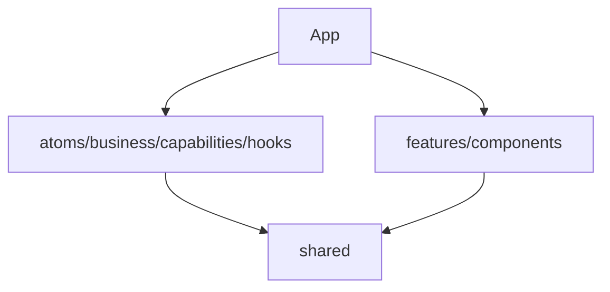

### 模块概览

- **职责**：渲染进程（Chromium + React）。状态逻辑层 + 业务 UI 层 + 根 App（hash 路由 + 3-tab + pop-out）。
- **输入**：IPC push（HOOK_EVENT/STATUS_LINE/JSONL_*/PTY_BIND/...）、用户交互。
- **输出**：IPC invoke（PROJECT_*/SESSION_*/GIT_*/CONFIG_*/...）、UI 渲染。

### API 概览

- **`App`**：hash 路由（`#/terminal`、`#/chat` pop-out 各自 JotaiProvider）+ 3-tab（global/project/notifications）+ 全局 overlay（GlobalSettingsModal/InitSopModal）。
- **状态逻辑层**：atoms（16）/ business（9）/ capabilities（11+utils5）/ hooks（6）。
- **业务 UI**：features（9）/ components（6）。

### 数据模型

- **`TabId`**：`'global' | 'project' | 'notifications'`。
- 各状态见 atoms/*；业务数据见 shared/types。

### 关键流程

1. **IPC->Atom 桥接**：useIpcBridge 注册 -> business -> capabilities -> store.set(atom) -> 组件 re-render
2. **用户操作**：组件 -> IPC.invoke -> main -> 推送回 -> atom 更新
3. **Pop-out**：hash 路由 -> 独立 JotaiProvider -> TerminalPage/ChatPage

### 状态机

- **4 态视口**：overview/focus/follow/locked（viewport.atom）。
- **Branch 握手**：IDLE/PENDING_CONFIRM/PENDING_BIND（business/branchHandler）。

### 异常处理

- 组件错误边界（React ErrorBoundary）。
- IPC 失败 -> 日志警告，不崩。

### 监控与测试

- **日志点**：IPC 事件分发、atom 变更、组件 render/insertion/layout/effect（ProcessLineCanvas `[DIAG]`）。
- **测试覆盖**：atoms/business/capabilities/utils（见 __tests__）；无组件测试。

## atoms
<!-- parent: renderer -->
### 模块架构图

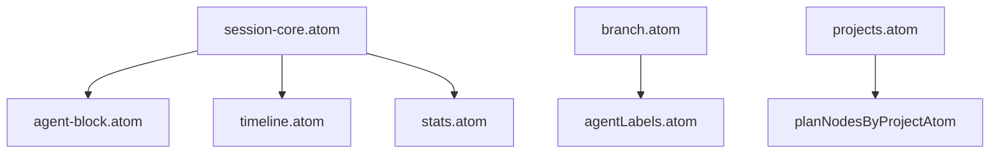

### 模块概览

- **职责**：Jotai 原子状态容器（16 文件）。原始 atom（可变）+ 派生 atom（计算选择器）。无逻辑、无 IPC、无 React。
- **输入**：被 business 经 capabilities 写（store.set）；被 hooks/features 经 useAtomValue 读。
- **输出**：atom 值（状态）。

### API 概览

- **`session-core.atom`**：`activeSessionsAtom: atom<Map<string,Session>>`、`ptySessionIdsAtom: atom<Set<string>>`（由 `addToRealtime`/`removeFromRealtime` 配对写入，是 `runningProjectsAtom` 的关键依赖）、派生 `sessionByIdAtom`/`runningSessionCountAtom`。
- **`pty-binding.atom`**：`ptyBindingsAtom: atom<PtyBindings>`（双向 Map）。
- **`branch.atom`**：`sessionRelationsAtom: atom<Map<string,SessionRelation>>`、`branchCountAtom: atom<Map<string,number>>`。
- **`agent-block.atom`**：`agentBlocksAtom: atom<Map<string,AgentBlockState>>`、`sessionFrameHeightsAtom`（atomFamily）、`allFrameHeightsAtom`、`subagentIdsAtom`、`agentCallCountAtom`、`activeSubagentSlotsAtom`、`pendingBtwAtom`、`nodeYOffsetsAtom`。
- **`timeline.atom`**：`timelineBySessionAtom`、`lineInsertionsBySessionAtom`、`subagentTimelineAtom`、`scrubberIndexAtom`、`cursorNodeIndexAtom`。
- **`context-panel.atom`**：`contextPanelAtom`、`selectedContextAgentAtom`。
- **`projects.atom`**：`projectsAtom`、派生 `projectByIdAtom`/`claimedProjectsAtom`/`pendingProjectCountAtom`/`allPlanNodesMapAtom`/`runningProjectsAtom`（派生：ptySessionIds.has + Running/Paused + pathMatches → RunningProject[]）、atomFamily `planNodesByProjectAtom`/`projectSettingsAtom`/`planIndicatorsByProjectAtom`/`milestonesByProjectAtom`、`activeProjectIdAtom`。
- **`permission.atom`**：`permissionRequestsAtom`。
- **`notification.atom`**：`notificationQueueAtom`、派生 `unreadCountAtom`/`pendingRequestCountAtom`。
- **`pending-starts.atom`**：`pendingPtyStartsAtom: atom<Map<string,PendingPtyStart>>`。
- **`insight.atom`**：`insightStateAtom`（idle/loading/ready/error）、`insightReportPathAtom`、`insightErrorAtom`。
- **`scheduler.atom`**：`schedulerTasksAtom: atom<SchedulerTask[]>`。
- **`viewport.atom`**：`viewportModeAtom`（overview/focus/follow/locked）、`focusedSessionIdAtom`、`focusRequestAtom`、`nodeJumpRequestAtom`。
- **`stats.atom`**：`sessionTokensAtom`（atomFamily）、`driverConfigAtom`、派生 `tokenStatsAtom`/`todayCostUsdAtom`/`todayTokensAtom`/`projectTotalTokensAtom`、`latestStatusLineAtom`。
- **`agentLabels.atom`**：`agentLabelsAtom: atom<Map<string,string>>`（派生，主线/AgentN/Branch/历史主线）。
- **`sessions.atom`**：barrel re-export（向后兼容）。

### 数据模型
### 关键流程
### 状态机
### 异常处理
### 监控与测试

## business
<!-- parent: renderer -->
### 模块架构图

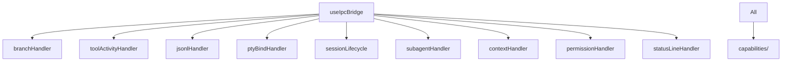

### 模块概览

- **职责**：IPC 事件处理器（9 文件，工厂模式 `createXxxHandler(store)`）。监听 IPC，转译 payload 为 capability 调用变更 atom。含状态机（branchHandler 握手三态）与插入线构建（toolActivityHandler）。
- **输入**：IPC push（HOOK_EVENT/STATUS_LINE/JSONL_*/PTY_BIND/...）。
- **输出**：atom 变更（经 capabilities）、持久化 sidecar（经 capabilities）。

### API 概览

- **`createBranchHandler(store)`** → `{ register, handlePreNotify, handleConfirm, handlePtyBind, handleBranchSnapshot, isPendingBind }`
- **`createContextHandler(store)`** → `{ register, handlePostToolUseContext, handlePostCompact }`
- **`createJsonlHandler(store)`** → `{ register, handleRecord, handleBatchRecords, handleSubagentRecord }`
- **`createPermissionHandler(store)`** → `{ register, handlePermissionRequest, handlePermissionDenied }`
- **`createPtyBindHandler(store)`** → `{ register, handleBind, handleUnbind }`
- **`createSessionLifecycle(store, isBranchPending?)`** → `{ register, handleSessionStart, handleSessionEnd, handleStop }`
- **`createStatusLineHandler(store)`** → `{ register, handleStatusLine }`
- **`createSubagentHandler(store)`** → `{ register, handleSubagentStart, handleSubagentStop }`
- **`createToolActivityHandler(store)`** → `{ register, handlePreToolUse, handlePostToolUse, handlePostToolUseFailure }`

### 数据模型
### 关键流程
### 状态机
### 异常处理
### 监控与测试

## capabilities
<!-- parent: renderer -->
### 模块架构图

```mermaid
graph TD
    AgentActivity["agentActivity (M)"] --> atoms["atoms/"]
    BranchRegistry["branchRegistry (L)"] --> atoms
    ContextTracker["contextTracker (N)"] --> atoms
    PermissionQueue["permissionQueue (O)"] --> atoms
    GitCapability["gitCapability (P)"] --> atoms
    GitCapability -.INSERTION_*.-> IPC["IPC"]
    PtyBindings["ptyBindings (I)"] --> atoms
    RealtimeVis["realtimeVisibility (J)"] --> atoms
    SessionRegistry["sessionRegistry (H)"] --> atoms
    SessionRegistry -.SESSION_META_WRITE.-> IPC
    TimelineStore["timelineStore (K)"] --> atoms
    TimelineStore -.INSERTION_*.-> IPC
    TokenCapability["tokenCapability (M7)"] --> atoms
    TokenCapability -.TOKEN_SCAN_FILE.-> IPC
    JumpableNodes["jumpableNodes"] --> atoms
    Utils["utils/"]
```

### 模块概览

- **职责**：store 变更 + 持久化助手（11 文件，接受注入 `store: Pick<TestStore,'get'|'set'>`）。对特定 atom 的原子读写操作，按域分组。部分调用 IPC 持久化到 JSONL sidecar。
- **输入**：被 business/hooks 调用。
- **输出**：atom 变更（store.set）+ 可选 IPC 持久化。

### API 概览

- **agentActivity(M)**：`toolStart(store, claudeId, cwd, toolEntry)`、`toolDone(store, claudeId, matcher)`、`toolFailed(store, claudeId, matcher)`、`showSubagent(store, claudeId, info)`、`hideSubagent(store, claudeId)`、`registerSubagentId(store, claudeId, agentId)`、`incrementAgentCount(store, claudeId): number`、`allocateSubagentSlot(store, claudeId, toolUseId): number`、`releaseSubagentSlot(store, claudeId, toolUseId): number`、`setInsight(store, claudeId, text)`、`clearWorkStatus(store, claudeId)`。
- **branchRegistry(L)**：`registerBranch(store, childId, parentClaudeId, opts)`（自动算 side/lineLength/branchIndex）、`updateBranchSnapshot(store, childId, branchStartUuid)`、`cachePendingSnapshot`/`consumePendingSnapshot`（快照竞态缓存）、`getBranchRelation`、`getChildBranches`、`isBranchParent`。
- **contextTracker(N)**：`addContextComponent(store, claudeId, comp)`、`clearDynamicContext(store, claudeId)`、`getContext(store, claudeId)`。
- **gitCapability(P)**：`markNodeGitted(store, claudeId, nodeId, commitHash)`、`unmarkNodeGitted(store, claudeId, nodeId)`、`replayGitMarks(store, claudeId, marks)` — IPC: `GIT_MARK_SAVE`/`GIT_MARK_DELETE`。
- **permissionQueue(O)**：`enqueueRequest(store, req)`（dedup by requestId）、`dequeueRequest(store, requestId)`、`getPendingRequests(store)`。
- **ptyBindings(I)**：`bindPty(store, ptyId, claudeId)`、`unbindPty(store, ptyId, claudeId)`、`resolveClaudeId(store, ptyId): string|undefined`、`resolvePtyId(store, claudeId): string|undefined`。
- **realtimeVisibility(J)**：`addToRealtime(store, claudeId)`、`removeFromRealtime(store, claudeId)`、`isRealtimeVisible(store, claudeId): boolean`、`getRealtimeVisible(store): ReadonlySet<string>`。
- **sessionRegistry(H)**：`createSession(store, key, session)`（+ IPC `SESSION_META_WRITE`）、`patchSession(store, claudeId, patch)`、`completeSession(store, claudeId, endedAt)`、`getSession(store, claudeId)`、`findSessionByCwd(store, cwd)`、`findSessionByPtyId(store, ptyId, bindings)`。
- **timelineStore(K)**：`appendTimelineNode`/`appendTimelineNodes`、`getTranscriptPath`、`appendInsertion`（+ IPC `INSERTION_APPEND`）、`updateInsertionStatus`（matcher by id/toolName/toolUseId）、`patchInsertion`（deep-merge badgeContent，+ IPC `INSERTION_PATCH`）、`resolveTimelineKey`、`getTimelineLength`、`getVisibleNodeCount`、`getLastNodeParsedAt`、`clearTimeline`、`appendSubagentInsertion`（+ `INSERTION_SUBAGENT_APPEND`）、`updateSubagentInsertionStatus`、`patchSubagentInsertion`（+ `INSERTION_SUBAGENT_PATCH`）。
- **tokenCapability(M7)**：`updateSessionTokensFromFile(store, claudeId, transcriptPath): Promise<void>`（IPC `TOKEN_SCAN_FILE`，取 max vs existing）、`addTokensFromRecord(store, claudeId, record)`（实时增量）、`setDriverConfig(store, config)`（mirror to driverConfigAtom）、`getSessionTokens(store, claudeId)`。
- **jumpableNodes**：`buildJumpableNodes(timelineNodes, insertions): JumpableNode[]`（纯函数）。

### 数据模型
### 关键流程
### 状态机
### 异常处理
### 监控与测试

## components
<!-- parent: renderer -->
### 模块架构图

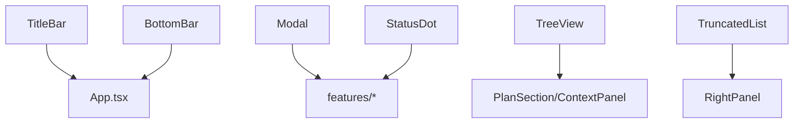

### 模块概览

- **职责**：通用、feature-agnostic 的展示型 React 组件（6 组件 + 1 dev），跨页复用。各自 default export，无 barrel。
- **输入**：props。
- **输出**：React 渲染。

### API 概览

- **`TitleBar`**：props `{ runningCount, todayTokens, todayCostUsd }`；38px 顶栏（macOS 控件装饰 + logo + 标题 + 右侧统计），`-webkit-app-region: drag`。
- **`BottomBar`**：props `{ activeTab, onTabChange, notificationCount, monthlyTokens, activeProjectTokens, projectCount, agentCount, pendingRequests, onOpenSettings }`；38px 底栏（3 tab + 右侧统计 + 设置按钮）。
- **`Modal`**：props `{ open, onClose, title?, width? (default 480), children, showClose? (default true) }`；全局 overlay（blur 背景 + Portal to body + ESC/click-outside 关闭）。
- **`StatusDot`**：props `{ status: DotStatus, size?: DotSize (sm|md|lg, default md), className? }`；6 状态点（running 绿脉/paused 橙脉/done 绿静/todo 空心/idle 灰/error 红）；导出 `DotStatus`/`DotSize` 类型。
- **`TreeView`**：props `{ nodes: TreeNode[], renderLabel?, defaultExpanded? (default false), indentPx? (default 12), className? }`；递归可展开树；导出 `TreeNode { id, label: ReactNode, children?, defaultExpanded? }`。
- **`TruncatedList<T>`**：props `{ items: T[], renderItem, maxVisible? (default 3), overlayTitle?, className? }`；≤3 全显；>3 显 2+`···N` 点击展开 overlay popover。
- **`Versions`**：props none；dev 组件（列 Electron/Chromium/Node 版本）。

### 数据模型
### 关键流程
### 状态机
### 异常处理
### 监控与测试

## features
<!-- parent: renderer -->
### 模块架构图

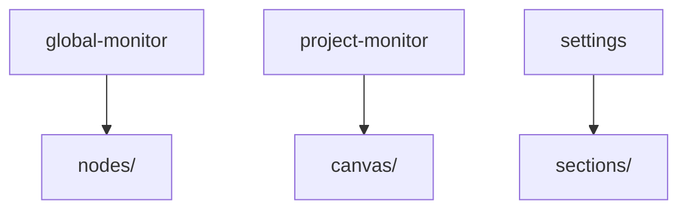

### 模块概览

- **职责**：业务 UI 模块（9 子目录）。每个对应 PRD 一类界面概念。
- **输入**：atoms/hooks/capabilities + components + shared。
- **输出**：UI 渲染 + IPC invoke。

### API 概览

各 feature API 详见对应子级块文件。整体无统一 API。

### 数据模型
### 关键流程
### 状态机
### 异常处理
### 监控与测试

## hooks
<!-- parent: renderer -->
### 模块架构图

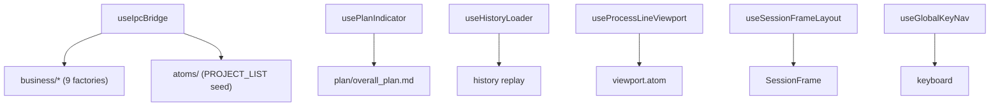

### 模块概览

- **职责**：React 胶水（6 文件）。挂载/卸载 IPC 编排（useIpcBridge）、生命周期状态机（usePlanIndicator/useHistoryLoader）、画布 UI 控制器（useGlobalKeyNav/useProcessLineViewport/useSessionFrameLayout）。
- **输入**：Jotai store（useStore()）、IPC push、DOM 事件。
- **输出**：atom 变更、视口控制、键盘导航。

### API 概览

- **`useIpcBridge(): void`**：IPC 编排入口。组装 9 business handlers（注册顺序 branch 优先），PROJECT_LIST seed，后台扫描 token（PROJECT_HISTORY_SCAN），直接处理 NOTIFICATION/PROJECT_UPDATED/SESSION_STATUS。
- **`usePlanIndicator(): void`**：Plan 数据管理 + 倒三角指示器状态机（active/possibly-paused/completed）。监听 PostToolUse plan 文件写入 -> 重拉取 -> diff T 状态 -> 生成 Milestone。导出 `parsePlanNodes(content, projectId): PlanNode[]`。
- **`useHistoryLoader(): void`**：历史 session 加载（GIT_ENSURE_REPO → PROJECT_HISTORY_SCAN max 20 → 种子 activeSessionsAtom skip live → replay insertions/milestones/git-marks/branch relations → token-scan all → focus latest）。常量 `MAX_HISTORY_SESSIONS = 20`。
- **`useProcessLineViewport(flowRef, activeSessionIds): ViewportControl`**：4 态视口机（overview/focus/follow/locked）+ 节流 fitView 500ms。`ViewportControl` 接口（onUserMoveStart/End, onEscapeToFollow, focusSession, unfocusSession, onNewNodeInserted）。
- **`useSessionFrameLayout(sessionIds, heights, relations, nodeYOffsets?, startTimes?): FrameLayout[]`**：SessionFrame 位置计算（cluster-aware X + 时间堆叠 Y）。导出常量 `FRAME_WIDTH=1500`/`FRAME_GAP_X=40`/`FRAME_GAP_Y=24`/`FRAME_HEADER_HEIGHT=40`/`FRAME_FOOTER_HEIGHT=28`/`NODE_HEIGHT_ESTIMATE=120`/`BRANCH_INSERTION_LINE_HEIGHT=10`/`BRANCH_HANDLE_OFFSET=38`。`computeFrozenOffset(parentH): number`。
- **`useGlobalKeyNav(rf, layouts, focusSession, canvasContainerRef): void`**：←-> 框间跳转（cluster small-jump 到 branch / cross-cluster big-jump）；↑↓ 框内节点跳转（buildJumpableNodes → cursorNodeIndexAtom + nodeJumpRequestAtom + scrubberIndexAtom 同步 + requestAnimationFrame 微平移）。忽略 INPUT/TEXTAREA/contentEditable。

### 数据模型
### 关键流程
### 状态机
### 异常处理
### 监控与测试

## utils
<!-- parent: renderer -->
### 模块架构图

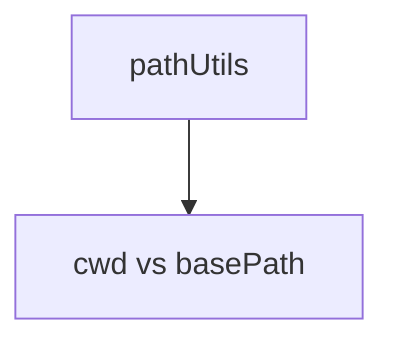

### 模块概览

- **职责**：渲染层通用工具。当前仅跨平台路径前缀匹配。
- **输入**：cwd、basePath。
- **输出**：boolean 匹配结果。

### API 概览

- **`pathUtils.ts`**
  - `pathMatches(cwd: string, basePath: string): boolean` — 规范化 `\`->`/`、大小写不敏感、`cwd===base || cwd.startsWith(base+'/')`。

### 数据模型
### 关键流程
### 状态机
### 异常处理
### 监控与测试

## styles
<!-- parent: renderer -->
### 模块架构图

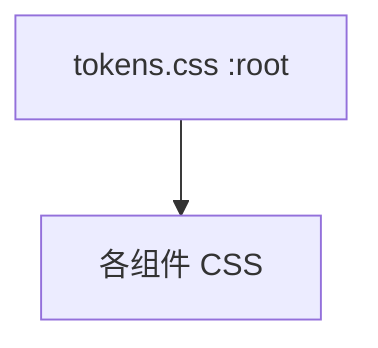

### 模块概览

- **职责**：全局 CSS Design Token 系统（权威）。Anthropic 暖色暗主题 + 响应式排版/间距 + 动画。
- **输入**：组件 CSS 经 `var(--...)` 引用。
- **输出**：CSS 自定义属性。

### API 概览

- **`tokens.css`**：`:root` 自定义属性（color bg0-bg4/orange --or/green/purple/red/blue status；响应式 typography `clamp()` 800-2560px；spacing；layout sizes/radii；shadows；pulse/blink keyframes；reset；scrollbar）。

### 数据模型
### 关键流程
### 状态机
### 异常处理
### 监控与测试

## i18n
<!-- parent: renderer -->
### 模块架构图

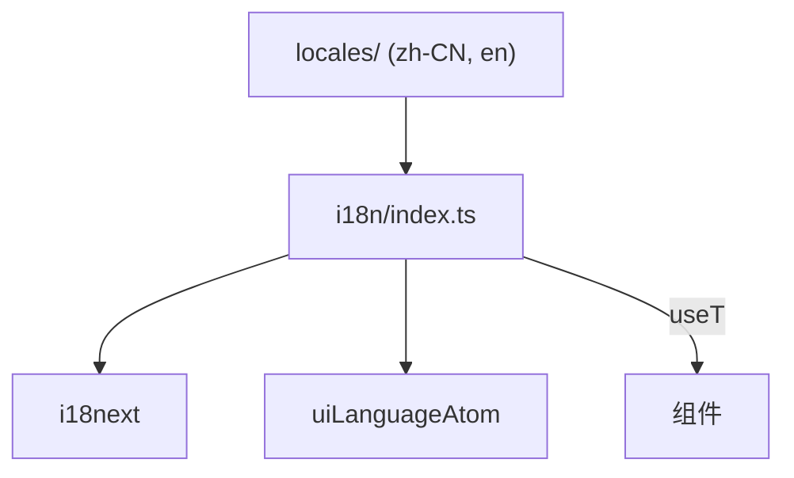

### 模块概览

- **职责**：i18next 翻译引擎 + Jotai atom 集成。atom 为单一真相源，i18next 为引擎。
- **输入**：locale 字典（zh-CN/en）、setLanguage 调用。
- **输出**：翻译后的字符串。

### API 概览

- **`i18n/index.ts`**
  - `uiLanguageAtom = atom<UILanguage>(FALLBACK_LANGUAGE)`
  - `useT(): { t: TFunction, language, setLanguage }`
  - `tStatic(key: string, vars?: Record<string, unknown>): string`
- **`i18n/types.ts`**
  - `type UILanguage = 'zh-CN' | 'en'`
  - `SUPPORTED_LANGUAGES: UILanguage[]`
  - `FALLBACK_LANGUAGE: UILanguage = 'zh-CN'`

### 数据模型
### 关键流程
### 状态机
### 异常处理
### 监控与测试

## assets
<!-- parent: renderer -->
### 模块架构图

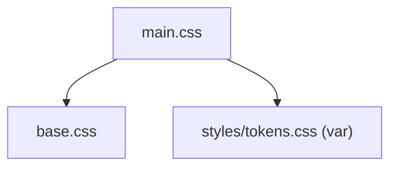

### 模块概览

- **职责**：electron-vite 脚手架遗留 CSS（base reset + scaffold 样式）。
- **输入**：main.tsx import。
- **输出**：全局样式。

### API 概览

- **`base.css`**：electron-vite 默认 color tokens（`--ev-c-*`）+ reset。
- **`main.css`**：import base.css + body/#root flex 布局 + code/versions 脚手架。

### 数据模型
### 关键流程
### 状态机
### 异常处理
### 监控与测试
