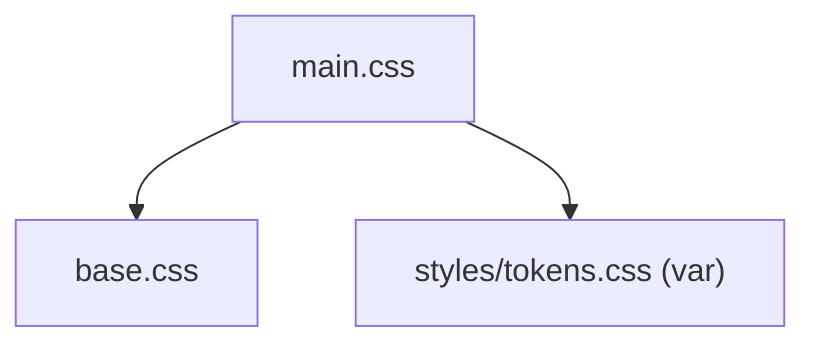

---
paths:
  - "claude-driver/src/renderer/src/assets/**/*"
---

<!-- parent: renderer -->

### 模块架构图

### 模块概览

- **职责**：electron-vite 脚手架遗留 CSS（base reset + scaffold 样式）。
- **输入**：main.tsx import。
- **输出**：全局样式。

### API 概览

- **`base.css`**：electron-vite 默认 color tokens（`--ev-c-*`）+ reset。
- **`main.css`**：import base.css + body/#root flex 布局 + code/versions 脚手架。

### 数据模型

无。

### 关键流程

- main.tsx import tokens.css；assets 为脚手架层。

### 状态机

无。

### 异常处理

- 遗留 [待清理]：`--ev-c-*` token 与 tokens.css 的 `--bg*`/`--or` 并存，旧 token 多为遗留。

### 监控与测试

无。

> 详情请阅读对应 Architecture 块文件：`docs/architecture.md` § renderer § assets（`.claude/rules/architecture/src/renderer/assets.md`）
