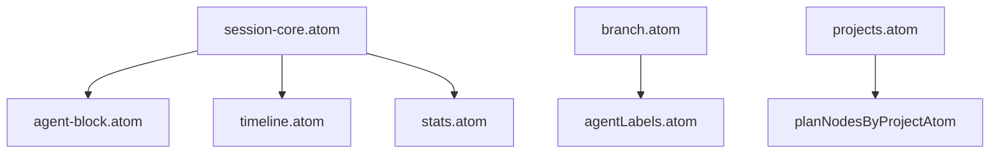

---
paths:
  - "claude-driver/src/renderer/src/atoms/**/*"
---

<!-- parent: renderer -->

### 模块架构图

### 模块概览

- **职责**：Jotai 原子状态容器（16 文件）。原始 atom（可变）+ 派生 atom（计算选择器）。无逻辑、无 IPC、无 React。
- **输入**：被 business 经 capabilities 写（store.set）；被 hooks/features 经 useAtomValue 读。
- **输出**：atom 值（状态）。

### API 概览

- **`session-core.atom`**：`activeSessionsAtom: atom<Map<string,Session>>`、`ptySessionIdsAtom: atom<Set<string>>`（由 `addToRealtime`/`removeFromRealtime` 配对写入，是 `runningProjectsAtom` 的关键依赖）、派生 `sessionByIdAtom`/`runningSessionCountAtom`。
- **`pty-binding.atom`**：`ptyBindingsAtom: atom<PtyBindings>`（双向 Map）。
- **`branch.atom`**：`sessionRelationsAtom: atom<Map<string,SessionRelation>>`、`branchCountAtom: atom<Map<string,number>>`。
- **`agent-block.atom`**：`agentBlocksAtom: atom<Map<string,AgentBlockState>>`、`sessionFrameHeightsAtom`（atomFamily）、`allFrameHeightsAtom`、`subagentIdsAtom`、`agentCallCountAtom`、`activeSubagentSlotsAtom`、`pendingBtwAtom`、`nodeYOffsetsAtom`。
- **`timeline.atom`**：`timelineBySessionAtom`、`lineInsertionsBySessionAtom`、`subagentTimelineAtom`、`scrubberIndexAtom`、`cursorNodeIndexAtom`。
- **`context-panel.atom`**：`contextPanelAtom`、`selectedContextAgentAtom`。
- **`projects.atom`**：`projectsAtom`、派生 `projectByIdAtom`/`claimedProjectsAtom`/`pendingProjectCountAtom`/`allPlanNodesMapAtom`/`runningProjectsAtom`（派生：ptySessionIds.has + Running/Paused + pathMatches → RunningProject[]）、atomFamily `planNodesByProjectAtom`/`projectSettingsAtom`/`planIndicatorsByProjectAtom`/`milestonesByProjectAtom`、`activeProjectIdAtom`。
- **`permission.atom`**：`permissionRequestsAtom`。
- **`notification.atom`**：`notificationQueueAtom`、派生 `unreadCountAtom`/`pendingRequestCountAtom`。
- **`pending-starts.atom`**：`pendingPtyStartsAtom: atom<Map<string,PendingPtyStart>>`。
- **`insight.atom`**：`insightStateAtom`（idle/loading/ready/error）、`insightReportPathAtom`、`insightErrorAtom`。
- **`scheduler.atom`**：`schedulerTasksAtom: atom<SchedulerTask[]>`。
- **`viewport.atom`**：`viewportModeAtom`（overview/focus/follow/locked）、`focusedSessionIdAtom`、`focusRequestAtom`、`nodeJumpRequestAtom`。
- **`stats.atom`**：`sessionTokensAtom`（atomFamily）、`driverConfigAtom`、派生 `tokenStatsAtom`/`todayCostUsdAtom`/`todayTokensAtom`/`projectTotalTokensAtom`、`latestStatusLineAtom`。
- **`agentLabels.atom`**：`agentLabelsAtom: atom<Map<string,string>>`（派生，主线/AgentN/Branch/历史主线）。
- **`sessions.atom`**：barrel re-export（向后兼容）。

### 数据模型

- **`AgentBlockState`**：workStatus、tools（ToolEntry[]）、experiences（ExperienceEntry[]）、subagent（SubagentInfo?）、insight（string?）、agentColor、agentLabel。
- **`ToolEntry`**：name、displayText、status（pending/running/done/failed）、category（tool/mcp/cli）。
- **`ExperienceEntry`**：name、category（skill/workflow）、status。
- **`SubagentInfo`**：agentId、description、status。
- **`TimelineNode`**：id、sessionId、type（user_input/assistant/tool_use/tool_result）、text?、toolName?、toolDisplayText?、toolUseId?、isError?、isBranchStart?、isGitted?、commitHash?、parsedAt。
- **`SessionRelation`**：parentSessionId、triggerNodeIndex、side（left/right）、lineLength、branchIndex、inheritedNodeCount、branchStartUuid、triggerYOffset。
- **`ContextComponent`**：type（system/claude_md/memory/skills/read_file/webfetch）、name、path?、tokenEstimate?、isPersistent。
- **`PermissionRequest`**：requestId、sessionId、ptySessionId、agentName、toolName、toolInput、description、receivedAt。
- **`SessionTokens`**：inputTokens、outputTokens、cacheCreationTokens、cacheReadTokens、model。
- **`PtyBindings`**：ptyToClaudeMap、claudeToPtyMap（双向 Map）。

### 关键流程

1. **IPC 事件** -> business -> capabilities -> store.set(atom) -> 订阅组件 re-render
2. **PTY 生命周期清理**：PTY 退出 → `removeFromRealtime(store, claudeId)` → `ptySessionIdsAtom` 移除 → `runningProjectsAtom` 重算（`ptySessionIds.has` 不再满足）→ 项目分组消失。`removeFromRealtime` 是 `ptySessionIdsAtom` 的唯一写入口之一，必须与 `addToRealtime`（PTY_BIND 时）配对调用。
3. **派生 atom**：tokenStatsAtom 聚合 activeSessions + sessionTokens + driverConfig；agentLabelsAtom 计算主线/AgentN/Branch 标签
4. **atomFamily**：按 sessionId/projectId keyed，避免全局重渲染

### 状态机

无（纯状态）。

### 异常处理

无（纯数据）。

### 监控与测试

- **测试覆盖**：atom-structure.test.ts 覆盖 9 atom 初始值 + re-export shell。
- **日志点**：无（纯状态，无副作用）。

> 详情请阅读对应 Architecture 块文件：`docs/architecture.md` § renderer § atoms（`.claude/rules/architecture/src/renderer/atoms.md`）
