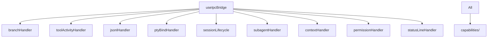

---
paths:
  - "claude-driver/src/renderer/src/business/**/*"
---

<!-- parent: renderer -->

### 模块架构图

### 模块概览

- **职责**：IPC 事件处理器（9 文件，工厂模式 `createXxxHandler(store)`）。监听 IPC，转译 payload 为 capability 调用变更 atom。含状态机（branchHandler 握手三态）与插入线构建（toolActivityHandler）。
- **输入**：IPC push（HOOK_EVENT/STATUS_LINE/JSONL_*/PTY_BIND/...）。
- **输出**：atom 变更（经 capabilities）、持久化 sidecar（经 capabilities）。

### API 概览

- **`createBranchHandler(store)`** → `{ register, handlePreNotify, handleConfirm, handlePtyBind, handleBranchSnapshot, isPendingBind }`
- **`createContextHandler(store)`** → `{ register, handlePostToolUseContext, handlePostCompact }`
- **`createJsonlHandler(store)`** → `{ register, handleRecord, handleBatchRecords, handleSubagentRecord }`
- **`createPermissionHandler(store)`** → `{ register, handlePermissionRequest, handlePermissionDenied }`
- **`createPtyBindHandler(store)`** → `{ register, handleBind, handleUnbind }`
- **`createSessionLifecycle(store, isBranchPending?)`** → `{ register, handleSessionStart, handleSessionEnd, handleStop }`
- **`createStatusLineHandler(store)`** → `{ register, handleStatusLine }`
- **`createSubagentHandler(store)`** → `{ register, handleSubagentStart, handleSubagentStop }`
- **`createToolActivityHandler(store)`** → `{ register, handlePreToolUse, handlePostToolUse, handlePostToolUseFailure }`

### 数据模型

- **`BranchState`**（internal，branchHandler）：`IDLE | PENDING_CONFIRM | PENDING_BIND` 联合类型。
- **`Store`**：`Pick<TestStore, 'get' | 'set'>`（Jotai store 子集，注入）。
- **`SessionStartPayload` / `SessionEndPayload` / `StopPayload`**（sessionLifecycle）。
- **`PtyBindPayload` / `PtyUnbindPayload`**（ptyBindHandler）。

### 关键流程

1. **Branch 握手**：PreNotify -> IDLE→PENDING_CONFIRM；Confirm -> PENDING_CONFIRM→PENDING_BIND；PtyBind -> PENDING_BIND→IDLE；BranchSnapshot -> 更新 branchStartUuid
2. **PTY 绑定**：PTY_BIND → handleBind（路径 B：已有条目 patch / 路径 C：缺失查 pendingPtyStarts / 外部启动）；PTY_UNBIND → handleUnbind（禁改 session 状态）
3. **Session 生命周期**：SessionStart（consume pendingPtyStarts, migrate placeholder, create/patch, addToRealtime unless branch-pending）；SessionEnd（completeSession + removeFromRealtime）；Stop（Paused + clearWorkStatus）
4. **Tool 活动**：PreToolUse → 按类别构建插入线（tool/mcp/skill/cli）+ subagent 槽位分配；PostToolUse → 状态 done + badge 回填（WebSearch/ToolSearch/AskUserQuestion）；PostToolUseFailure → failed
5. **消息队列**：Stop Hook → onStop → 取队首 → PTY stdin 注入
6. **上下文**：PostToolUse(Read/Glob/Grep/WebFetch) → addContextComponent；PostCompact → clearDynamicContext

### 状态机

- **Branch 握手**：IDLE -> PENDING_CONFIRM -> PENDING_BIND -> IDLE。

### 异常处理

- Branch preNotify 无 child -> 等 Confirm
- PTY_BIND 路径 C 缺失 -> 查 pendingPtyStarts 或标记外部启动
- 注册顺序：branch 优先（PTY_BIND/HOOK_EVENT 先到 branch 状态机）

### 监控与测试

- **日志点**：Hook 事件分发、branch 状态转换、消息出队。
- **测试覆盖**：branchHandler/jsonlHandler/ptyBindHandler/sessionLifecycle 单测（helpers/createTestStore 隔离）。
- **测试缺口 [待补]**：toolActivityHandler/contextHandler/permissionHandler/statusLineHandler/subagentHandler 无单测。

> 详情请阅读对应 Architecture 块文件：`docs/architecture.md` § renderer § business（`.claude/rules/architecture/src/renderer/business.md`）
