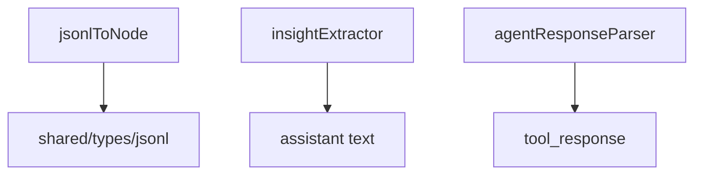

```mermaid
graph TD
    AgentActivity["agentActivity (M)"] --> atoms["atoms/"]
    BranchRegistry["branchRegistry (L)"] --> atoms
    ContextTracker["contextTracker (N)"] --> atoms
    PermissionQueue["permissionQueue (O)"] --> atoms
    GitCapability["gitCapability (P)"] --> atoms
    GitCapability -.INSERTION_*.-> IPC["IPC"]
    PtyBindings["ptyBindings (I)"] --> atoms
    RealtimeVis["realtimeVisibility (J)"] --> atoms
    SessionRegistry["sessionRegistry (H)"] --> atoms
    SessionRegistry -.SESSION_META_WRITE.-> IPC
    TimelineStore["timelineStore (K)"] --> atoms
    TimelineStore -.INSERTION_*.-> IPC
    TokenCapability["tokenCapability (M7)"] --> atoms
    TokenCapability -.TOKEN_SCAN_FILE.-> IPC
    JumpableNodes["jumpableNodes"] --> atoms
    Utils["utils/"]
```

---
paths:
  - "claude-driver/src/renderer/src/capabilities/**/*"
---

<!-- parent: renderer -->

### 模块架构图

### 模块概览

- **职责**：store 变更 + 持久化助手（11 文件，接受注入 `store: Pick<TestStore,'get'|'set'>`）。对特定 atom 的原子读写操作，按域分组。部分调用 IPC 持久化到 JSONL sidecar。
- **输入**：被 business/hooks 调用。
- **输出**：atom 变更（store.set）+ 可选 IPC 持久化。

### API 概览

- **agentActivity(M)**：`toolStart(store, claudeId, cwd, toolEntry)`、`toolDone(store, claudeId, matcher)`、`toolFailed(store, claudeId, matcher)`、`showSubagent(store, claudeId, info)`、`hideSubagent(store, claudeId)`、`registerSubagentId(store, claudeId, agentId)`、`incrementAgentCount(store, claudeId): number`、`allocateSubagentSlot(store, claudeId, toolUseId): number`、`releaseSubagentSlot(store, claudeId, toolUseId): number`、`setInsight(store, claudeId, text)`、`clearWorkStatus(store, claudeId)`。
- **branchRegistry(L)**：`registerBranch(store, childId, parentClaudeId, opts)`（自动算 side/lineLength/branchIndex）、`updateBranchSnapshot(store, childId, branchStartUuid)`、`cachePendingSnapshot`/`consumePendingSnapshot`（快照竞态缓存）、`getBranchRelation`、`getChildBranches`、`isBranchParent`。
- **contextTracker(N)**：`addContextComponent(store, claudeId, comp)`、`clearDynamicContext(store, claudeId)`、`getContext(store, claudeId)`。
- **gitCapability(P)**：`markNodeGitted(store, claudeId, nodeId, commitHash)`、`unmarkNodeGitted(store, claudeId, nodeId)`、`replayGitMarks(store, claudeId, marks)` — IPC: `GIT_MARK_SAVE`/`GIT_MARK_DELETE`。
- **permissionQueue(O)**：`enqueueRequest(store, req)`（dedup by requestId）、`dequeueRequest(store, requestId)`、`getPendingRequests(store)`。
- **ptyBindings(I)**：`bindPty(store, ptyId, claudeId)`、`unbindPty(store, ptyId, claudeId)`、`resolveClaudeId(store, ptyId): string|undefined`、`resolvePtyId(store, claudeId): string|undefined`。
- **realtimeVisibility(J)**：`addToRealtime(store, claudeId)`、`removeFromRealtime(store, claudeId)`、`isRealtimeVisible(store, claudeId): boolean`、`getRealtimeVisible(store): ReadonlySet<string>`。
- **sessionRegistry(H)**：`createSession(store, key, session)`（+ IPC `SESSION_META_WRITE`）、`patchSession(store, claudeId, patch)`、`completeSession(store, claudeId, endedAt)`、`getSession(store, claudeId)`、`findSessionByCwd(store, cwd)`、`findSessionByPtyId(store, ptyId, bindings)`。
- **timelineStore(K)**：`appendTimelineNode`/`appendTimelineNodes`、`getTranscriptPath`、`appendInsertion`（+ IPC `INSERTION_APPEND`）、`updateInsertionStatus`（matcher by id/toolName/toolUseId）、`patchInsertion`（deep-merge badgeContent，+ IPC `INSERTION_PATCH`）、`resolveTimelineKey`、`getTimelineLength`、`getVisibleNodeCount`、`getLastNodeParsedAt`、`clearTimeline`、`appendSubagentInsertion`（+ `INSERTION_SUBAGENT_APPEND`）、`updateSubagentInsertionStatus`、`patchSubagentInsertion`（+ `INSERTION_SUBAGENT_PATCH`）。
- **tokenCapability(M7)**：`updateSessionTokensFromFile(store, claudeId, transcriptPath): Promise<void>`（IPC `TOKEN_SCAN_FILE`，取 max vs existing）、`addTokensFromRecord(store, claudeId, record)`（实时增量）、`setDriverConfig(store, config)`（mirror to driverConfigAtom）、`getSessionTokens(store, claudeId)`。
- **jumpableNodes**：`buildJumpableNodes(timelineNodes, insertions): JumpableNode[]`（纯函数）。

### 数据模型

- **`JumpableNode`**：id、type（user_input/assistant/insertion）、timestamp。
- 各 capability 读写对应 atom 的数据模型（见 atoms TDD）。

### 关键流程

1. **Timeline 持久化**：appendInsertion → store.set + IPC INSERTION_APPEND（fire-and-forget）
2. **Subagent 持久化**：appendSubagentInsertion → IPC INSERTION_SUBAGENT_APPEND（路径 `subagents/agent-<agentId>.insertions.jsonl`）
3. **Token 扫描**：updateSessionTokensFromFile → IPC TOKEN_SCAN_FILE → 取 max vs existing（防重复累计）
4. **Session 元数据**：createSession → IPC SESSION_META_WRITE（first-write only）
5. **Branch 注册**：registerBranch 自动算 side（odd→right/even→left）/lineLength（同方向累积）/branchIndex；pendingSnapshot 缓存防快照-before-link 竞态

### 状态机

无（纯变更）。

### 异常处理

- Token 扫描取 max vs existing（防 JSONL 重复累计）
- Timeline dedup by id

### 监控与测试

- **日志点**：store.set 变更、IPC 持久化。
- **测试覆盖**：agentActivity/branchRegistry/contextTracker/permissionQueue/ptyBindings/realtimeVisibility/sessionRegistry/timelineStore 单测。
- **测试缺口**：部分 capability 调用 window.api.invoke（持久化）需 mock。

## utils
<!-- parent: capabilities -->
### 模块架构图

### 模块概览

- **职责**：纯转换/解析函数（3 文件）。无 store、无 IPC、无 React。
- **输入**：各类数据（JsonlRecord、assistant text、tool_response）。
- **输出**：结构化结果（TimelineNode、string、string）。

### API 概览

- **`agentResponseParser.ts`**
  - `extractAgentResponse(raw: unknown): string` — 处理 string / array-of-text-blocks / object.content / object.result
- **`insightExtractor.ts`**
  - `extractInsightText(text: string): string | null` — 匹配 `★ Insight ─...─` ... `─...─` 格式块
- **`jsonlToNode.ts`**
  - `jsonlRecordToNode(record: JsonlRecord): TimelineNode | null` — 各 type 分支（user_input/assistant/tool_use/tool_result）+ null 过滤 + uuid fallback

### 数据模型
### 关键流程
### 状态机
### 异常处理
### 监控与测试
