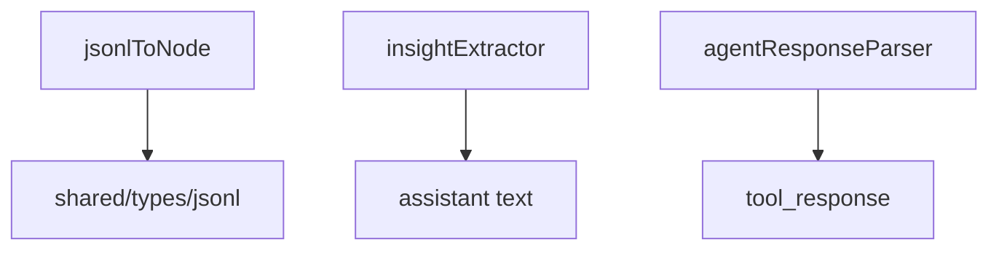

---
paths:
  - "claude-driver/src/renderer/src/capabilities/utils/**/*"
---

<!-- parent: capabilities -->

### 模块架构图

### 模块概览

- **职责**：纯转换/解析函数（3 文件）。无 store、无 IPC、无 React。
- **输入**：各类数据（JsonlRecord、assistant text、tool_response）。
- **输出**：结构化结果（TimelineNode、string、string）。

### API 概览

- **`agentResponseParser.ts`**
  - `extractAgentResponse(raw: unknown): string` — 处理 string / array-of-text-blocks / object.content / object.result
- **`insightExtractor.ts`**
  - `extractInsightText(text: string): string | null` — 匹配 `★ Insight ─...─` ... `─...─` 格式块
- **`jsonlToNode.ts`**
  - `jsonlRecordToNode(record: JsonlRecord): TimelineNode | null` — 各 type 分支（user_input/assistant/tool_use/tool_result）+ null 过滤 + uuid fallback

### 数据模型

各函数返回类型（TimelineNode/string 等）。

### 关键流程

- jsonlHandler 用 jsonlToNode + insightExtractor
- toolActivityHandler 内联实现工具分类/状态词/插入线构建（语义独立，不依赖 utils）

### 状态机

无。

### 异常处理

无。

### 监控与测试

- **测试覆盖**：agentResponseParser/insightExtractor/jsonlToNode 单测。

> 详情请阅读对应 Architecture 块文件：`docs/architecture.md` § renderer § capabilities § utils（`.claude/rules/architecture/src/renderer/capabilities/utils.md`）
