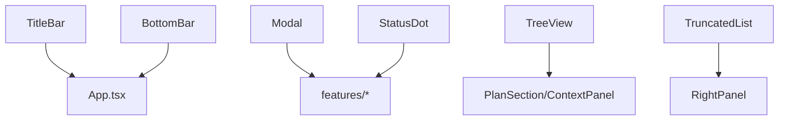
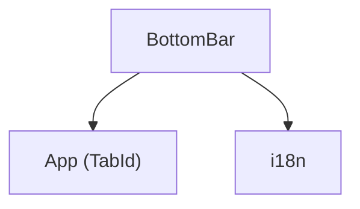
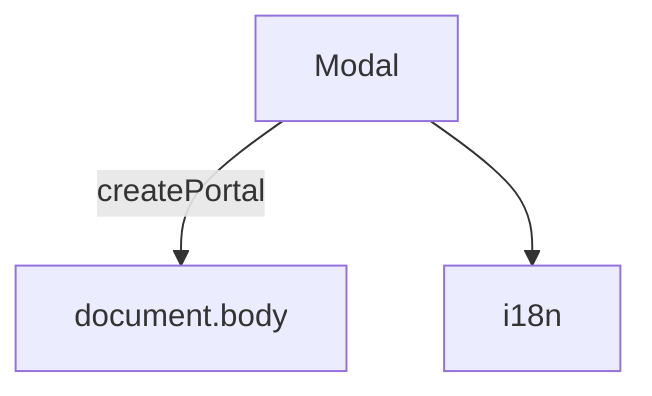
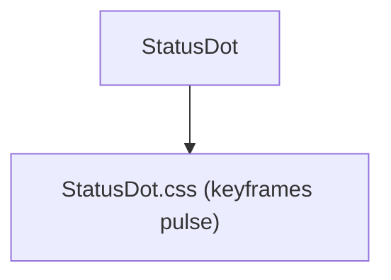
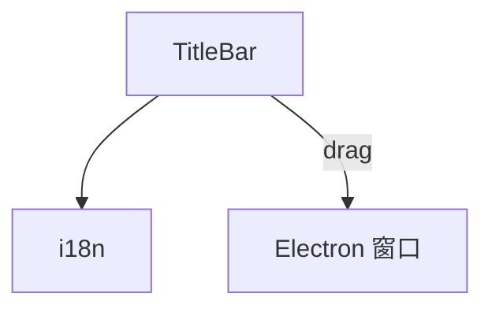
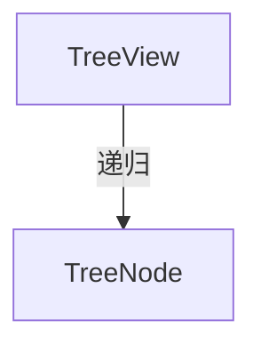
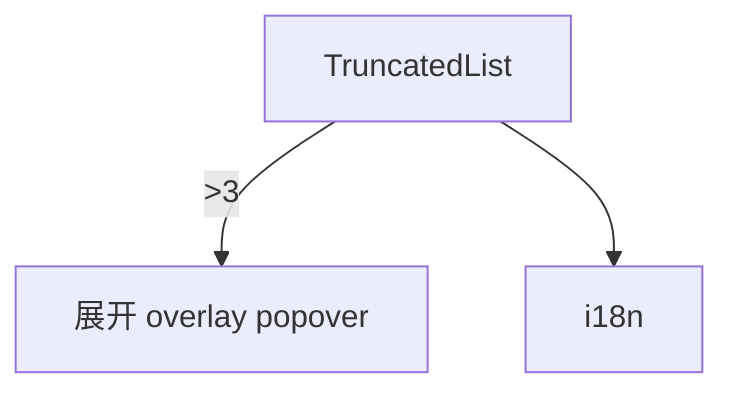

---
paths:
  - "claude-driver/src/renderer/src/components/**/*"
---

<!-- parent: renderer -->

### 模块架构图

### 模块概览

- **职责**：通用、feature-agnostic 的展示型 React 组件（6 组件 + 1 dev），跨页复用。各自 default export，无 barrel。
- **输入**：props。
- **输出**：React 渲染。

### API 概览

- **`TitleBar`**：props `{ runningCount, todayTokens, todayCostUsd }`；38px 顶栏（macOS 控件装饰 + logo + 标题 + 右侧统计），`-webkit-app-region: drag`。
- **`BottomBar`**：props `{ activeTab, onTabChange, notificationCount, monthlyTokens, activeProjectTokens, projectCount, agentCount, pendingRequests, onOpenSettings }`；38px 底栏（3 tab + 右侧统计 + 设置按钮）。
- **`Modal`**：props `{ open, onClose, title?, width? (default 480), children, showClose? (default true) }`；全局 overlay（blur 背景 + Portal to body + ESC/click-outside 关闭）。
- **`StatusDot`**：props `{ status: DotStatus, size?: DotSize (sm|md|lg, default md), className? }`；6 状态点（running 绿脉/paused 橙脉/done 绿静/todo 空心/idle 灰/error 红）；导出 `DotStatus`/`DotSize` 类型。
- **`TreeView`**：props `{ nodes: TreeNode[], renderLabel?, defaultExpanded? (default false), indentPx? (default 12), className? }`；递归可展开树；导出 `TreeNode { id, label: ReactNode, children?, defaultExpanded? }`。
- **`TruncatedList<T>`**：props `{ items: T[], renderItem, maxVisible? (default 3), overlayTitle?, className? }`；≤3 全显；>3 显 2+`···N` 点击展开 overlay popover。
- **`Versions`**：props none；dev 组件（列 Electron/Chromium/Node 版本）。

### 数据模型

- **`TabId`**：`'global' | 'project' | 'notifications'`（App）。
- **`DotStatus`** / **`DotSize`**：状态/尺寸联合类型。
- **`TreeNode`**：id/label/children?/defaultExpanded?。

### 关键流程

- BottomBar onTabChange 切 tab；onOpenSettings 开 GlobalSettingsModal。
- Modal 经 Portal 渲染到 body 避 z-index 战争。
- TruncatedList 实现 PRD §3.2.1 截断规则。

### 状态机

无。

### 异常处理

- Modal ESC + click-outside 关闭。

### 监控与测试

- **测试缺口 [待补]**：无组件测试。

## BottomBar
<!-- parent: components -->
### 模块架构图

### 模块概览

- **职责**：38px 底部导航栏。3 tab（global/project/notifications）+ 右侧统计（tokens/项目数/agents/pending）+ 设置按钮。
- **输入**：props（activeTab/onTabChange/notificationCount/monthlyTokens/activeProjectTokens/projectCount/agentCount/pendingRequests/onOpenSettings）。
- **输出**：UI 渲染。

### API 概览

- **`BottomBar`**：FC<BottomBarProps>。

### 数据模型
### 关键流程
### 状态机
### 异常处理
### 监控与测试

## Modal
<!-- parent: components -->
### 模块架构图

### 模块概览

- **职责**：全局 overlay Modal。blur 背景 + 居中内容 + ESC 关闭 + click-outside 关闭。经 React Portal 渲染到 body 避免 z-index 堆叠。
- **输入**：props。
- **输出**：UI 渲染。

### API 概览

- **`Modal`**：props `{ open, onClose, title?, width? (default 480), children, showClose? (default true) }`。

### 数据模型
### 关键流程
### 状态机
### 异常处理
### 监控与测试

## StatusDot
<!-- parent: components -->
### 模块架构图

### 模块概览

- **职责**：状态指示点。6 状态（running 绿脉/paused 橙脉/done 绿静/todo 空心/idle 灰/error 红）。贯穿项目卡片/Agent Block/Plan 节点。
- **输入**：props。
- **输出**：UI 渲染。

### API 概览

- **`StatusDot`**：props `{ status: DotStatus, size?: DotSize (sm|md|lg, default md), className? }`；导出 `DotStatus`/`DotSize` 类型。

### 数据模型
### 关键流程
### 状态机
### 异常处理
### 监控与测试

## TitleBar
<!-- parent: components -->
### 模块架构图

### 模块概览

- **职责**：38px 顶栏。macOS 红黄绿控件装饰 + logo + "Claude Steer" 标题 + 右侧 meta（today tokens/today cost USD/running count 绿脉点）。`-webkit-app-region: drag` 可拖动窗口。
- **输入**：props。
- **输出**：UI 渲染。

### API 概览

- **`TitleBar`**：props `{ runningCount, todayTokens, todayCostUsd }`。

### 数据模型
### 关键流程
### 状态机
### 异常处理
### 监控与测试

## TreeView
<!-- parent: components -->
### 模块架构图

### 模块概览

- **职责**：递归可展开树视图。用于 Plan 树（M/S/T 层级）与上下文面板文件树。节点点击切换开合，箭头展开旋转 90deg。
- **输入**：props（nodes/renderLabel/defaultExpanded/indentPx/className）。
- **输出**：UI 渲染。

### API 概览

- **`TreeView`**：props `{ nodes: TreeNode[], renderLabel?, defaultExpanded? (default false), indentPx? (default 12), className? }`；导出 `TreeNode { id, label: ReactNode, children?, defaultExpanded? }`。

### 数据模型
### 关键流程
### 状态机
### 异常处理
### 监控与测试

## TruncatedList
<!-- parent: components -->
### 模块架构图

### 模块概览

- **职责**：截断列表。≤3 全显；>3 显前 2 + `···N more`，点击展开 overlay popover 列全部。click-outside 关闭。实现 PRD §3.2.1 截断规则。
- **输入**：props（items/renderItem/maxVisible/overlayTitle/className）。
- **输出**：UI 渲染。

### API 概览

- **`TruncatedList<T>`**：泛型 props `{ items: T[], renderItem: (item: T, index: number) => ReactNode, maxVisible? (default 3), overlayTitle?, className? }`。

### 数据模型
### 关键流程
### 状态机
### 异常处理
### 监控与测试
