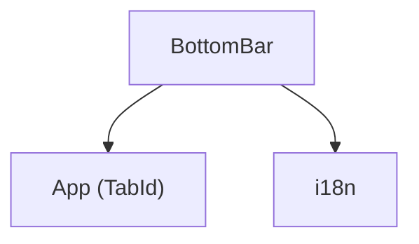

---
paths:
  - "claude-driver/src/renderer/src/components/BottomBar/**/*"
---

<!-- parent: components -->

### 模块架构图

### 模块概览

- **职责**：38px 底部导航栏。2 tab（global/project）+ 右侧统计（tokens/项目数/agents/pending）+ 设置按钮；通知入口归属 TitleBar 的独立通知窗口按钮。
- **输入**：props（activeTab/onTabChange/monthlyTokens/activeProjectTokens/projectCount/agentCount/pendingRequests/onOpenSettings）。
- **输出**：UI 渲染。

### API 概览

- **`BottomBar`**：`FC<BottomBarProps>`；`BottomBarProps` 不包含 `notificationCount`，通知未读数不进入底栏数据链。

### 数据模型

- **`BottomBarProps`**：`activeTab`、`onTabChange`、`monthlyTokens`、`activeProjectTokens`、`projectCount`、`agentCount`、`pendingRequests`、`onOpenSettings`。

### 关键流程

- onTabChange 在 global/project 间切 tab；onOpenSettings 开 GlobalSettingsModal；App 不为 BottomBar 订阅 `unreadCountAtom`。

### 状态机

- **类型检查**：App 与 BottomBar 的 props 必须一致，不保留无消费者 prop；`npm run typecheck` 应通过。

### 异常处理

无。

### 监控与测试

无。

> 详情请阅读对应 Architecture 块文件：`docs/architecture.md` § renderer § components § BottomBar（`.claude/rules/architecture/src/renderer/components/BottomBar.md`）
