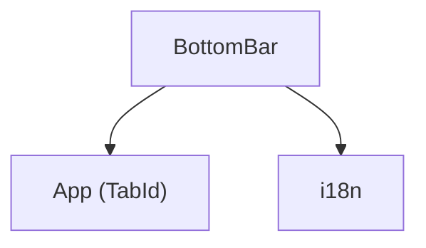

---
paths:
  - "claude-driver/src/renderer/src/components/BottomBar/**/*"
---

<!-- parent: components -->

### 模块架构图

### 模块概览

- **职责**：38px 底部导航栏。3 tab（global/project/notifications）+ 右侧统计（tokens/项目数/agents/pending）+ 设置按钮。
- **输入**：props（activeTab/onTabChange/notificationCount/monthlyTokens/activeProjectTokens/projectCount/agentCount/pendingRequests/onOpenSettings）。
- **输出**：UI 渲染。

### API 概览

- **`BottomBar`**：FC<BottomBarProps>。

### 数据模型

- **`BottomBarProps`**：见模块概览。

### 关键流程

- onTabChange 切 tab；onOpenSettings 开 GlobalSettingsModal。

### 状态机

无。

### 异常处理

无。

### 监控与测试

无。

> 详情请阅读对应 Architecture 块文件：`docs/architecture.md` § renderer § components § BottomBar（`.claude/rules/architecture/src/renderer/components/BottomBar.md`）
