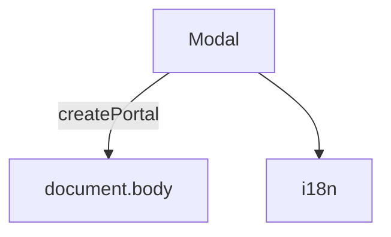

---
paths:
  - "claude-driver/src/renderer/src/components/Modal/**/*"
---

<!-- parent: components -->

### 模块架构图

### 模块概览

- **职责**：全局 overlay Modal。blur 背景 + 居中内容 + ESC 关闭 + click-outside 关闭。经 React Portal 渲染到 body 避免 z-index 堆叠。
- **输入**：props。
- **输出**：UI 渲染。

### API 概览

- **`Modal`**：props `{ open, onClose, title?, width? (default 480), children, showClose? (default true) }`。

### 数据模型

- **`ModalProps`**：见 API 概览。

### 关键流程

- SchedulerModal/RemoteModal/GlobalSettingsModal 等共用此容器。

### 状态机

无。

### 异常处理

- ESC + click-outside 关闭。

### 监控与测试

无。

> 详情请阅读对应 Architecture 块文件：`docs/architecture.md` § renderer § components § Modal（`.claude/rules/architecture/src/renderer/components/Modal.md`）
