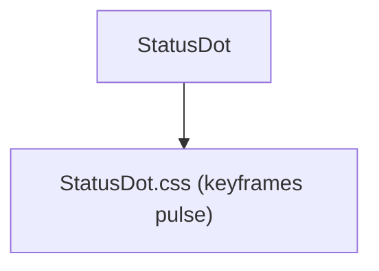

---
paths:
  - "claude-driver/src/renderer/src/components/StatusDot/**/*"
---

<!-- parent: components -->

### 模块架构图

### 模块概览

- **职责**：状态指示点。6 状态（running 绿脉/paused 橙脉/done 绿静/todo 空心/idle 灰/error 红）。贯穿项目卡片/Agent Block/Plan 节点。
- **输入**：props。
- **输出**：UI 渲染。

### API 概览

- **`StatusDot`**：props `{ status: DotStatus, size?: DotSize (sm|md|lg, default md), className? }`；导出 `DotStatus`/`DotSize` 类型。

### 数据模型

- **`DotStatus`**：`'running' | 'paused' | 'done' | 'todo' | 'idle' | 'error'`。

### 关键流程

- 项目卡片/Agent Block/Plan 节点状态可视化（对应 PRD §5 状态标识规范）。

### 状态机

无。

### 异常处理

无。

### 监控与测试

无。

> 详情请阅读对应 Architecture 块文件：`docs/architecture.md` § renderer § components § StatusDot（`.claude/rules/architecture/src/renderer/components/StatusDot.md`）
