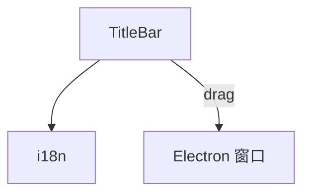

---
paths:
  - "claude-driver/src/renderer/src/components/TitleBar/**/*"
---

<!-- parent: components -->

### 模块架构图

### 模块概览

- **职责**：38px 顶栏。macOS 红黄绿控件装饰 + logo + "Claude Steer" 标题 + 右侧 meta（today tokens/today cost USD/running count 绿脉点）。`-webkit-app-region: drag` 可拖动窗口。
- **输入**：props。
- **输出**：UI 渲染。

### API 概览

- **`TitleBar`**：props `{ runningCount, todayTokens, todayCostUsd }`。

### 数据模型

- **`TitleBarProps`**：见 API 概览。

### 关键流程

- 窗口拖动；实时显示 today 统计。

### 状态机

无。

### 异常处理

- 跨平台：macOS 风格控件装饰；Electron 原生窗口控制实际生效。

### 监控与测试

无。

> 详情请阅读对应 Architecture 块文件：`docs/architecture.md` § renderer § components § TitleBar（`.claude/rules/architecture/src/renderer/components/TitleBar.md`）
