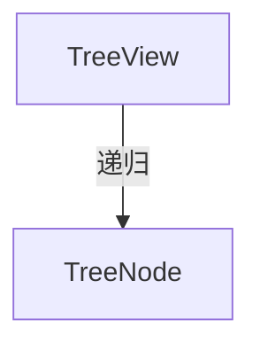

---
paths:
  - "claude-driver/src/renderer/src/components/TreeView/**/*"
---

<!-- parent: components -->

### 模块架构图

### 模块概览

- **职责**：递归可展开树视图。用于 Plan 树（M/S/T 层级）与上下文面板文件树。节点点击切换开合，箭头展开旋转 90deg。
- **输入**：props（nodes/renderLabel/defaultExpanded/indentPx/className）。
- **输出**：UI 渲染。

### API 概览

- **`TreeView`**：props `{ nodes: TreeNode[], renderLabel?, defaultExpanded? (default false), indentPx? (default 12), className? }`；导出 `TreeNode { id, label: ReactNode, children?, defaultExpanded? }`。

### 数据模型

- **`TreeNode`**：见 API 概览。

### 关键流程

- PlanSection 渲染 M->S->T；ContextPanel 渲染文件树。

### 状态机

无。

### 异常处理

- renderLabel 支持自定义节点渲染（状态图标等）。

### 监控与测试

无。

> 详情请阅读对应 Architecture 块文件：`docs/architecture.md` § renderer § components § TreeView（`.claude/rules/architecture/src/renderer/components/TreeView.md`）
