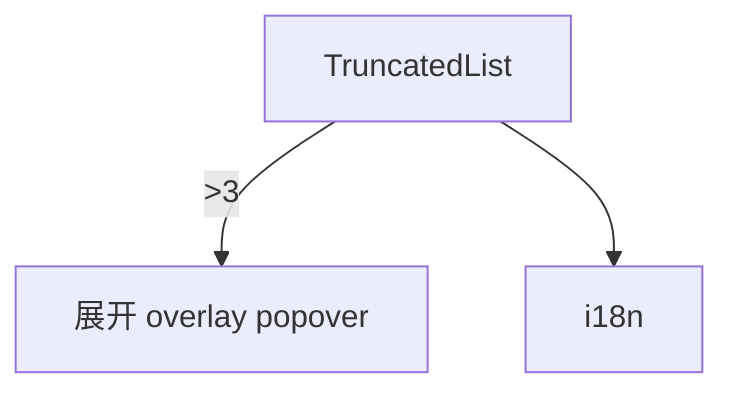

---
paths:
  - "claude-driver/src/renderer/src/components/TruncatedList/**/*"
---

<!-- parent: components -->

### 模块架构图

### 模块概览

- **职责**：截断列表。≤3 全显；>3 显前 2 + `···N more`，点击展开 overlay popover 列全部。click-outside 关闭。实现 PRD §3.2.1 截断规则。
- **输入**：props（items/renderItem/maxVisible/overlayTitle/className）。
- **输出**：UI 渲染。

### API 概览

- **`TruncatedList<T>`**：泛型 props `{ items: T[], renderItem: (item: T, index: number) => ReactNode, maxVisible? (default 3), overlayTitle?, className? }`。

### 数据模型

无。

### 关键流程

- RightPanel Agent/经验/工具列表截断；ExperiencesPanel/ToolsPanel 列展示。

### 状态机

无。

### 异常处理

- click-outside 关闭。

### 监控与测试

无。

> 详情请阅读对应 Architecture 块文件：`docs/architecture.md` § renderer § components § TruncatedList（`.claude/rules/architecture/src/renderer/components/TruncatedList.md`）
