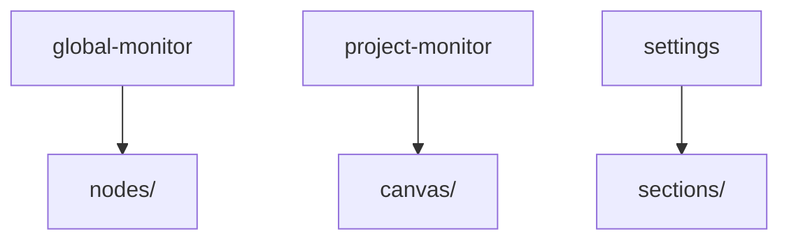
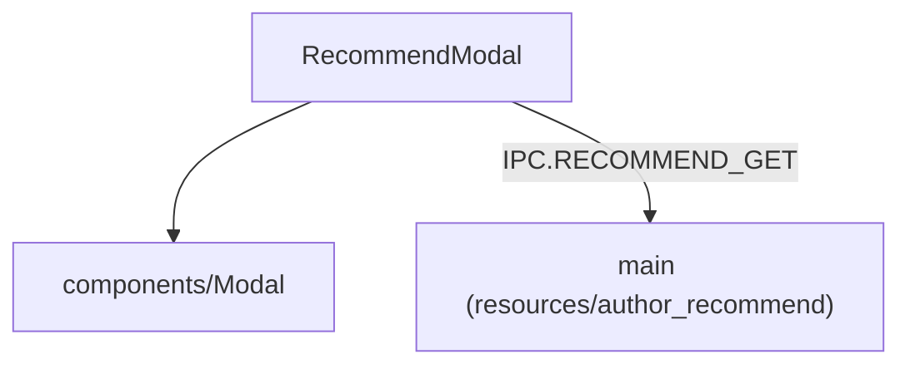
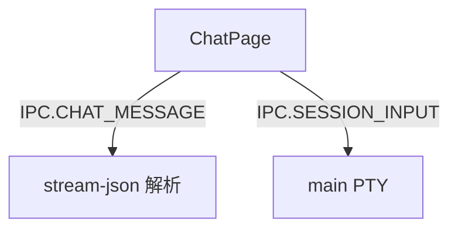
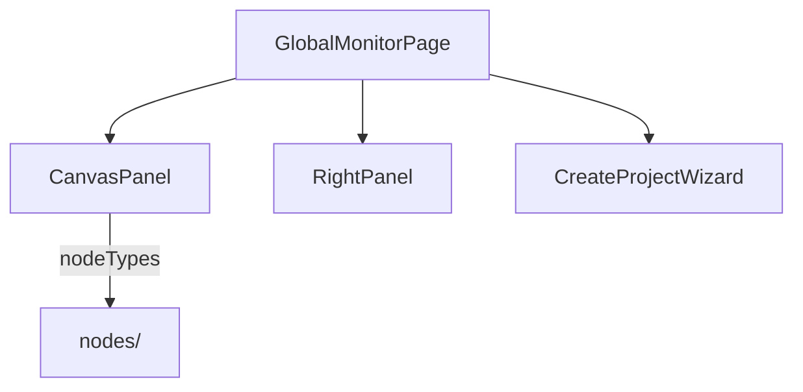
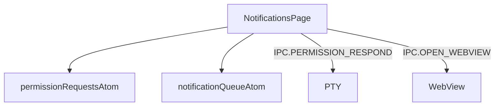
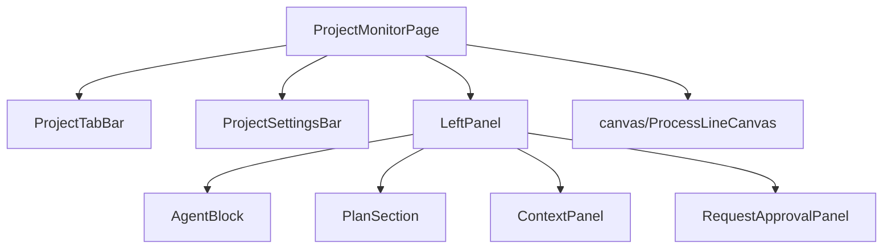
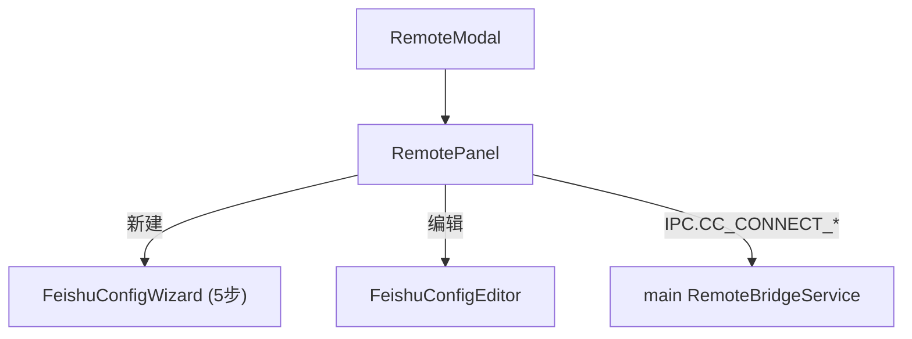
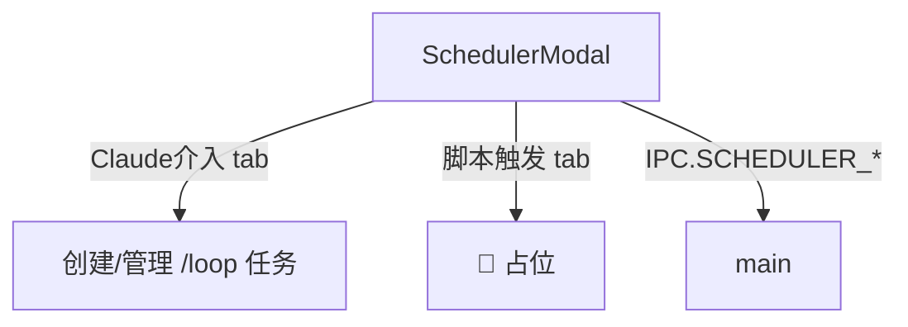
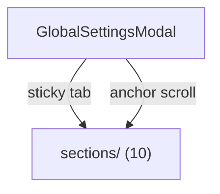
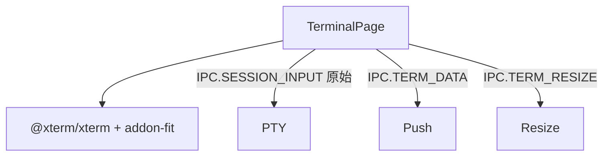

---
paths:
  - "claude-driver/src/renderer/src/features/**/*"
---

<!-- parent: renderer -->

### 模块架构图

### 模块概览

- **职责**：业务 UI 模块（9 子目录）。每个对应 PRD 一类界面概念。
- **输入**：atoms/hooks/capabilities + components + shared。
- **输出**：UI 渲染 + IPC invoke。

### API 概览

各 feature API 详见对应子级块文件。整体无统一 API。

### 数据模型

各 feature 数据见 atoms/* + shared/types。

### 关键流程

1. GlobalMonitorPage 双击项目卡 -> onNavigateToProject（切 project tab）
2. CreateProjectWizard 3 步向导 -> SESSION_START
3. ProcessLineCanvas 节点 Git 操作
4. GlobalSettingsModal 统一保存
5. NotificationsPage 权限审批
6. Hash 路由 pop-out（#/terminal, #/chat 各自 JotaiProvider）

### 状态机

无（各 feature 内部状态机见子级）。

### 异常处理

- 各 feature 容错处理见子级。

### 监控与测试

- **测试缺口 [待补]**：无组件测试。

## author-recommend
<!-- parent: features -->
### 模块架构图

### 模块概览

- **职责**：作者推荐 Modal。加载某分类精选推荐列表，三视图模式（list/detail/install-commands）。
- **输入**：props（category/onClose）。
- **输出**：UI 渲染。

### API 概览

- **`RecommendModal`**：props `{ category: 'agents'|'skills'|'mcps'|'workflows'|'clis', onClose }`；state `{ items[], loading, view, selected, copiedIdx }`；CATEGORY_I18N 映射。

### 数据模型
### 关键流程
### 状态机
### 异常处理
### 监控与测试

## chat
<!-- parent: features -->
### 模块架构图

### 模块概览

- **职责**：独立闲聊气泡 pop-out 窗口（`#/chat?sessionId=`）。监听 IPC.CHAT_MESSAGE（stream-json）追加 user/assistant 气泡；Enter 发送。
- **输入**：props（sessionId）。
- **输出**：UI 渲染（bubbles）。

### API 概览

- **`ChatPage`**：props `{ sessionId }`；state `{ bubbles[], input, ended, sending }`；streamingIdRef 跟踪 in-flight assistant 气泡。纯 DOM（无外部 children）。

### 数据模型
### 关键流程
### 状态机
### 异常处理
### 监控与测试

## global-monitor
<!-- parent: features -->
### 模块架构图

### 模块概览

- **职责**：全局监控页根。左半项目画板（无限画布）+ 右半（RightPanel/CreateProjectWizard 切换）。
- **输入**：atoms（projects/sessions/stats/scheduler/insight/notification）。
- **输出**：UI 渲染。

### API 概览

- **`GlobalMonitorPage`**：props `{ onNavigateToProject?: (projectId) => void }`；state `{ wizardOpen }`。
- **`CanvasPanel`**：props `{ onCreateProject, onNavigateToProject? }`；读 claimedProjectsAtom/activeSessionsAtom/pendingProjectCountAtom/allPlanNodesMapAtom；布局 buildCardPositions（2 列网格 CARD_W=248/CARD_H=180/CARD_GAP=16）+ buildBadgePosition。
- **`RightPanel`**：读 tokenStatsAtom/todayCostUsdAtom/schedulerTasksAtom/insightStateAtom/insightReportPathAtom/insightErrorAtom/notificationQueueAtom；state `{ config, showCost, expandState, showSoul/showScheduler/showRemote/showRecommend, recommendCategory }`；内部 SoulModal（监听 INSIGHT_REPORT_READY + 调用 INSIGHT_RUN/OPEN_WEBVIEW）；Skills named `cli` 分入 CLI 列；每类有 expand-all + `+` 推荐按钮。
- **`CreateProjectWizard`**：props `{ onClose }`；state `{ step(1|2|3), projectName, parentDir, description, permission (default 'acceptEdits'), planPrompt, submitting, error }`；computedPath。Step1 DIALOG_OPEN_DIR；Step2 SHELL_OPEN_PATH；Step3 SESSION_START + 300ms SESSION_INPUT。
- **`InitSopModal`**：props `{ isFirstLaunch, pendingProjects?, onClose }`；state `{ rootDir, scanning, scanned: ScannedProject[]|null, claimMap, pendingClaimMap, saving, error }`；IPC DIALOG_OPEN_DIR/PROJECT_SCAN/PROJECT_UPDATE（batch claimStatus 1|-1）。
- **`LanguageSwitcher`**：读 `{language, setLanguage}` from useT()；SUPPORTED_LANGUAGES 选项。

### 数据模型
### 关键流程
### 状态机
### 异常处理
### 监控与测试

## notifications
<!-- parent: features -->
### 模块架构图

### 模块概览

- **职责**：消息通知页。左侧权限请求列表（按 Agent 分组 + info 消息）+ 右侧详情（同意/同意带消息/不同意 + info 打开报告）。
- **输入**：atoms（permission/notification）。
- **输出**：UI 渲染 + IPC invoke。

### API 概览

- **`NotificationsPage`**：读 permissionRequestsAtom/notificationQueueAtom；state `{ selectedId }`；调 dequeueRequest capability；内部 NotificationList/NotificationDetail/InfoItem/InfoDetail。

### 数据模型
### 关键流程
### 状态机
### 异常处理
### 监控与测试

## project-monitor
<!-- parent: features -->
### 模块架构图

### 模块概览

- **职责**：项目监控页根。顶部 tab + 设置栏 + 左半实时工作区（LeftPanel）+ 右半历史画布（ProcessLineCanvas）。
- **输入**：atoms（projects/sessions/agent-block/timeline/context-panel/permission/viewport）。
- **输出**：UI 渲染。

### API 概览

各组件 API 详见对应子级块文件（含 canvas/）。

### 数据模型
### 关键流程
### 状态机
### 异常处理
### 监控与测试

## remote
<!-- parent: features -->
### 模块架构图

### 模块概览

- **职责**：cc-connect 远程/飞书配置 UI。基于外部 cc-connect 工具（github.com/chenhg5/cc-connect），非进程内实现。
- **输入**：atoms（projects）+ IPC push（CC_CONNECT_LOG）。
- **输出**：UI 渲染 + IPC invoke。

### API 概览

- **`RemoteModal`**：props `{ onClose }`；Modal 外壳（📡 标题，width 520）。
- **`RemotePanel`**：读 claimedProjectsAtom；state `{ installInfo, serviceStatus (stopped/starting/running), logs[], wizardTarget, configChoice, projectBots, editingTarget }`；8s 轮询 CC_CONNECT_CHECK；5s 轮询 CC_CONNECT_STATUS；实时日志 capped 50 行；配置选择（CLI 一键 / 手动向导）。
- **`FeishuConfigWizard`**：props `{ projectId, projectName, initialBot?, onSave(bot), onCancel }`；state `{ step(1-5), saving, Step4 form }`；TOTAL_STEPS=5；PERMISSIONS（8 Feishu scope codes）；canProceed() 验证 Step4（appId+appSecret）。
- **`FeishuConfigEditor`**：props `{ projectId, projectName, bot: FeishuBotConfig, onSave(bot), onCancel }`；local per-field state；canSave = appId && appSecret。

### 数据模型
### 关键流程
### 状态机
### 异常处理
### 监控与测试

## scheduler
<!-- parent: features -->
### 模块架构图

### 模块概览

- **职责**：定时任务 Modal。两 tab：「Claude 介入」（创建/管理 loop 任务）+「脚本触发」（占位）。
- **输入**：atoms（projects/scheduler）。
- **输出**：UI 渲染 + IPC invoke。

### API 概览

- **`SchedulerModal`**：props `{ onClose }`；读 claimedProjectsAtom/schedulerTasksAtom；state `{ activeTab (claude/script), selectedPath, interval (default '1h'), prompt, creating, createError, togglingProject, toggleError }`；内部 TaskCard；3s 轮询 SCHEDULER_LIST。

### 数据模型
### 关键流程
### 状态机
### 异常处理
### 监控与测试

## settings
<!-- parent: features -->
### 模块架构图

### 模块概览

- **职责**：全局设置 Modal 容器（width 640）。sticky 顶 tab 栏 + 滚动内容（10 section 全挂载）+ 底部保存/取消。
- **输入**：atoms（driverConfig）+ IPC invoke。
- **输出**：UI 渲染 + IPC invoke。

### API 概览

- **`GlobalSettingsModal`**：props `{ open, onClose }`；state `{ activeSection (SectionId, default 'provider'), claude (ClaudeSettingsSnapshot), driver (DriverConfig), appVersion, updaterState, saving, saveMsg, exportMsg, importMsg }`；SECTIONS 顺序（provider/language/permissions/token-cost/notification/preferences/memory/storage/about）；统一 handleChange(scope, key, value) + 单次保存写三处（driver config + claude settings.json + provider env block）；useStore() + setDriverConfig(store, driver)；IPC DRIVER_CONFIG_READ/PROVIDER_CONFIG_READ/CLAUDE_SETTINGS_READ/CONFIG_WRITE/PROVIDER_CONFIG_WRITE/CONFIG_EXPORT/CONFIG_IMPORT/DIALOG_*/UPDATER_*。

### 数据模型
### 关键流程
### 状态机
### 异常处理
### 监控与测试

## terminal
<!-- parent: features -->
### 模块架构图

### 模块概览

- **职责**：独立终端 pop-out 窗口（`#/terminal?sessionId=`）。xterm.js 渲染 PTY 原始输出；转发按键。
- **输入**：props（sessionId）。
- **输出**：UI 渲染（terminal）+ IPC invoke。

### API 概览

- **`TerminalPage`**：props `{ sessionId }`；refs `{ termRef, fitAddonRef, containerRef }`；@xterm/xterm Terminal + FitAddon。

### 数据模型
### 关键流程
### 状态机
### 异常处理
### 监控与测试
