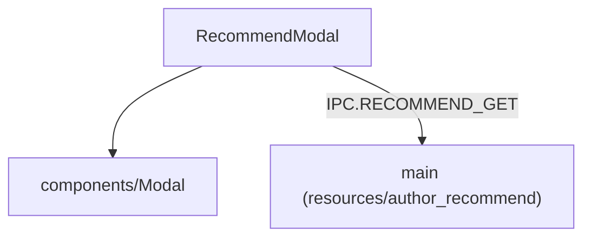

---
paths:
  - "claude-driver/src/renderer/src/features/author-recommend/**/*"
---

<!-- parent: features -->

### 模块架构图

### 模块概览

- **职责**：作者推荐 Modal。加载某分类精选推荐列表，三视图模式（list/detail/install-commands）。
- **输入**：props（category/onClose）。
- **输出**：UI 渲染。

### API 概览

- **`RecommendModal`**：props `{ category: 'agents'|'skills'|'mcps'|'workflows'|'clis', onClose }`；state `{ items[], loading, view, selected, copiedIdx }`；CATEGORY_I18N 映射。

### 数据模型

- **`RecommendItem`**（shared/types）：name/description/installCommand/category 等。

### 关键流程

- 选分类 -> 加载列表 -> 查看详情 -> 复制安装命令。

### 状态机

无。

### 异常处理

- **当前限制 [部分实现]**：仅显示命令供复制，不实际执行安装。

### 监控与测试

无。

> 详情请阅读对应 Architecture 块文件：`docs/architecture.md` § renderer § features § author-recommend（`.claude/rules/architecture/src/renderer/features/author-recommend.md`）
