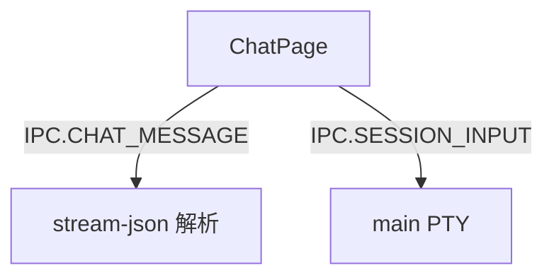

---
paths:
  - "claude-driver/src/renderer/src/features/chat/**/*"
---

<!-- parent: features -->

### 模块架构图

### 模块概览

- **职责**：独立闲聊气泡 pop-out 窗口（`#/chat?sessionId=`）。监听 IPC.CHAT_MESSAGE（stream-json）追加 user/assistant 气泡；Enter 发送。
- **输入**：props（sessionId）。
- **输出**：UI 渲染（bubbles）。

### API 概览

- **`ChatPage`**：props `{ sessionId }`；state `{ bubbles[], input, ended, sending }`；streamingIdRef 跟踪 in-flight assistant 气泡。纯 DOM（无外部 children）。

### 数据模型

- **`Bubble`**（internal）：role（user/assistant）、content、id、isStreaming?。

### 关键流程

- Enter 发送 -> IPC.SESSION_INPUT
- Shift+Enter 换行
- 流式回复 -> 追加气泡（streamingIdRef 跟踪）

### 状态机

无。

### 异常处理

- 独立 JotaiProvider（pop-out）。

### 监控与测试

无。

> 详情请阅读对应 Architecture 块文件：`docs/architecture.md` § renderer § features § chat（`.claude/rules/architecture/src/renderer/features/chat.md`）
