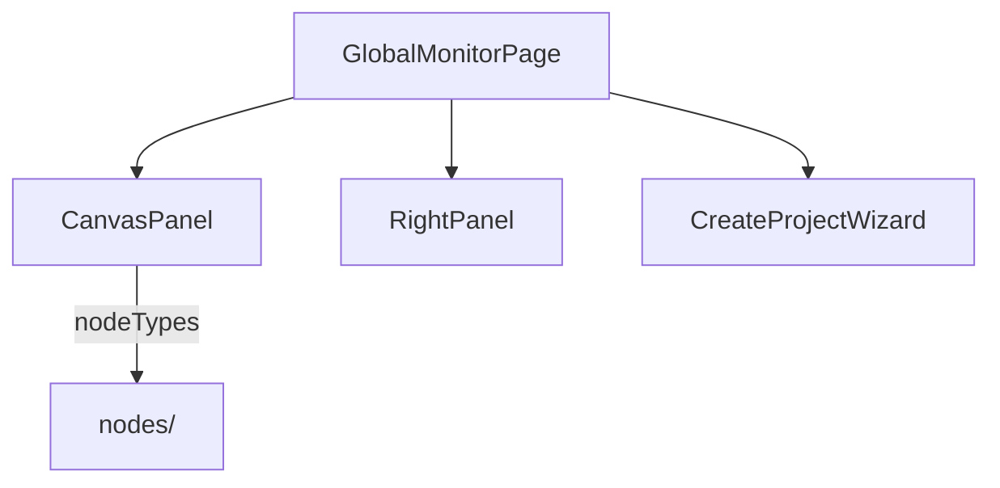
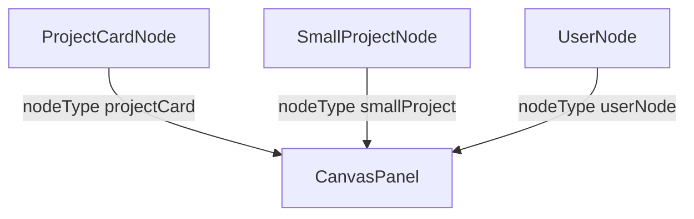

---
paths:
  - "claude-driver/src/renderer/src/features/global-monitor/**/*"
---

<!-- parent: features -->

### 模块架构图

### 模块概览

- **职责**：全局监控页根。左半项目画板（无限画布）+ 右半（RightPanel/CreateProjectWizard 切换）。
- **输入**：atoms（projects/sessions/stats/scheduler/insight/notification）。
- **输出**：UI 渲染。

### API 概览

- **`GlobalMonitorPage`**：props `{ onNavigateToProject?: (projectId) => void }`；state `{ wizardOpen }`。
- **`CanvasPanel`**：props `{ onCreateProject, onNavigateToProject? }`；读 claimedProjectsAtom/activeSessionsAtom/pendingProjectCountAtom/allPlanNodesMapAtom；布局 buildCardPositions（2 列网格 CARD_W=248/CARD_H=180/CARD_GAP=16）+ buildBadgePosition。
- **`RightPanel`**：读 tokenStatsAtom/todayCostUsdAtom/schedulerTasksAtom/insightStateAtom/insightReportPathAtom/insightErrorAtom/notificationQueueAtom；state `{ config, showCost, expandState, showSoul/showScheduler/showRemote/showRecommend, recommendCategory }`；内部 SoulModal（监听 INSIGHT_REPORT_READY + 调用 INSIGHT_RUN/OPEN_WEBVIEW）；Skills named `cli` 分入 CLI 列；每类有 expand-all + `+` 推荐按钮。
- **`CreateProjectWizard`**：props `{ onClose }`；state `{ step(1|2|3), projectName, parentDir, description, permission (default 'acceptEdits'), planPrompt, submitting, error }`；computedPath。Step1 DIALOG_OPEN_DIR；Step2 SHELL_OPEN_PATH；Step3 SESSION_START + 300ms SESSION_INPUT。
- **`InitSopModal`**：props `{ isFirstLaunch, pendingProjects?, onClose }`；state `{ rootDir, scanning, scanned: ScannedProject[]|null, claimMap, pendingClaimMap, saving, error }`；IPC DIALOG_OPEN_DIR/PROJECT_SCAN/PROJECT_UPDATE（batch claimStatus 1|-1）。
- **`LanguageSwitcher`**：读 `{language, setLanguage}` from useT()；SUPPORTED_LANGUAGES 选项。

### 数据模型

- **`ProjectCardNodeData`**：project/session/planNodes/onDoubleClick?。
- **`SmallProjectNodeData`**：project/isPending?/onDoubleClick?。
- **`UserNodeData`**：username?。

### 关键流程

1. 双击 projectCard 节点 -> onNavigateToProject（切 project tab + 设 activeProjectIdAtom）
2. 新建项目向导 -> PROJECT_CREATE -> PROJECT_LIST -> SESSION_START -> 300ms SESSION_INPUT（wizard.instruction prompt）
3. 初始化 SOP -> PROJECT_SCAN -> PROJECT_UPDATE（batch claimStatus）
4. 闲聊 FAB -> CHAT_START -> CHAT_WINDOW_OPEN

### 状态机

- **倒三角执行指示器 3 态**：active（Plan 文件写入触发）/ possibly-paused（5min 无变动）/ completed（全 M DONE 后 3min 清空）。

### 异常处理

- PTY start 失败 -> 静默处理
- CSS bug [待修]：ProjectCardNode.css line 107 `padding: 3.var(--space-sm)` 非法

### 监控与测试

- **日志点**：项目切换、向导提交。
- **测试缺口 [待补]**：无组件测试。

## nodes
<!-- parent: global-monitor -->
### 模块架构图

### 模块概览

- **职责**：全局画布 ReactFlow 自定义节点（3 个）。
- **输入**：NodeProps。
- **输出**：UI 渲染。

### API 概览

- **`ProjectCardNode`**：NodeProps `data: { project, session, planNodes, onDoubleClick? }`；248px 进行中项目卡（状态点 + 名 + 当前模型 + M 级 Plan max 4 + 倒三角指示器 + 双击提示 + 空 plan 占位）；读/写 planIndicatorsByProjectAtom(project.id)；mNodes = planNodes.filter(level==='M').slice(0,4)；倒三角生命周期：全 M DONE -> marks active/possibly-paused as `completed` -> clears after COMPLETED_DESTROY_MS = 3*60*1000。
- **`SmallProjectNode`**：NodeProps `data: { project, isPending?, onDoubleClick? }`；155px 紧凑卡（状态点 + 名 + `›`；isPending 橙警告样式）；double-click short-circuits for synthetic `__pending__` id。
- **`UserNode`**：NodeProps `data: { username? }`；顶部用户 pill（橙色渐变头像 + 用户名 + `▾`）；fallback to t('canvasPanel.username')。

### 数据模型
### 关键流程
### 状态机
### 异常处理
### 监控与测试
