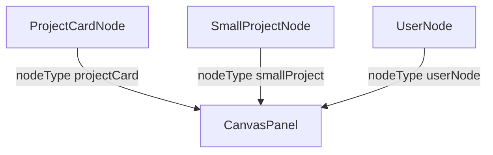

---
paths:
  - "claude-driver/src/renderer/src/features/global-monitor/nodes/**/*"
---

<!-- parent: global-monitor -->

### 模块架构图

### 模块概览

- **职责**：全局画布 ReactFlow 自定义节点（3 个）。
- **输入**：NodeProps。
- **输出**：UI 渲染。

### API 概览

- **`ProjectCardNode`**：NodeProps `data: { project, session, planNodes, onDoubleClick? }`；248px 进行中项目卡（状态点 + 名 + 当前模型 + M 级 Plan max 4 + 倒三角指示器 + 双击提示 + 空 plan 占位）；读/写 planIndicatorsByProjectAtom(project.id)；mNodes = planNodes.filter(level==='M').slice(0,4)；倒三角生命周期：全 M DONE -> marks active/possibly-paused as `completed` -> clears after COMPLETED_DESTROY_MS = 3*60*1000。
- **`SmallProjectNode`**：NodeProps `data: { project, isPending?, onDoubleClick? }`；155px 紧凑卡（状态点 + 名 + `›`；isPending 橙警告样式）；double-click short-circuits for synthetic `__pending__` id。
- **`UserNode`**：NodeProps `data: { username? }`；顶部用户 pill（橙色渐变头像 + 用户名 + `▾`）；fallback to t('canvasPanel.username')。

### 数据模型

- **`ProjectCardNodeData`**：project/session/planNodes/onDoubleClick?。
- **`SmallProjectNodeData`**：project/isPending?/onDoubleClick?。
- **`UserNodeData`**：username?。

### 关键流程

- 双击 projectCard -> onDoubleClick 导航
- 倒三角 active/possibly-paused/completed 状态转换

### 状态机

- **倒三角 3 态**：active / possibly-paused / completed（Plan 文件写入触发 + 5min 无变动 + 全 M DONE）。

### 异常处理

- CSS bug [待修]：ProjectCardNode.css `padding: 3.var(--space-sm)` 非法。

### 监控与测试

无。

> 详情请阅读对应 Architecture 块文件：`docs/architecture.md` § renderer § features § global-monitor § nodes（`.claude/rules/architecture/src/renderer/features/global-monitor/nodes.md`）
