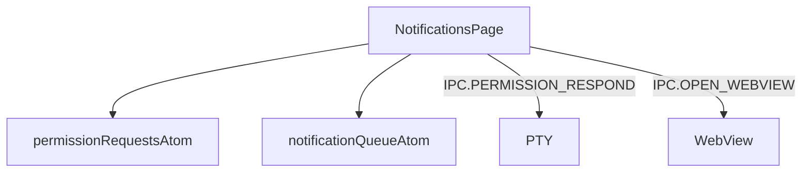

---
paths:
  - "claude-driver/src/renderer/src/features/notifications/**/*"
---

<!-- parent: features -->

### 模块架构图

### 模块概览

- **职责**：消息通知页。左侧权限请求列表（按 Agent 分组 + info 消息）+ 右侧详情（同意/同意带消息/不同意 + info 打开报告）。
- **输入**：atoms（permission/notification）。
- **输出**：UI 渲染 + IPC invoke。

### API 概览

- **`NotificationsPage`**：读 permissionRequestsAtom/notificationQueueAtom；state `{ selectedId }`；调 dequeueRequest capability；内部 NotificationList/NotificationDetail/InfoItem/InfoDetail。

### 数据模型

- 见 atoms（PermissionRequest/Notification）。

### 关键流程

- 权限请求 FIFO -> 审批 -> IPC.PERMISSION_RESPOND（y/n + 附加 -> PTY stdin）
- info 消息 -> IPC.OPEN_WEBVIEW（insight 报告）

### 状态机

无。

### 异常处理

- 权限请求无超时（Agent 一直等待）；多请求 FIFO 堆叠。

### 监控与测试

无。

> 详情请阅读对应 Architecture 块文件：`docs/architecture.md` § renderer § features § notifications（`.claude/rules/architecture/src/renderer/features/notifications.md`）
