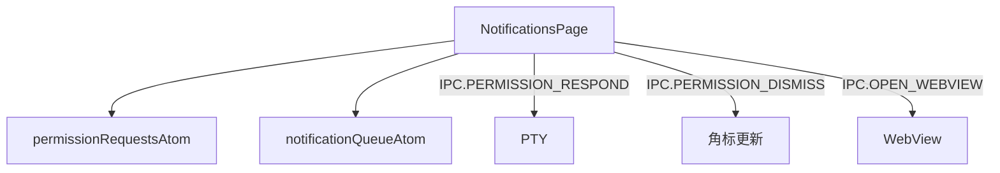

---
paths:
  - "claude-driver/src/renderer/src/features/notifications/**/*"
---

<!-- parent: features -->

### 模块架构图

### 模块概览

- **职责**：消息通知页。左侧权限请求列表（按 Agent 分组 + info 消息）+ 右侧详情（同意/同意带消息/不同意 + info 打开报告）。
- **输入**：atoms（permission/notification）。
- **输出**：UI 渲染 + IPC invoke。

### API 概览

- **`NotificationsPage`**：读 permissionRequestsAtom/notificationQueueAtom；state `{ selectedId }`；调 dequeueRequest capability；内部 NotificationList/NotificationDetail/InfoItem/InfoDetail。

### 数据模型

- 见 atoms（PermissionRequest/Notification）。

### 关键流程

- 权限请求 FIFO -> 审批 -> IPC.PERMISSION_RESPOND（TUI 按键序列 -> PTY stdin rawWrite）
- **权限响应真实机制**（实测验证，日志 `~/.claude-driver/permission-debug.log`）：
  - 时序：Claude 欲用工具 -> PreToolUse hook fire -> 无 hook 决策 -> Claude 弹 TUI（❯ 1.Yes 默认聚焦 / 2.Yes-and-don't-ask / 3.No；底部 "Esc to cancel · Tab to amend"）-> ~2s 后 PermissionRequest hook fire -> 驱动 app 审批面板（面板显示时 TUI 已就绪，无竞态）
  - 按键映射（rawWrite 逐个发送，不追加 \r，每个按键间隔 ~50ms）：同意=`\r`；拒绝=`\x1b[B`×2+`\r`；同意+附加=`\t`+msg+`\r`；拒绝+附加=`\x1b[B`×2+`\t`+msg+`\r`
  - **关键发现**：**按键时间间隔是核心**——一次性写入所有字节会导致 TUI 无法逐个处理，全部忽略变成"同意"。必须 for 循环逐个 rawWrite + await sleep(50ms)。`\x1b[B`（普通模式）和 `\x1bOB`（应用光标模式）在有延时的情况下都能工作。
  - **禁止发 y/n 字母**：TUI 是选项型交互，字母被忽略（原 bug 根因之一）
  - **单实例约束**：HookServer 端口 39521 唯一，多实例会导致 hook 路由到另一实例，本实例面板不显示
- **关闭操作**：权限请求 -> 点击"关闭"按钮 -> IPC.PERMISSION_DISMISS -> 主进程 decrementBadge -> 通知从列表消失（Agent 继续等待，不发送任何按键）
- info 消息 -> IPC.OPEN_WEBVIEW（insight 报告）

### 状态机

无。

### 异常处理

- 权限请求无超时（Agent 一直等待）；多请求 FIFO 堆叠。

### 监控与测试

无。

> 详情请阅读对应 Architecture 块文件：`docs/architecture.md` § renderer § features § notifications（`.claude/rules/architecture/src/renderer/features/notifications.md`）
