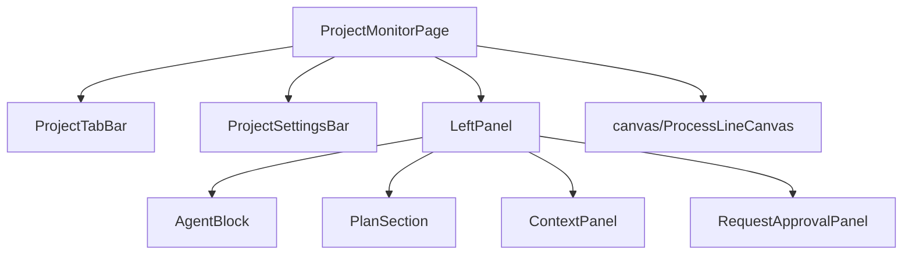
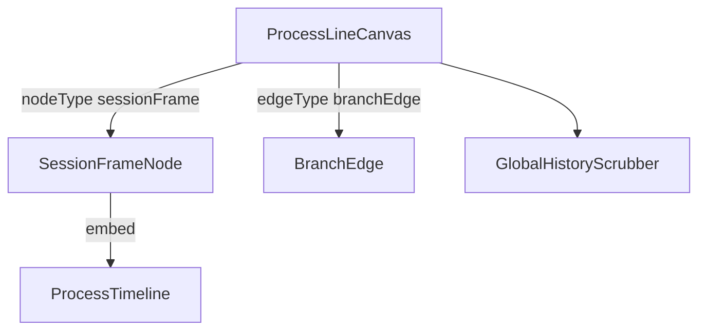

---
paths:
  - "claude-driver/src/renderer/src/features/project-monitor/**/*"
---

<!-- parent: features -->

### 模块架构图

### 模块概览

- **职责**：项目监控页根。顶部 tab + 设置栏 + 左半实时工作区（LeftPanel）+ 右半历史画布（ProcessLineCanvas）。
- **输入**：atoms（projects/sessions/agent-block/timeline/context-panel/permission/viewport）。
- **输出**：UI 渲染。

### API 概览

各组件 API 详见对应子级块文件（含 canvas/）。

### 数据模型

各组件数据见 atoms/* + shared/types。

### 关键流程

1. 实时工作区 Agent Block（状态 + 工具/经验并排 + Subagent + Insight + MessageInputBar）
2. 历史时间线节点 Git 操作（commit/reset/delete-commit）
3. Plan 折叠区（M/S/T 树 + 刷新）
4. 项目标签栏（running 项目 tabs + 所有项目下拉）
5. 设置栏（8 下拉 + 添加并行 Agent + 同步到 GitHub）

### 状态机

无（各组件内部状态机见子级）。

### 异常处理

- Branch 完全复用主线工作框（AgentBlock + SessionFrameNode）。

### 监控与测试

- **日志点**：Session 切换、Git 操作、Plan 刷新。
- **测试缺口 [待补]**：无组件测试。

## canvas
<!-- parent: project-monitor -->
### 模块架构图

### 模块概览

- **职责**：右半历史进程线画布。@xyflow/react 容器，发现项目 session、布局 SessionFrameNode + BranchEdge、4 态视口机 + 全局键盘导航。
- **输入**：atoms（sessions/agentLabels/allFrameHeights/viewport/focus）。
- **输出**：UI 渲染。

### API 概览

- **`ProcessLineCanvas`**：props `{ projectId }`；读 projectByIdAtom/activeSessionsAtom/sessionRelationsAtom/agentLabelsAtom/allFrameHeightsAtom/viewportModeAtom/focusRequestAtom；useStore() 读 nodeYOffsetsAtom(id)；写 focusRequestAtom/viewportModeAtom；内部 ProcessLineCanvasInner；ReactFlow 容器（panOnScroll=true/Ctrl+scroll/pinch zoom/minZoom 0.3/maxZoom 3/nodesDraggable=false）；config auto-focuses newly-joined sessions；`[DIAG]` render/insertion/layout/effect counters 在 mode badge。
- **`SessionFrameNode`**：自定义 ReactFlow 节点（虚线框 + 头部状态/agent/token/时长 + 内嵌 ProcessTimeline + 底部 interrupt/resume/open-terminal/merge + milestone badges + ResizeObserver 框高）；data `{ sessionId, ptyId, agentLabel, agentColor, isExpanded, estimatedHeight }`；读 activeSessionsAtom/sessionRelationsAtom/allFrameHeightsAtom/projectByIdAtom/sessionTokensAtom(id)/milestonesByProjectAtom(projectId)；写 sessionFrameHeightsAtom(id)/allFrameHeightsAtom；Handle（default + dynamic source/target per branch）；IPC SESSION_STOP/RESUME（resume `claude -r <claudeId>` 开新 xterm）/TERM_WINDOW_OPEN；merge-to-main button stub（M4 S4 T4 console.info）；computeFrozenOffset(parentH) + FRAME_HEADER_HEIGHT。
- **`BranchEdge`**：自定义边（dashed bezier + 紫色 + 两端圆点，/branch 继承记忆连接）；EdgeProps；BaseEdge + getBezierPath from @xyflow/react；color `#35C98A` (green) dashed `8 4` opacity 0.85；source Handle Y 外部定位 via nodeYOffsetsAtom。
- **`GlobalHistoryScrubber`**：右侧竖向拉动条（按 session 分段 + user_input 刻度 + 拖拽跳转）；props `{ orderedSessionIds, onSessionFocus }`；读 focusedSessionIdAtom；useStore() 读 timeline/lineInsertions by sid + 写 scrubber/cursor/nodeJumpRequest；buildJumpableNodes；MIN_SEGMENT_HEIGHT=24/MIN_THUMB_HEIGHT=32；内部 SegmentTrack（不导出）。

### 数据模型
### 关键流程
### 状态机
### 异常处理
### 监控与测试
