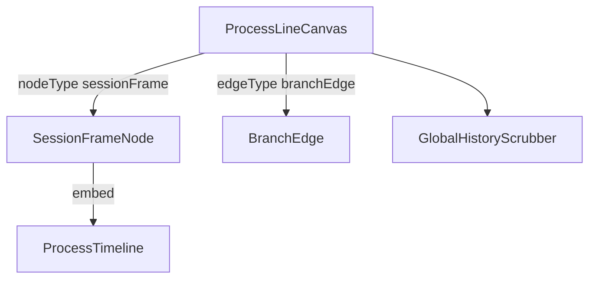

---
paths:
  - "claude-driver/src/renderer/src/features/project-monitor/canvas/**/*"
---

<!-- parent: project-monitor -->

### 模块架构图

### 模块概览

- **职责**：右半历史进程线画布。@xyflow/react 容器，发现项目 session、布局 SessionFrameNode + BranchEdge、4 态视口机 + 全局键盘导航。
- **输入**：atoms（sessions/agentLabels/allFrameHeights/viewport/focus）。
- **输出**：UI 渲染。

### API 概览

- **`ProcessLineCanvas`**：props `{ projectId }`；读 projectByIdAtom/activeSessionsAtom/sessionRelationsAtom/agentLabelsAtom/allFrameHeightsAtom/viewportModeAtom/focusRequestAtom；useStore() 读 nodeYOffsetsAtom(id)；写 focusRequestAtom/viewportModeAtom；内部 ProcessLineCanvasInner；ReactFlow 容器（panOnScroll=true/Ctrl+scroll/pinch zoom/minZoom 0.3/maxZoom 3/nodesDraggable=false）；config auto-focuses newly-joined sessions；`[DIAG]` render/insertion/layout/effect counters 在 mode badge。
- **`SessionFrameNode`**：自定义 ReactFlow 节点（虚线框 + 头部状态/agent/token/时长 + 内嵌 ProcessTimeline + 底部 interrupt/resume/open-terminal/merge + milestone badges + ResizeObserver 框高）；data `{ sessionId, ptyId, agentLabel, agentColor, isExpanded, estimatedHeight }`；读 activeSessionsAtom/sessionRelationsAtom/allFrameHeightsAtom/projectByIdAtom/sessionTokensAtom(id)/milestonesByProjectAtom(projectId)；写 sessionFrameHeightsAtom(id)/allFrameHeightsAtom；Handle（default + dynamic source/target per branch）；IPC SESSION_STOP/RESUME（resume `claude -r <claudeId>` 开新 xterm）/TERM_WINDOW_OPEN；merge-to-main button stub（M4 S4 T4 console.info）；computeFrozenOffset(parentH) + FRAME_HEADER_HEIGHT。
- **`BranchEdge`**：自定义边（dashed bezier + 紫色 + 两端圆点，/branch 继承记忆连接）；EdgeProps；BaseEdge + getBezierPath from @xyflow/react；color `#35C98A` (green) dashed `8 4` opacity 0.85；source Handle Y 外部定位 via nodeYOffsetsAtom。
- **`GlobalHistoryScrubber`**：右侧竖向拉动条（按 session 分段 + user_input 刻度 + 拖拽跳转）；props `{ orderedSessionIds, onSessionFocus }`；读 focusedSessionIdAtom；useStore() 读 timeline/lineInsertions by sid + 写 scrubber/cursor/nodeJumpRequest；buildJumpableNodes；MIN_SEGMENT_HEIGHT=24/MIN_THUMB_HEIGHT=32；内部 SegmentTrack（不导出）。

### 数据模型

- **`SessionFrameData`**：sessionId/ptyId/agentLabel/agentColor/isExpanded/estimatedHeight。

### 关键流程

1. **3 布局情形**：单框居中 / `/branch` 继承记忆（两框并排 + 水平连线 + 紫色标签）/ 多 Session 独立并排（两框并排 + 竖向分隔线）
2. **视口 4 态切换**：overview（fitView all）/ focus（fitView [id]）/ follow（setViewport 平移）/ locked（user drag 中）；isProgrammaticRef 区分；auto-switch overview<->follow based on running sessions
3. **键盘 ←->/↑↓ 跳转**：useGlobalKeyNav（cluster small-jump 到 branch / cross-cluster big-jump / 框内节点精细跳转）
4. **框高 ResizeObserver**：SessionFrameNode 监听 DOM 高度 -> updateNodeData estimatedHeight -> useSessionFrameLayout 重排

### 状态机

- **视口 4 态**：overview/focus/follow/locked。

### 异常处理

- fitView 节流 500ms 防 Hook 高频抖动
- **占位**：SessionFrameNode 合并到 Main 按钮 stub（M4 S4 T4 console.info）
- **可观测性**：`[DIAG]` render/insertion/layout/effect counters 暴露在 DOM mode badge

### 监控与测试

- **日志点**：视口切换、框高变化、键盘导航。
- **测试缺口 [待补]**：无组件测试。

> 详情请阅读对应 Architecture 块文件：`docs/architecture.md` § renderer § features § project-monitor § canvas（`.claude/rules/architecture/src/renderer/features/project-monitor/canvas.md`）
