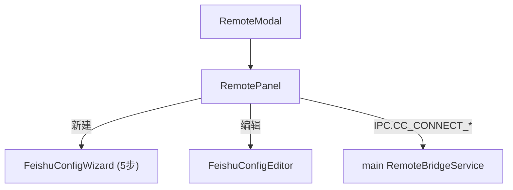

---
paths:
  - "claude-driver/src/renderer/src/features/remote/**/*"
---

<!-- parent: features -->

### 模块架构图

### 模块概览

- **职责**：cc-connect 远程/飞书配置 UI。基于外部 cc-connect 工具（github.com/chenhg5/cc-connect），非进程内实现。
- **输入**：atoms（projects）+ IPC push（CC_CONNECT_LOG）。
- **输出**：UI 渲染 + IPC invoke。

### API 概览

- **`RemoteModal`**：props `{ onClose }`；Modal 外壳（📡 标题，width 520）。
- **`RemotePanel`**：读 claimedProjectsAtom；state `{ installInfo, serviceStatus (stopped/starting/running), logs[], wizardTarget, configChoice, projectBots, editingTarget }`；8s 轮询 CC_CONNECT_CHECK；5s 轮询 CC_CONNECT_STATUS；实时日志 capped 50 行；配置选择（CLI 一键 / 手动向导）。
- **`FeishuConfigWizard`**：props `{ projectId, projectName, initialBot?, onSave(bot), onCancel }`；state `{ step(1-5), saving, Step4 form }`；TOTAL_STEPS=5；PERMISSIONS（8 Feishu scope codes）；canProceed() 验证 Step4（appId+appSecret）。
- **`FeishuConfigEditor`**：props `{ projectId, projectName, bot: FeishuBotConfig, onSave(bot), onCancel }`；local per-field state；canSave = appId && appSecret。

### 数据模型

- **`FeishuBotConfig`**（shared/types）：appId/appSecret/adminFrom/allowFrom/enableFeishuCard/progressStyle/agentMode/model/provider。

### 关键流程

1. 检测安装（8s 轮询）-> 未装引导（CHAT_START+CHAT_WINDOW_OPEN 预填 `npm install -g cc-connect`）
2. 服务状态栏（start/stop，5s 轮询）
3. 实时日志（capped 50 行，auto-scroll）
4. 项目列表 -> 新建向导 / 编辑现有

### 状态机

- **Service status**：stopped / starting / running。

### 异常处理

- config.toml 字段级合并保留其他项目
- 外部 cc-connect 进程崩溃 -> 服务状态回 stopped

### 监控与测试

- **日志点**：安装检测、服务启停、配置保存。
- **测试缺口 [待补]**：无组件测试。

> 详情请阅读对应 Architecture 块文件：`docs/architecture.md` § renderer § features § remote（`.claude/rules/architecture/src/renderer/features/remote.md`）
