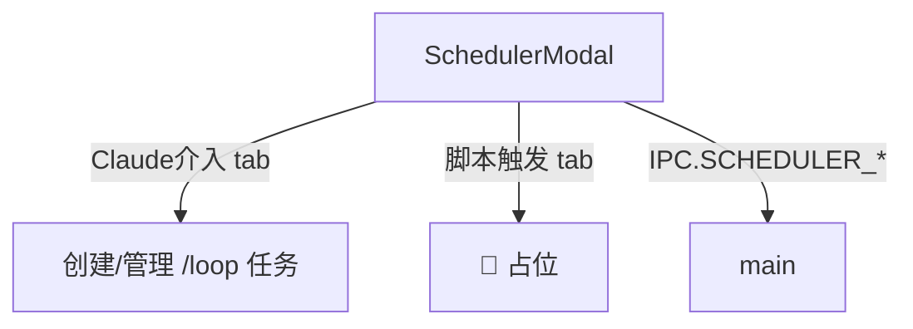

---
paths:
  - "claude-driver/src/renderer/src/features/scheduler/**/*"
---

<!-- parent: features -->

### 模块架构图

### 模块概览

- **职责**：定时任务 Modal。两 tab：「Claude 介入」（创建/管理 loop 任务）+「脚本触发」（占位）。
- **输入**：atoms（projects/scheduler）。
- **输出**：UI 渲染 + IPC invoke。

### API 概览

- **`SchedulerModal`**：props `{ onClose }`；读 claimedProjectsAtom/schedulerTasksAtom；state `{ activeTab (claude/script), selectedPath, interval (default '1h'), prompt, creating, createError, togglingProject, toggleError }`；内部 TaskCard；3s 轮询 SCHEDULER_LIST。

### 数据模型

- **`SchedulerTask`**（atoms）：taskId、projectPath、claudeId、interval、prompt、createdAt、isActive、isExpired。

### 关键流程

1. 选项目 + 间隔 + prompt -> SCHEDULER_CREATE
2. toggle 暂停/恢复（需 claudeId 初始化）
3. 删除 -> SCHEDULER_DELETE
4. 重建过期任务
5. 7 天过期（formatExpiry 强制）

### 状态机

无。

### 异常处理

- 每会话最多 50 任务
- toggle 需 claudeId 初始化
- **占位**：脚本触发 tab 为 🚧 coming soon

### 监控与测试

- **日志点**：任务 CRUD、toggle。
- **测试缺口 [待补]**：无组件测试。

> 详情请阅读对应 Architecture 块文件：`docs/architecture.md` § renderer § features § scheduler（`.claude/rules/architecture/src/renderer/features/scheduler.md`）
