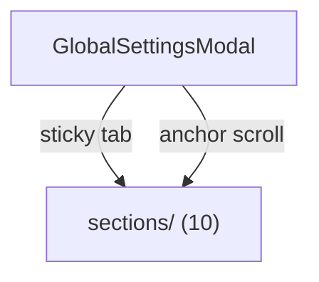
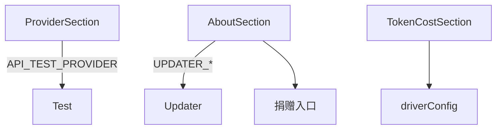

---
paths:
  - "claude-driver/src/renderer/src/features/settings/**/*"
---

<!-- parent: features -->

### 模块架构图

### 模块概览

- **职责**：全局设置 Modal 容器（width 640）。sticky 顶 tab 栏 + 滚动内容（10 section 全挂载）+ 底部保存/取消。
- **输入**：atoms（driverConfig）+ IPC invoke。
- **输出**：UI 渲染 + IPC invoke。

### API 概览

- **`GlobalSettingsModal`**：props `{ open, onClose }`；state `{ activeSection (SectionId, default 'provider'), claude (ClaudeSettingsSnapshot), driver (DriverConfig), appVersion, updaterState, saving, saveMsg, exportMsg, importMsg }`；SECTIONS 顺序（provider/language/permissions/token-cost/notification/preferences/memory/storage/about）；统一 handleChange(scope, key, value) + 单次保存写三处（driver config + claude settings.json + provider env block）；useStore() + setDriverConfig(store, driver)；IPC DRIVER_CONFIG_READ/PROVIDER_CONFIG_READ/CLAUDE_SETTINGS_READ/CONFIG_WRITE/PROVIDER_CONFIG_WRITE/CONFIG_EXPORT/CONFIG_IMPORT/DIALOG_*/UPDATER_*。

### 数据模型

- **`SectionId`**：`'provider' | 'language' | 'permissions' | 'token-cost' | 'notification' | 'preferences' | 'memory' | 'storage' | 'about'`。
- **`ClaudeSettingsSnapshot`**：permissions/language/model/env 等字段快照。

### 关键流程

1. 开 Modal -> 加载配置（DRIVER_CONFIG_READ + PROVIDER_CONFIG_READ + CLAUDE_SETTINGS_READ）
2. anchor scroll 切 section（scrollToSection(id) 设 state + scrollIntoView `gsm-section-${id}`）
3. 保存统一写三处
4. export/import 配置（DIALOG_SAVE_FILE/OPEN_FILE + CONFIG_EXPORT/IMPORT）

### 状态机

无。

### 异常处理

- **死代码 [待清理]**：ApiSection.tsx 未被渲染（API key 实际在 ProviderSection 经 API_TEST_PROVIDER）；section nav 无 api tab。
- **占位**：PreferencesSection「Claude Code in Chrome」toggle disabled。

### 监控与测试

- **日志点**：配置加载、保存。
- **测试缺口 [待补]**：无组件测试。

## sections
<!-- parent: settings -->
### 模块架构图

### 模块概览

- **职责**：全局设置各 section 面板（10 个）。
- **输入**：props（统一受控）+ i18n。
- **输出**：UI 渲染。

### API 概览

- **`ProviderSection`**：props `{ providerId, apiKey, providerBaseUrl, providerModel, providerLightModel, providerBalancedModel, providerPowerfulModel, providerReasoningModel, providerApiTimeoutMs, providerDisableNonEssential, onChange }`；state `{ showKey, testing, testResult }`；PROVIDER_PRESETS/PROVIDER_PRESET_LIST from @shared/constants/providers；handlePresetChange 自动填 baseUrl + 所有模型字段；切换 anthropic 清空 baseUrl；IPC API_TEST_PROVIDER。
- **`PermissionsSection`**：props `{ defaultMode, additionalDirectories, allowList, ignorePatterns, onChange }`；6 权限模式 radio + textarea。
- **`TokenCostSection`**：props `{ driverConfig, onChange }`；input/output 单价 + 月预算 USD（driver scope）。
- **`NotificationSection`**：props `{ driverConfig, onChange }`；桌面通知开关（driver scope，注：当前死开关见机制五）。
- **`PreferencesSection`**：props `{ claudePrefs, driverConfig, onChange }`；主题（即时 dataset.theme）+ outputStyle + 语法高亮（inverted "disabled" UI "enabled"）+ thinking 摘要 + spinner tips + disabled「Claude Code in Chrome」toggle。
- **`LanguageSection`**：props `{ language, onChange }`；Claude 回复语言（6 locales）+ UI 语言（SUPPORTED_LANGUAGES，即时 setLanguage）。
- **`MemorySection`**：props `{ autoMemoryEnabled, memoryDir, onChange }`；autoMemory 开关 + memoryDir。
- **`StorageSection`**：props `{ cleanupPeriodDays, driverConfig, onChange, onCheckUpdate }`；cleanupPeriodDays 1-365 + 检查更新按钮（与 AboutSection 重复）。
- **`AboutSection`**：props `{ appVersion, updaterState, onCheckUpdate, onDownloadUpdate, onQuitAndInstall }`；版本 + auto-updater 全状态机 UI（idle/checking/update-available/downloading/downloaded/no-update/error）+ GitHub 链接 + 捐赠（Buy Me a Coffee + 支付宝 QR overlay）；noUpdateVisible auto-hide 2.5s；showAlipay；IPC SHELL_OPEN_PATH。

### 数据模型
### 关键流程
### 状态机
### 异常处理
### 监控与测试
