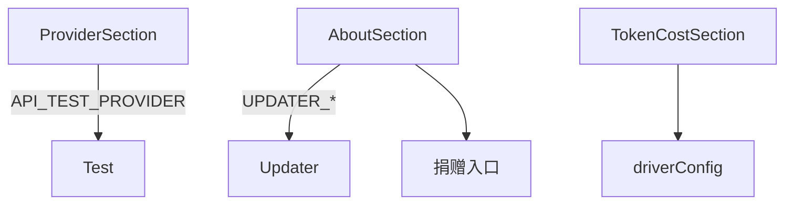

---
paths:
  - "claude-driver/src/renderer/src/features/settings/sections/**/*"
---

<!-- parent: settings -->

### 模块架构图

### 模块概览

- **职责**：全局设置各 section 面板（10 个）。
- **输入**：props（统一受控）+ i18n。
- **输出**：UI 渲染。

### API 概览

- **`ProviderSection`**：props `{ providerId, apiKey, providerBaseUrl, providerModel, providerLightModel, providerBalancedModel, providerPowerfulModel, providerReasoningModel, providerApiTimeoutMs, providerDisableNonEssential, onChange }`；state `{ showKey, testing, testResult }`；PROVIDER_PRESETS/PROVIDER_PRESET_LIST from @shared/constants/providers；handlePresetChange 自动填 baseUrl + 所有模型字段；切换 anthropic 清空 baseUrl；IPC API_TEST_PROVIDER。
- **`PermissionsSection`**：props `{ defaultMode, additionalDirectories, allowList, ignorePatterns, onChange }`；6 权限模式 radio + textarea。
- **`TokenCostSection`**：props `{ driverConfig, onChange }`；input/output 单价 + 月预算 USD（driver scope）。
- **`NotificationSection`**：props `{ driverConfig, onChange }`；桌面通知开关（driver scope，注：当前死开关见机制五）。
- **`PreferencesSection`**：props `{ claudePrefs, driverConfig, onChange }`；主题（即时 dataset.theme）+ outputStyle + 语法高亮（inverted "disabled" UI "enabled"）+ thinking 摘要 + spinner tips + disabled「Claude Code in Chrome」toggle。
- **`LanguageSection`**：props `{ language, onChange }`；Claude 回复语言（6 locales）+ UI 语言（SUPPORTED_LANGUAGES，即时 setLanguage）。
- **`MemorySection`**：props `{ autoMemoryEnabled, memoryDir, onChange }`；autoMemory 开关 + memoryDir。
- **`StorageSection`**：props `{ cleanupPeriodDays, driverConfig, onChange, onCheckUpdate }`；cleanupPeriodDays 1-365 + 检查更新按钮（与 AboutSection 重复）。
- **`AboutSection`**：props `{ appVersion, updaterState, onCheckUpdate, onDownloadUpdate, onQuitAndInstall }`；版本 + auto-updater 全状态机 UI（idle/checking/update-available/downloading/downloaded/no-update/error）+ GitHub 链接 + 捐赠（Buy Me a Coffee + 支付宝 QR overlay）；noUpdateVisible auto-hide 2.5s；showAlipay；IPC SHELL_OPEN_PATH。

### 数据模型

- **`UpdaterState`**：status union + version?/releaseDate?/releaseNotes?/percent?/bytesPerSecond?/error?。

### 关键流程

- provider 切换自动填 baseUrl + 模型；主题即时切换；捐赠打开链接。
- 受控表单（props + 父 handleChange）。

### 状态机

- **Updater 状态机**：idle/checking/update-available/downloading/downloaded/no-update/error（AboutSection）。

### 异常处理

- **占位**：PreferencesSection「Claude Code in Chrome」toggle disabled。

### 监控与测试

- **日志点**：API test、updater 状态变化。
- **测试缺口 [待补]**：无组件测试。

> 详情请阅读对应 Architecture 块文件：`docs/architecture.md` § renderer § features § settings § sections（`.claude/rules/architecture/src/renderer/features/settings/sections.md`）
