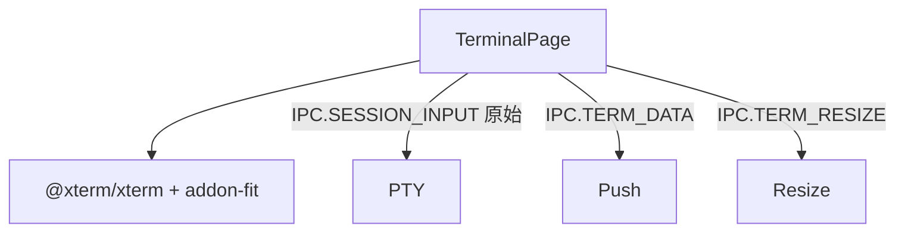

---
paths:
  - "claude-driver/src/renderer/src/features/terminal/**/*"
---

<!-- parent: features -->

### 模块架构图

### 模块概览

- **职责**：独立终端 pop-out 窗口（`#/terminal?sessionId=`）。xterm.js 渲染 PTY 原始输出；转发按键。
- **输入**：props（sessionId）。
- **输出**：UI 渲染（terminal）+ IPC invoke。

### API 概览

- **`TerminalPage`**：props `{ sessionId }`；refs `{ termRef, fitAddonRef, containerRef }`；@xterm/xterm Terminal + FitAddon。

### 数据模型

无。

### 关键流程

1. SessionFrameNode「打开终端」-> IPC.TERM_WINDOW_OPEN -> 此页渲染
2. 用户键入 -> IPC.SESSION_INPUT（raw）
3. PTY 输出 -> IPC.TERM_DATA -> xterm.write
4. 窗口 resize -> IPC.TERM_RESIZE

### 状态机

无。

### 异常处理

- 独立 JotaiProvider（pop-out）。

### 监控与测试

无。

> 详情请阅读对应 Architecture 块文件：`docs/architecture.md` § renderer § features § terminal（`.claude/rules/architecture/src/renderer/features/terminal.md`）
