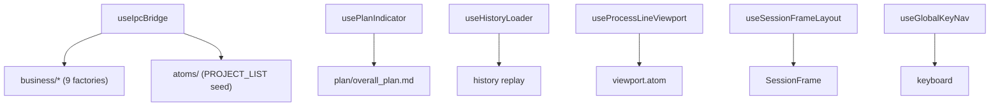

---
paths:
  - "claude-driver/src/renderer/src/hooks/**/*"
---

<!-- parent: renderer -->

### 模块架构图

### 模块概览

- **职责**：React 胶水（6 文件）。挂载/卸载 IPC 编排（useIpcBridge）、生命周期状态机（usePlanIndicator/useHistoryLoader）、画布 UI 控制器（useGlobalKeyNav/useProcessLineViewport/useSessionFrameLayout）。
- **输入**：Jotai store（useStore()）、IPC push、DOM 事件。
- **输出**：atom 变更、视口控制、键盘导航。

### API 概览

- **`useIpcBridge(): void`**：IPC 编排入口。组装 9 business handlers（注册顺序 branch 优先），PROJECT_LIST seed，后台扫描 token（PROJECT_HISTORY_SCAN），直接处理 NOTIFICATION/PROJECT_UPDATED/SESSION_STATUS。
- **`usePlanIndicator(): void`**：Plan 数据管理 + 倒三角指示器状态机（active/possibly-paused/completed）。监听 PostToolUse plan 文件写入 -> 重拉取 -> diff T 状态 -> 生成 Milestone。导出 `parsePlanNodes(content, projectId): PlanNode[]`。
- **`useHistoryLoader(): void`**：历史 session 加载（GIT_ENSURE_REPO → PROJECT_HISTORY_SCAN max 20 → 种子 activeSessionsAtom skip live → replay insertions/milestones/git-marks/branch relations → token-scan all → focus latest）。常量 `MAX_HISTORY_SESSIONS = 20`。
- **`useProcessLineViewport(flowRef, activeSessionIds): ViewportControl`**：4 态视口机（overview/focus/follow/locked）+ 节流 fitView 500ms。`ViewportControl` 接口（onUserMoveStart/End, onEscapeToFollow, focusSession, unfocusSession, onNewNodeInserted）。
- **`useSessionFrameLayout(sessionIds, heights, relations, nodeYOffsets?, startTimes?): FrameLayout[]`**：SessionFrame 位置计算（cluster-aware X + 时间堆叠 Y）。导出常量 `FRAME_WIDTH=1500`/`FRAME_GAP_X=40`/`FRAME_GAP_Y=24`/`FRAME_HEADER_HEIGHT=40`/`FRAME_FOOTER_HEIGHT=28`/`NODE_HEIGHT_ESTIMATE=120`/`BRANCH_INSERTION_LINE_HEIGHT=10`/`BRANCH_HANDLE_OFFSET=38`。`computeFrozenOffset(parentH): number`。
- **`useGlobalKeyNav(rf, layouts, focusSession, canvasContainerRef): void`**：←-> 框间跳转（cluster small-jump 到 branch / cross-cluster big-jump）；↑↓ 框内节点跳转（buildJumpableNodes → cursorNodeIndexAtom + nodeJumpRequestAtom + scrubberIndexAtom 同步 + requestAnimationFrame 微平移）。忽略 INPUT/TEXTAREA/contentEditable。

### 数据模型

- **`FrameLayout`**：sessionId、x、y、width、height、isBranch、branchIndex。
- **`ViewportControl`**：接口（视口控制方法）。
- **`RelationsMap`** / **`BranchChild`** / **`Cluster`**（useSessionFrameLayout 内部类型）。

### 关键流程

1. **IPC->Atom 桥接**：useIpcBridge 在 App 根 useStore() 获取 live store，createXxxHandler(store).register() 注册所有 IPC 监听
2. **Plan 指示器**：mount + claimedProjectsAtom 订阅 → PLAN_READ 各 claimed project → 解析 M/S/T → 基线 T 状态快照 → PostToolUse Write/Edit/MultiEdit 匹配 plan/*.md → 重拉取 → diff → 新完成 T → Milestone（含 DOM 高度快照 sessionFrameHeightsAtom）→ planIndicatorsByProjectAtom 更新 → 5min 无变动 → possibly-paused
3. **历史加载**：项目切换 → GIT_ENSURE_REPO → PROJECT_HISTORY_SCAN → 种子 activeSessionsAtom → replay 衍生 sidecar（INSERTIONS_LOAD/MILESTONES_LOAD/GIT_MARKS_LOAD）→ branch 关系恢复（from forkedFrom + triggerYOffset）→ token-scan → focus latest session
4. **视口机**：overview（fitView all）/ focus（fitView [id]）/ follow（setViewport 平移）/ locked（user drag 中）；isProgrammaticRef 区分程序化/用户；auto-switch overview<->follow based on running sessions
5. **键盘导航**：←-> 框间（getAdjacentClusterParent 判断 branch/cluster parent）；↑↓ 框内（buildJumpableNodes → cursor 移动 → requestAnimationFrame 微平移）

### 状态机

- **视口 4 态**：overview/focus/follow/locked（viewportModeAtom）。
- **Plan 指示器 3 态**：active/possibly-paused/completed（planIndicatorsByProjectAtom）。

### 异常处理

- fitView 节流 500ms 防 Hook 高频抖动
- useHistoryLoader MAX_HISTORY_SESSIONS=20 防性能

### 监控与测试

- **日志点**：IPC 注册、Plan 解析、历史加载、视口切换。
- **测试缺口 [待补]**：hooks 偏 UI 控制器，无单测（useIpcBridge 是不可测组合根）。

> 详情请阅读对应 Architecture 块文件：`docs/architecture.md` § renderer § hooks（`.claude/rules/architecture/src/renderer/hooks.md`）
