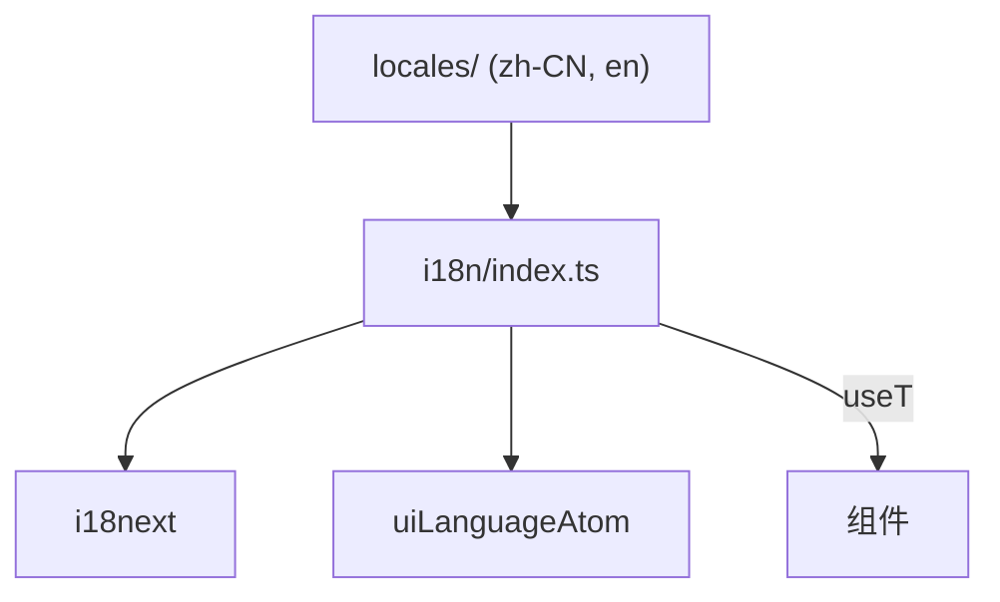
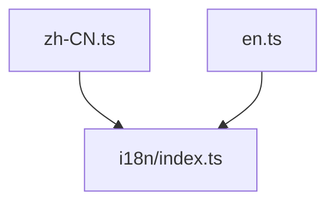

---
paths:
  - "claude-driver/src/renderer/src/i18n/**/*"
---

<!-- parent: renderer -->

### 模块架构图

### 模块概览

- **职责**：i18next 翻译引擎 + Jotai atom 集成。atom 为单一真相源，i18next 为引擎。
- **输入**：locale 字典（zh-CN/en）、setLanguage 调用。
- **输出**：翻译后的字符串。

### API 概览

- **`i18n/index.ts`**
  - `uiLanguageAtom = atom<UILanguage>(FALLBACK_LANGUAGE)`
  - `useT(): { t: TFunction, language, setLanguage }`
  - `tStatic(key: string, vars?: Record<string, unknown>): string`
- **`i18n/types.ts`**
  - `type UILanguage = 'zh-CN' | 'en'`
  - `SUPPORTED_LANGUAGES: UILanguage[]`
  - `FALLBACK_LANGUAGE: UILanguage = 'zh-CN'`

### 数据模型

- **`TFunction`**：接口（t 方法签名）。

### 关键流程

1. **翻译查找**：useT().t(key) → i18next 按 key 查当前 locale → 插值 `{{count}}`
2. **语言切换**：setLanguage(lang) → 写 uiLanguageAtom → 订阅组件 re-render → i18next.changeLanguage → 持久化 IPC.CONFIG_WRITE(scope:driver, key:uiLanguage)
3. **非组件上下文**：tStatic(key, vars?) 直接调用 i18next.t（不订阅 atom）

### 状态机

无。

### 异常处理

- 缺失 key → 返回 key 本身（i18next 默认）。

### 监控与测试

- **日志点**：语言切换。
- **测试缺口 [待补]**：无单测。

## locales
<!-- parent: i18n -->
### 模块架构图

### 模块概览

- **职责**：翻译字典（扁平 key -> 翻译，支持 `{{count}}` 插值）。
- **输入**：i18n/index.ts 加载。
- **输出**：`Record<string, string>`。

### API 概览

- **`locales/zh-CN.ts`** / **`locales/en.ts`**
  - default export: `Record<string, string>`
  - 命名空间：titlebar / bottombar / canvasPanel / projectCard / globalMonitor / projectMonitor / notifications / settings / remote / scheduler / insight / recommend 等

### 数据模型
### 关键流程
### 状态机
### 异常处理
### 监控与测试
