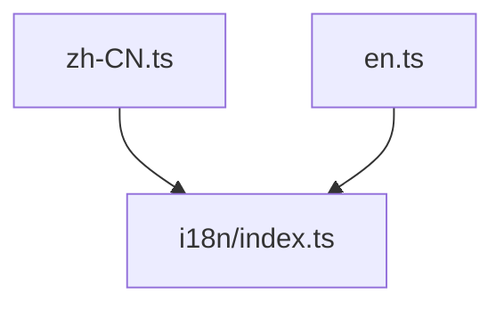

---
paths:
  - "claude-driver/src/renderer/src/i18n/locales/**/*"
---

<!-- parent: i18n -->

### 模块架构图

### 模块概览

- **职责**：翻译字典（扁平 key -> 翻译，支持 `{{count}}` 插值）。
- **输入**：i18n/index.ts 加载。
- **输出**：`Record<string, string>`。

### API 概览

- **`locales/zh-CN.ts`** / **`locales/en.ts`**
  - default export: `Record<string, string>`
  - 命名空间：titlebar / bottombar / canvasPanel / projectCard / globalMonitor / projectMonitor / notifications / settings / remote / scheduler / insight / recommend 等

### 数据模型

无（纯数据）。

### 关键流程

- useT().t(key) → i18next 按 key 查当前 locale → 插值 `{{count}}`

### 状态机

无。

### 异常处理

- 新增文案需同步两语言文件。

### 监控与测试

无。

> 详情请阅读对应 Architecture 块文件：`docs/architecture.md` § renderer § i18n § locales（`.claude/rules/architecture/src/renderer/i18n/locales.md`）
