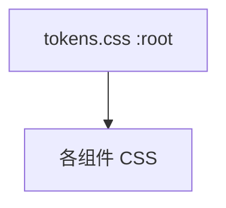

---
paths:
  - "claude-driver/src/renderer/src/styles/**/*"
---

<!-- parent: renderer -->

### 模块架构图

### 模块概览

- **职责**：全局 CSS Design Token 系统（权威）。Anthropic 暖色暗主题 + 响应式排版/间距 + 动画。
- **输入**：组件 CSS 经 `var(--...)` 引用。
- **输出**：CSS 自定义属性。

### API 概览

- **`tokens.css`**：`:root` 自定义属性（color bg0-bg4/orange --or/green/purple/red/blue status；响应式 typography `clamp()` 800-2560px；spacing；layout sizes/radii；shadows；pulse/blink keyframes；reset；scrollbar）。

### 数据模型

无。

### 关键流程

- 全局主题；主题切换经 `document.documentElement.dataset.theme`（PreferencesSection 即时应用）。

### 状态机

无。

### 异常处理

- 注意：`assets/base.css` 定义独立的 `--ev-c-*` 旧 token（electron-vite scaffold），与 tokens.css 的 `--bg*`/`--or` 并存；`assets/main.css` 同时引用两者，旧 token 多为遗留。

### 监控与测试

无。

> 详情请阅读对应 Architecture 块文件：`docs/architecture.md` § renderer § styles（`.claude/rules/architecture/src/renderer/styles.md`）
