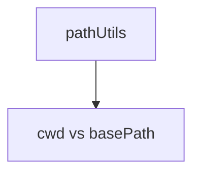

---
paths:
  - "claude-driver/src/renderer/src/utils/**/*"
---

<!-- parent: renderer -->

### 模块架构图

### 模块概览

- **职责**：渲染层通用工具。当前仅跨平台路径前缀匹配。
- **输入**：cwd、basePath。
- **输出**：boolean 匹配结果。

### API 概览

- **`pathUtils.ts`**
  - `pathMatches(cwd: string, basePath: string): boolean` — 规范化 `\`->`/`、大小写不敏感、`cwd===base || cwd.startsWith(base+'/')`。

### 数据模型

无。

### 关键流程

- session 按项目路径归属（LeftPanel 过滤 active sessions by `pathMatches(cwd, project.path)`）。
- statusLine claudeId 解析回退（by cwd match）。

### 状态机

无。

### 异常处理

无。

### 监控与测试

- **日志点**：无。
- **测试覆盖**：无（trivial helper）。

> 详情请阅读对应 Architecture 块文件：`docs/architecture.md` § renderer § utils（`.claude/rules/architecture/src/renderer/utils.md`）
