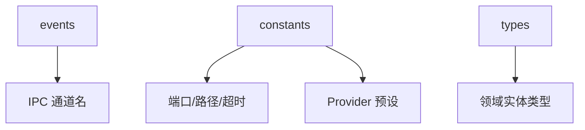
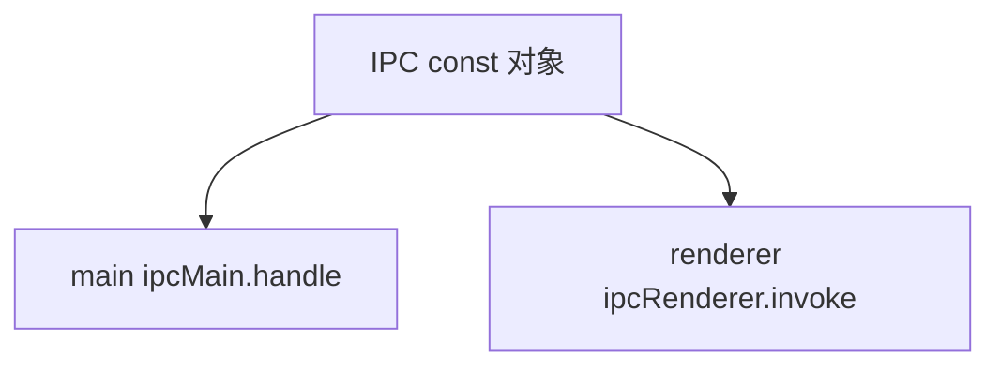
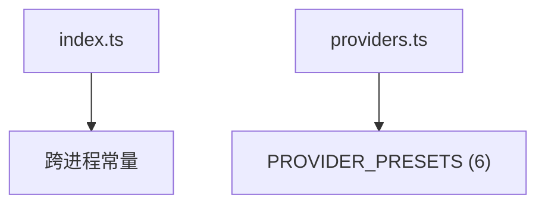
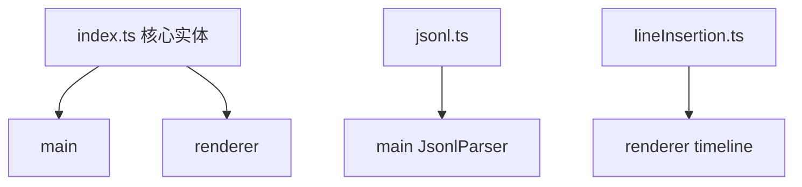

---
paths:
  - "claude-driver/src/shared/**/*"
---

<!-- parent: TDD -->

### 模块架构图

### 模块概览

- **职责**：跨进程契约层。类型（types）+ 常量（constants）+ IPC 通道名（events）。被 main 与 renderer 共同引用（renderer 经 `@shared` 别名）。
- **输入**：无。
- **输出**：类型 + 常量 + IPC 通道名 + extractToolDisplay 纯函数。

### API 概览

- **`events/ipc-channels.ts`**：`IPC` as const（~90 通道）+ `IpcChannel` 联合类型。
- **`constants/index.ts`**：HOOK_PORT=39521、DRIVER_CONFIG_DIRNAME='.claude-driver'（[待统一]）、CLAUDE_CONFIG_DIRNAME='.claude'、STATUS_LINE_SCRIPT_NAME、PTY_TIMEOUT_MS=30min、HEARTBEAT_INTERVAL_MS=10s、PLAN_INDICATOR_TTL_MS=5min、HOOK_ENDPOINT='/hooks'、STATUS_LINE_ENDPOINT='/statusline'。
- **`constants/providers.ts`**：PROVIDER_PRESETS（6：anthropic/deepseek/openrouter/siliconflow/minimax/custom）+ PROVIDER_PRESET_LIST。
- **`types/index.ts`**：核心领域实体（Project/Session/PlanNode/AgentNode/Hook*/StatusLineData/Notification/DriverConfig/Provider*/FeishuBotConfig 等）。
- **`types/jsonl.ts`**：Jsonl* 类型 + `extractToolDisplay(toolUse: JsonlToolUse): ToolDisplayInfo` 纯函数。
- **`types/lineInsertion.ts`**：LineInsertion* 类型（10 类统一模型）。

### 数据模型

见各文件 API 概览（全为类型定义，无运行时数据）。

### 关键流程

- 跨进程契约；IPC 类型安全；跨进程实体共享；常量统一。

### 状态机

无（纯类型/常量）。

### 异常处理

- HookPayload 判别联合支持类型安全分发。
- jsonl.ts 的 extractToolDisplay 与 main JsonlParser 重复实现（保持同步）。
- **配置路径 [待统一]**：DRIVER_CONFIG_DIRNAME='.claude-driver'，PRD 要求统一 '.claude-steer'。

### 监控与测试

- **测试缺口 [待补]**：无单测（纯类型/常量）。

## events
<!-- parent: shared -->
### 模块架构图

### 模块概览

- **职责**：IPC 通道名单一真相源（~90 通道）。防字符串硬编码漂移。
- **输入**：无。
- **输出**：IPC const 对象 + IpcChannel 联合类型。

### API 概览

- **`ipc-channels.ts`**
  - `IPC` as const 对象（~90 常量）
  - `IpcChannel` 联合类型 `(typeof IPC)[keyof typeof IPC]`
- **通道分组**（实际从 ipc-channels.ts 提取，~90）：
  - **Main->Renderer 推送**（~20）：HOOK_EVENT、STATUS_LINE、PLAN_UPDATED、SESSION_STATUS、NOTIFICATION、PROJECT_UPDATED、JSONL_RECORD/RECORDS/SUBAGENT_RECORD/BRANCH_SNAPSHOT/SUBAGENT_INSERTIONS、SESSION_BRANCH_LINK、PTY_BIND/UNBIND、NOTIFICATION_FOCUS_TAB、INSIGHT_REPORT_READY、CHAT_MESSAGE、CC_CONNECT_LOG、UPDATER_STATE_CHANGED
  - **Renderer->Main invoke**（~70）：PROJECT_*、SESSION_*、GIT_*、CONFIG_*/DRIVER_CONFIG_*/PROVIDER_*/CLAUDE_SETTINGS_*/PROJECT_SETTINGS_*、MCP_*/SKILL_*、SCHEDULER_*、CC_CONNECT_*、INSIGHT_*/CHAT_*、TERM_WINDOW_*、UPDATER_*、RECOMMEND_GET、API_TEST*、DIALOG_*、SHELL_*、OPEN_WEBVIEW、TOKEN_SCAN_FILE、PERMISSION_RESPOND、PLAN_READ、INSERTION_*、MILESTONE_*、SESSION_META_WRITE
  - **Terminal window**（2）：TERM_DATA（Main->Terminal push）、TERM_RESIZE（Terminal->Main invoke）

### 数据模型
### 关键流程
### 状态机
### 异常处理
### 监控与测试

## constants
<!-- parent: shared -->
### 模块架构图

### 模块概览

- **职责**：跨进程共享常量（端口/路径 dirname/超时/HTTP 端点）+ 多 provider 预设。renderer 安全（无 Node 内置）；main 自行拼接 os.homedir()。
- **输入**：无。
- **输出**：常量 + 预设。

### API 概览

- **`constants/index.ts`**
  - `HOOK_PORT = 39521`
  - `DRIVER_CONFIG_DIRNAME = '.claude-driver'`（PRD 要求统一 '.claude-steer' [待统一]）
  - `CLAUDE_CONFIG_DIRNAME = '.claude'`
  - `STATUS_LINE_SCRIPT_NAME = 'statusline-bridge.sh'`
  - `PTY_TIMEOUT_MS = 30 * 60 * 1000`（30 min）
  - `HEARTBEAT_INTERVAL_MS = 10 * 1000`（10s）
  - `PLAN_INDICATOR_TTL_MS = 5 * 60 * 1000`（5 min）
  - `HOOK_ENDPOINT = '/hooks'`
  - `STATUS_LINE_ENDPOINT = '/statusline'`
- **`constants/providers.ts`**
  - `PROVIDER_PRESETS: Record<ProviderId, ProviderPreset>`（6：anthropic/deepseek/openrouter/siliconflow/minimax/custom）
  - `PROVIDER_PRESET_LIST: Array<{ id: ProviderId, label: string }>`

### 数据模型
### 关键流程
### 状态机
### 异常处理
### 监控与测试

## types
<!-- parent: shared -->
### 模块架构图

### 模块概览

- **职责**：核心领域实体类型（跨 main/renderer）。纯 TypeScript interface/type，jsonl.ts 含一个纯函数 extractToolDisplay。
- **输入**：无。
- **输出**：类型 + 纯函数。

### API 概览

- **`types/index.ts`**（核心实体）：
  - `ClaimStatus = 1 | 0 | -1`、`PermissionMode`（6 模式）
  - `Project`：id/name/path/claimStatus/isGitRepo/activeSessionId/sessionIds[]/lastActiveAt/feishuBot?
  - `SessionStatus = 'Running' | 'Paused' | 'Interrupted' | 'Completed'`
  - `TokenUsage`：current/max/usedPercentage（all `number | null`）
  - `Session`：id/claudeId?/projectId/status/currentModel/tokenUsage/transcriptPath/cwd/startedAt/endedAt/worktreePath
  - `PlanStatus = 'TODO' | 'DOING' | 'DONE'`、`PlanLevel = 'M' | 'S' | 'T'`
  - `PlanNode`：id/projectId/level/title/status/parentId/filePath/updatedAt
  - `AgentType = 'General' | 'Explore' | 'Plan'`
  - `AgentNode`：id/sessionId/type/parentId/transcriptPath/status/startedAt/endedAt
  - `TokenStats`：monthlyTokens/totalCostUsd/mostUsedModel/costByProject
  - `HookEventName`（12 变体）：SessionStart/PreToolUse/PostToolUse/PostToolUseFailure/SubagentStart/SubagentStop/Notification/Stop/SessionEnd/PreCompact/PostCompact/PermissionRequest/PermissionDenied
  - `HookPayload`（判别联合）：HookPayloadBase/ToolUse/Subagent/Notification 扩展
  - `HookEvent`：eventName/sessionId/cwd/transcriptPath/payload/receivedAt/userHooks?
  - `StatusLineData`：model/context_window{current_usage,max_tokens,used_percentage}/rate_limits/transcript_path/cwd
  - `NotificationType`、`Notification`
  - `SessionHistoryMeta`、`GitMark`、`PlanIndicatorStatus/PlanIndicator`、`Milestone`
  - `DriverConfig`：tokenPriceInputPerM/tokenPriceOutputPerM/monthlyBudgetAlertUsd/desktopNotificationsEnabled/themePreference/uiLanguage?
  - `ProviderId/ProviderPreset/ProviderEnvBlock`
  - `FeishuBotConfig`
- **`types/jsonl.ts`**：
  - `JsonlMessageType = 'user' | 'assistant' | 'tool_use' | 'tool_result' | 'system' | 'summary'`
  - `JsonlToolUse`：id/name/input
  - `JsonlToolResult`：tool_use_id/content/is_error?
  - `JsonlUsage`：inputTokens/outputTokens/cacheCreationTokens/cacheReadTokens
  - `JsonlRecord`：uuid?/type/text?/toolUse?/toolResult?/cwd?/sessionId?/isSidechain?/agentId?/isBranchStart?/usage?/model?/raw?/parsedAt
  - `ToolDisplayInfo`：toolName/displayText
  - `extractToolDisplay(toolUse: JsonlToolUse): ToolDisplayInfo` — 纯函数：Bash->desc/cmd, Read/Write/Edit/MultiEdit/Glob->file_path/path, WebFetch->url, Agent->desc, Grep->"pattern in path", default->desc||name
- **`types/lineInsertion.ts`**：
  - `LineInsertionType`（10 类）：'tool' | 'mcp' | 'cli' | 'skill' | 'workflow' | 'insight' | 'subagent' | 'branch' | 'btw' | 'user-input'
  - `LineInsertionDirection = 'left' | 'right'`（right=tool-class, left=experience/interaction-class）
  - `LineInsertionLength = 'short' | 'medium' | 'long'`
  - `LineInsertionStatus = 'pending' | 'running' | 'done' | 'failed'`
  - `LineInsertion`：id/type/direction/color/length/customWidth?/sessionId/timestamp/badgeContent/status/isAnimating/lineLabel?/agentId?/toolUseId?/triggerYOffset?

### 数据模型
### 关键流程
### 状态机
### 异常处理
### 监控与测试
