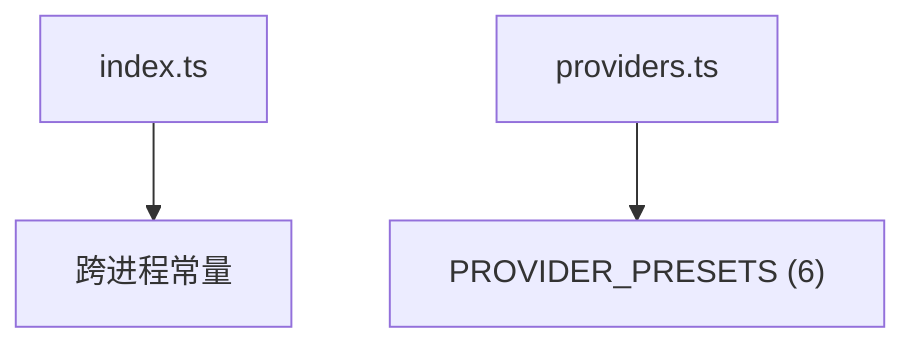

---
paths:
  - "claude-driver/src/shared/constants/**/*"
---

<!-- parent: shared -->

### 模块架构图

### 模块概览

- **职责**：跨进程共享常量（端口/路径 dirname/超时/HTTP 端点）+ 多 provider 预设。renderer 安全（无 Node 内置）；main 自行拼接 os.homedir()。
- **输入**：无。
- **输出**：常量 + 预设。

### API 概览

- **`constants/index.ts`**
  - `HOOK_PORT = 39521`
  - `DRIVER_CONFIG_DIRNAME = '.claude-driver'`（PRD 要求统一 '.claude-steer' [待统一]）
  - `CLAUDE_CONFIG_DIRNAME = '.claude'`
  - `STATUS_LINE_SCRIPT_NAME = 'statusline-bridge.sh'`
  - `PTY_TIMEOUT_MS = 30 * 60 * 1000`（30 min）
  - `HEARTBEAT_INTERVAL_MS = 10 * 1000`（10s）
  - `PLAN_INDICATOR_TTL_MS = 5 * 60 * 1000`（5 min）
  - `HOOK_ENDPOINT = '/hooks'`
  - `STATUS_LINE_ENDPOINT = '/statusline'`
- **`constants/providers.ts`**
  - `PROVIDER_PRESETS: Record<ProviderId, ProviderPreset>`（6：anthropic/deepseek/openrouter/siliconflow/minimax/custom）
  - `PROVIDER_PRESET_LIST: Array<{ id: ProviderId, label: string }>`

### 数据模型

- **`ProviderId`**：`'anthropic' | 'deepseek' | 'openrouter' | 'siliconflow' | 'minimax' | 'custom'`。
- **`ProviderPreset`**：id/label/baseUrl/defaultModel/defaultLightModel/defaultBalancedModel/defaultPowerfulModel/reasoningModel/requiresAuthToken。

### 关键流程

- HookServer 用 HOOK_PORT；PtyManager 用 HEARTBEAT/PTY_TIMEOUT；ProviderSection 用 PROVIDER_PRESETS。

### 状态机

无。

### 异常处理

- 跨平台：main 层拼接 homedir；renderer 不接触路径。
- **配置路径 [待统一]**：DRIVER_CONFIG_DIRNAME='.claude-driver'，PRD 要求统一 '.claude-steer'。

### 监控与测试

- **测试缺口 [待补]**：无单测（纯数据）。

> 详情请阅读对应 Architecture 块文件：`docs/architecture.md` § shared § constants（`.claude/rules/architecture/src/shared/constants.md`）
